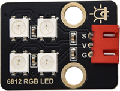
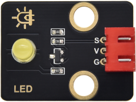
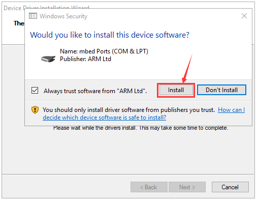
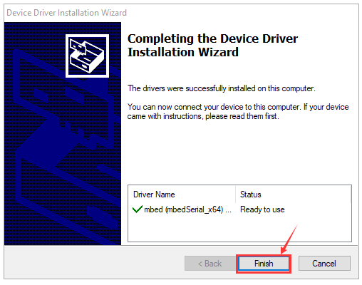

# 1.产品介绍

## 1.1 前言

随着现代科技的飞速发展，通过远程智能化技术来控制智能家居的方式已越来越贴近于人们的生活。因此，智能家居也越来越受大家的喜爱和重视，而智能家居系统就是以提高家庭居住环境为目的的，它融合了计算机，网络通信，自动控制等现代科学技术，进而形成的集功能性的、智能性、服务性为一体的舒适实用、安全便利、绿色环保的智能系统。

## 1.2 产品简介

这款基于开源硬件micro:bit的智能家居学习工具包是科易互动机器人有限公司新推出的，它是为那些梦想着用智能化技术让人们的生活更舒适的人设计的。本次设计的智能家居系统是以micro:bit板为主控板，由1602 LCD，XHT11温湿度传感器，模拟气体(MQ-2)传感器，人体红外释热电运动传感器，黄色LED模块，6812 RGB灯，舵机，水滴水蒸气传感器、microbit蓝牙等模块组成。通过各种传感器和模块分别检测和控制家庭环境的温度、湿度、可燃气体的浓度、门窗开与关，并将各项环境信息在1602 LCD实时显示，并通过智能手机/IPad的APP为操作终端，查看环境信息，还具备USB充电和太阳能充电。

本教程是关于通过微软（Microsoft）的线上图形化编程平台Make Code 给micro:bit控制板编写程序来控制智能家居，在体验造物的过程中，增强动手能力，学习编程技巧。MakeCode for micro:bit是micro:bit官网上使用最为广泛的图形化编程环境，它基于微软开源项目MakeCode开发的图形化编程环境。Make Code图形化编程，还可以转换为python或javascript，代码与图形化结合，非常方便易学。同时，Make Code编程可以仿真，也可以给实际的电子元件编程。

## 1.3 产品清单

当收到这个micro:bit智能家居系统套件的时候，首先看到是一个包装精美的外盒，每个配件被安全且有序的装在外盒里面的小袋子里，先来清点一下：

|序号|规格|数量|图片|
|-|-|-|-|
|1|Microbit主板（KE3030有主板，KE3031没有主板）|1||
|2|Keyes micro bit IO口扩展板|1||
|3|microbit智能家居椴木板 t=3mm|7||
|4|microbit智能家居亚克力板 无色透明亚克力|3||
|5|6812 RGB模块|1||
|6|模拟气体传感器|1||
|7|130电机模块（带叶片）|1||
|8|水滴水蒸气传感器|1||
|9|XHT11温湿度传感器|1||
|10|人体红外热释传感器|1||
|11|黄色LED模块|1||
|12|太阳能与USB充电锂电池电源模块|1||
|13|microbit智能家居电池盒|1||
|14|microbit智能家居太阳能板|1||
|15|舵机|2||
|16|I2C 1602 LCD模块|1||
|17|船型开关|1||
|18|XH2.54-3Pin+杜邦母单 长19.5cm (红线在中间)|5||
|19|HX-2.54 4P 转杜邦线母单 26AWG 黑红白棕 200mm|2||
|20|高温硅胶杜邦线 4pin 黑红蓝绿母对母20cm 26AWG 连拼 环保|1||
|21|白色端子2P转杜邦母 黑红 线长200mm|2||
|22|M2*8MM 圆头 十字螺钉|3||
|23|M1.4*6MM 圆头十字自攻螺钉|10||
|24|M3 镀镍 自锁螺母|5||
|25|M4*8MM 圆头 十字螺钉|18||
|26|M3*6MM 圆头 十字螺钉|9||
|27|M3*10MM 圆头 十字螺钉|9||
|28|M2*12MM 圆头 十字螺钉|5||
|29|M4 镀镍螺母|18||
|30|M3 镀镍螺母|6||
|31|M2 镀镍螺母|7||
|32|M3*8MM 平头 十字|2||
|33|十字扳手|1||
|34|3.0*40MM 红黑色 十字螺丝刀 刀头加粗|1||
|35|2.0*40MM 紫黑色 十字螺丝刀|1||
|36|M3*45MM 双通 六角铜柱|4||
|37|USB线 AM/MK5P(micro)黑色 OD：3.5 L=1M PVC过粉|1||
|38|LED灯 F5-蓝发蓝-短|2||
|39|18650电池（自备）|1||

## 1.4 初次使用前的准备

### 1.关于BBC Micro:bit

（1）Micro:bit是什么?

Micro:bit是由ARM、巴克莱、element14、微软等机构与英国广播公司（BBC）合作推出的一款基于ARM架构的开源硬件平台，核心设备是32位Arm Cortex-M4带有FPU的微处理器，Micro:bit主板只有信用卡一半大小，但功能非常强大。Micro:bit V2.0主板拥有丰富的板资源，搭载了5×5可编程LED点阵、2颗可编程按键、加速度计、电子罗盘、温度计、可触摸感应的Logo、MEMS麦克风、低功耗蓝牙等电子模块，背面还有一个蜂鸣器，可以在没有外部设备的情况下也可以播放各种声音。此外，Micro:bit主板还支持休眠模式，用户可以长按Micro:bit主板后面的复位&电源按钮，使进入睡眠模式，降低电池功耗。

Micro:bit开发板的功能强大，具有易用性和扩展性，底部齿轮设计的金手指，它可以很好的通过固定鳄鱼夹与各种电子元件互动。支持读取传感器数据，控制舵机与RGB灯带等，也可以插入扩展板连接各种传感器。Micro:bit支持多种代码及图形化编程平台，支持几乎所有的PC和移动设备，具有免安装驱动，电子模块集成度高，且带有串口监控功能，方便调试！

Micro:bit应用非常广泛，可以用于编写电子游戏，声光互动，机器人控制，科学实验，可穿戴装置开发等，可以实现任何酷炫的小发明，无论是机器人还是乐器，没有做不到只有想不到。创造更多的创意作品。

（2）Micro:bit主板硬件分布图介绍：

有关更多内容，请参阅：[<u>https://tech.microbit.org/hardware/</u>](https://tech.microbit.org/hardware/)

<https://microbit.org/new-microbit/>

[<u>https://www.microbit.org/get-started/user-guide/overview/</u>](https://www.microbit.org/get-started/user-guide/overview/)

[<u>https://microbit.org/get-started/user-guide/features-in-depth/</u>](https://microbit.org/get-started/user-guide/features-in-depth/)

（3）Micro:bit引脚配置介绍，如下图所示：

Micro:bit引出的引脚中，其引脚功能分类如下表所示：

|GPIO|P0，P1，P2，P3，P4，P5，P6，P7，P8，P9，P10，P11，P12，P13，P14，P15，P16，P19，P20|
|-|-|
|ADC/DAC|P0，P1，P2，P3，P4，P10|
|IIC|P19（SCL），P20（SDA）|
|SPI|P13（SCK），P14（MISO），P15（MOSI）|
|PWM（常用）|P0，P1，P2，P3，P4，P10|
|PWM（不常用）|P5、P6、P7、P8、P9、P11、P12、P13、P14、P15、P16、P19、P20|
|已占用|P3(LED Col3)，P4(LED Col1)，P5(Button A)，P6(LED Col4)，P7(LED Col2)，P10(LED Col5)，P11(Button B)|

详细信息请参考官方网站：[<u>https://tech.microbit.org/hardware/edgeconnector/</u>](https://tech.microbit.org/hardware/edgeconnector/)

<https://microbit.org/guide/hardware/pins/>

（4）Micro:bit主板使用注意事项：

- a\.   Micro:bit主板上有很多精密的电子元件，建议戴上硅胶保护套进行使用，防止短路。

- b\.   Micro:bit主板的IO口驱动能力很弱，IO口电流不足300mA，请勿接大电流器件（例如大舵机MG995、直流电机），否则会烧坏Micro:bit主板，使用前必须完全了解清楚你所使用的器件电流情况，一般建议配搭Micro:bit扩展板进行使用。

- c\.   供电建议从Micro:bit主板的USB口进行供电，或者Micro:bit主板上的3V电池座接口。Micro:bit主板本身IO口是3V电平，所以是不支持5V传感器的，如需支持5V传感器需要使用Micro:bit扩展板。

- d\.   使用与Micro:bit主板LED点阵的共用引脚（如P3、P4、P6、P7、P10），记得在代码中把LED点阵禁用掉，否则会有LED点阵乱亮的现象。

- e\. 不要使用IO   口P19、P20，P19和P20是不能当做IO口来使用的，虽然makecode软件上显示可以使用，实际是用不了的！只能用于I2C通讯。

- f\.   3V电池座接口上不能使用超过3.3V电池，插上去很容易会把Micro:bit主板烧坏。

- g\. 禁止放在金属制品上使用，以免发生短路。

总之：Micro:bit主板就像是一台微型计算机，它使编程变得有形，并促进数字创造力。关于编程环境，BBC提供了一个在线编程网站：<https://microbit.org/code/>，该网站有一个易于使用的图形化程序MakeCode。

### 2.Micro:bit驱动安装说明：

下面给micro:bit开发板安装驱动。首先将micro:bit主板用micro USB数据线连接到电脑上，然后鼠标左键双击驱动文件，点击Install。

继续点击Install，安装驱动。

先点击“Install”，再点击“Finish”，安装完成。

安装完成后，点击“Computer” —\>“Properties”—\> “Device manager”,我们可以看到下图。

