注意：亚克力板的薄膜安装时需要撕去，否则可能造成舵机卡死损坏，在使用过程中，如果发现舵机不转动并且伴随着发烫现象，请立刻断电，否则产品将损坏烧毁，整个安装过程请按照实际灵活调整安装顺序，安装完成后建议再多花几分钟检查整个产品的安装，特别是每一个传感器的接线，错误的接线极可能造成电路烧毁并且不可修复。

# 2. micro:bit智能家居安装部分

安装1

安装所需零件

安装

完成

安装2

安装所需零件

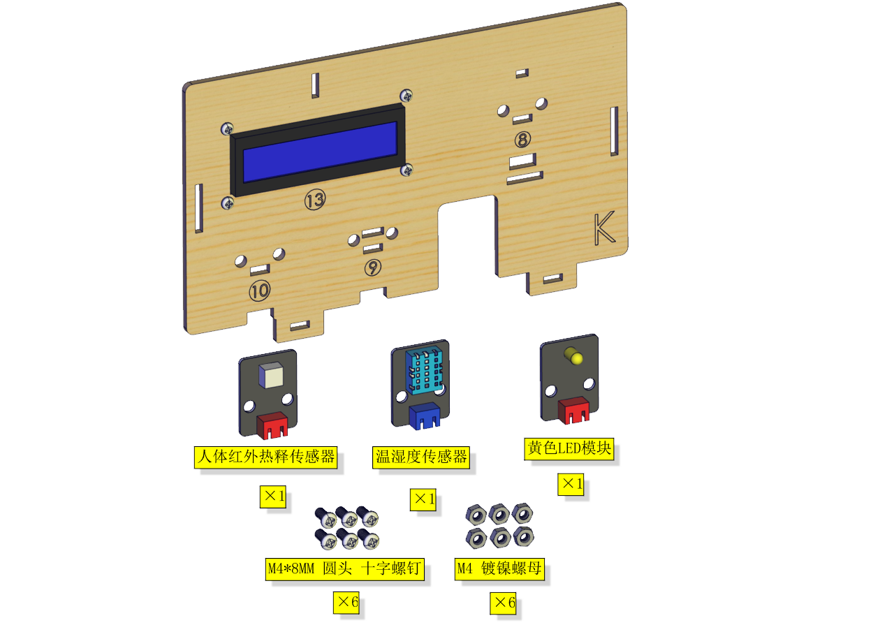

安装

完成

先将LCD的线插上（避免拼装后LCD不好插线）

安装3

安装所需零件

安装

完成

示例代码：代码路径：2. Makecode 课程\Makecode 代码\Microbit
基础课程

将示例代码上传到micro:bit主板上，上传成功后，舵机的角度就被调到0°位置。
这一步很重要！！

安装4

安装所需零件

安装

完成

安装5
安装所需零件

安 装

完成

安装6
安装所需零件

安 装（安装自锁螺母时不可拧紧）

完成

安装7
安装所需零件

安装

完成

安装8
安装所需零件

安装

完成

安装9
安装所需零件

安装

完成

安装10
安装所需零件

安装（注意太阳能板粘贴在划线之上）

完成

安装11
安装所需零件

安装

完成

安装12

安装所需零件

安装

完成

安装13

安装所需零件

安装

完成

安装14

安装所需零件

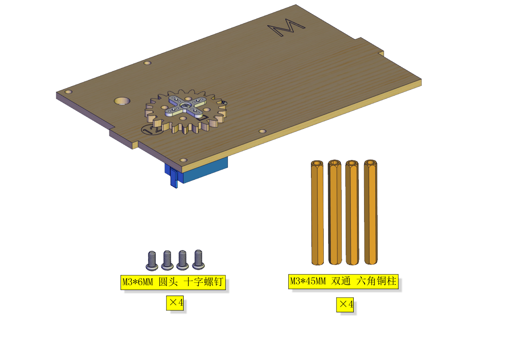

安装

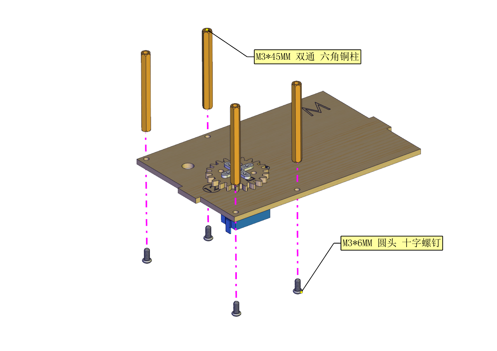

完成

安装15

安装所需零件

安装

完成

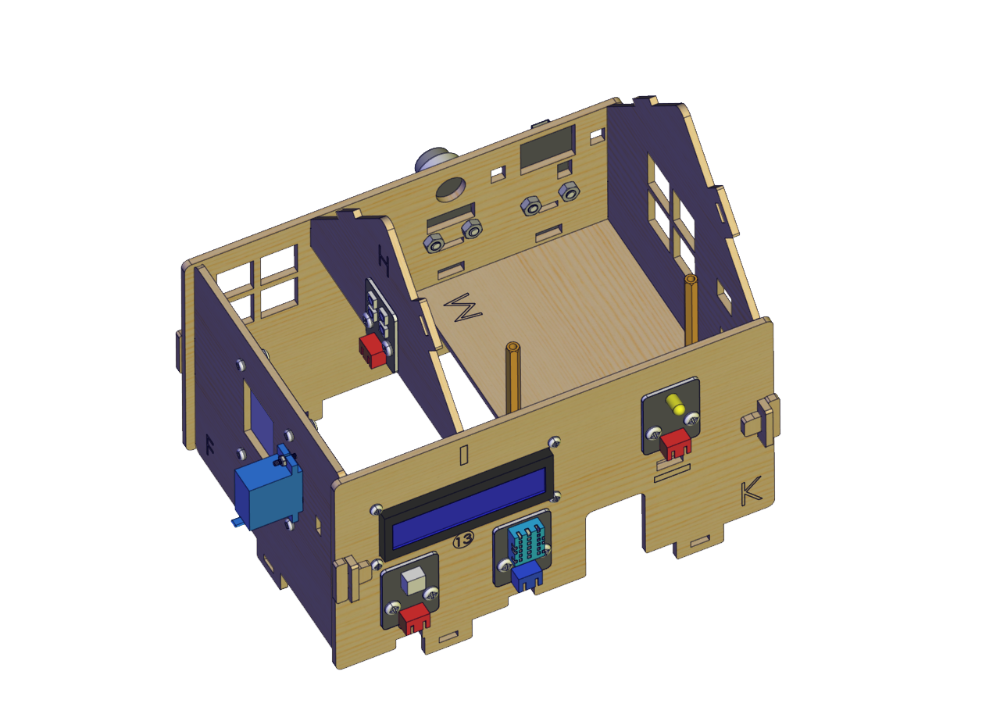

安装16
安装所需零件

安装

完成

安装17

安装所需零件

安装

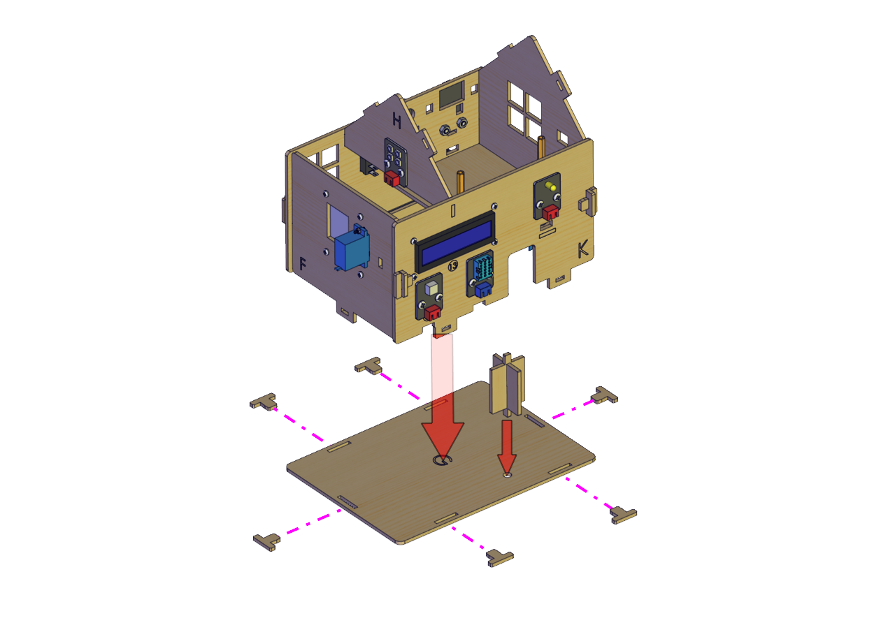

完成

安装18

安装所需零件

安装

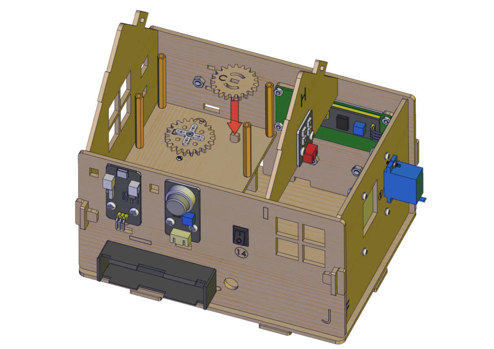

完成

安装19

安装所需零件

安装

完成

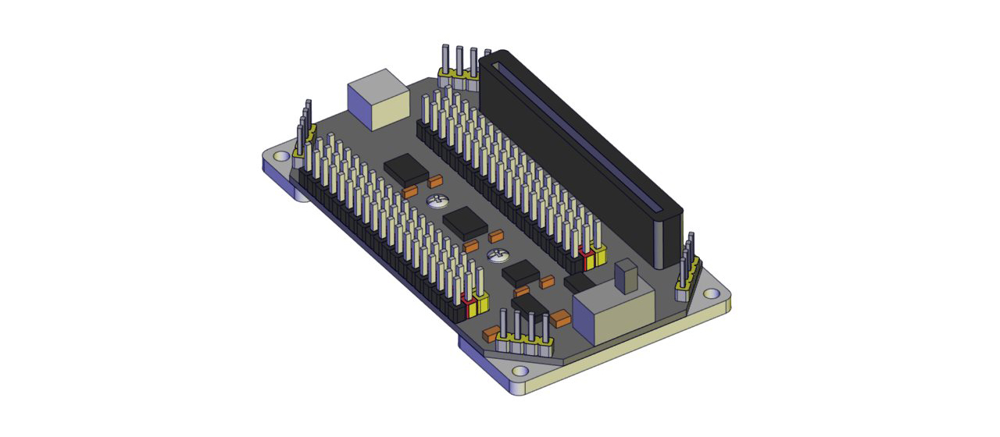

安装20

安装所需零件

安装

完成

安装21

安装所需零件

安装

完成

安装到此即可开始接线

注意：下面接线图是为了清晰展示后续太阳能模块的接线，这里不要一下子把线全部接好了，否则后面还要拆（肯定要拆的），后续步骤如果不清楚太阳能模块的接线可以回头到这里看下。

电池盒接线

黄色LED灯接线

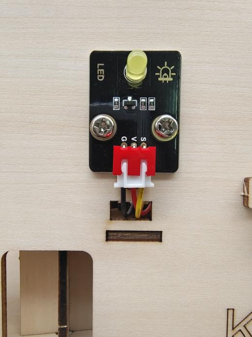

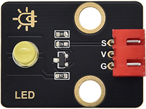

RGB模块接线

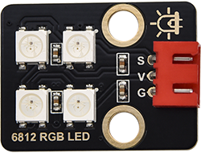

人体红外接线

1602LCD模块接线

模拟气体传感器(这里只使用了数字信号，
如果需要可以自己选择模拟信号)

温湿度传感器接线

门舵机接线

窗舵机接线

太阳能板接线

 

充放电模块电源接线图

 

 

电机模块接线

 

水滴传感器接线

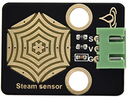

接完线后最后安装顶板
安装所需零件

安装1

安装1完成

安装2

安装2完成

最后插入microbit主板

安装完成

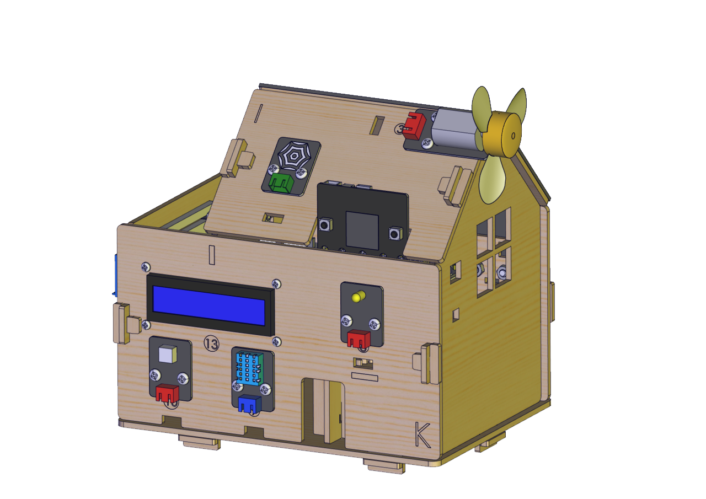