# 3. Makecode 课程

## 3.1 代码与编程

以下的步骤说明基于Windows
操作系统，如果你使用的是其他操作系统，可以将其作为参考。

### 1.快速开始

本节介绍如何为micro:bit编写程序以及如何将其下载到micro:bit主板。micro:bit官方网站上有非常详细的教程，你可以参考：[https://microbit.org/guide/quick/](https://microbit.org/guide/quick/)

Step 1: 连接Micro:bit主板

通过Micro USB线将micro:bit
主板连接到电脑，（[使用移动动设备对micro:bit进行编码，请移步查看](https://microbit.org/guide/mobile/)：[https://microbit.org/get-started/user-guide/mobile/](https://microbit.org/get-started/user-guide/mobile/)）
Macs、PCs、 Chromebooks and Linux系统（包括Raspberry Pi）都支持micro:bit主板。

micro:bit主板背后的红色LED指示灯会显示micro:bit
主板有电了，不管是电池还是micro USB数据线。在micro:bit主板上，当你的电脑通过micro USB与micro:bit主板通信时，黄色LED指示灯会闪烁，例如当你正在烧入一个“hex”程序文件时。

Micro:bit主板将在你的电脑上显示为一个名为'MICROBIT'的驱动器。但请注意，它不是普通的USB磁盘！如下图：

Step 2: 编写程序：

在浏览器中访问链接：<https://makecode.microbit.org/>，然后单击“新建项目”，出现“创建项目”对话框，在对话框中输入“heartbeat”，单击“创建
√”并开始编程。

如果你的电脑具有Windows 10操作系统，则还可以使用Windows 10 App进行编程，这与在浏览器上进行编程完全相同。Windows 10 App下载链接：<https://www.microsoft.com/zh-cn/p/makecode-for-micro-bit/9pjc7sv48lcx?ocid=badgep&rtc=1&activetab=pivot:overviewtab>

（以下是以Google Chrome为例，其他浏览器类似）

编写一个micro:bit代码。
例如，从模块区拖放一些指令方块放入代码编辑区，然后在MakeCode编辑器中的Simulator上尝试你的程序，如下图所示，该图显示了如何对heartbeat进行编程。

下一节将进一步介绍Makecode。

点击“ JS JavaScript”，你可以看到对应的JavaScript语言代码程序，如下图：

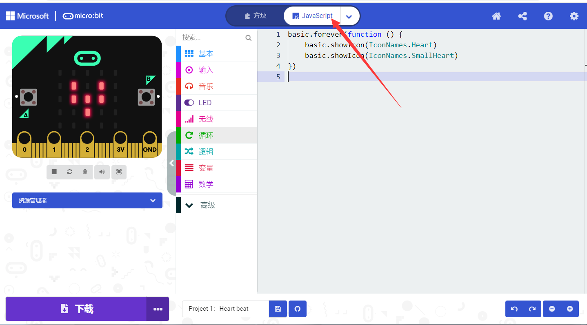

你还可以点击“
JSJavaScript”，再点击下拉按钮选择“Python”，你还可以看到对应的Python语言代码程序，如下图：

下载代码：

如果使用Windows 10 App编写程序，则只需单击“下载”按钮，该代码程序将直接下载到micro:bit主板，而无需任何其他操作。

如果使用浏览器编写程序，请按照以下步骤操作：

单击编辑器中的“下载”按钮。
这将下载一个“hex”文件，该文件是micro:bit主板可以读取的格式。十六进制文件下载后，将其复制到你的micro:bit
主板，就像将文件复制到USB驱动器一样。
在Windows上，你还可以右键单击并选择“发送到→MICROBIT（E）”将“hex”文件拷贝到micro:bit主板。

也可以将“hex”文件直接拖入MICROBIT磁盘中。

将下载好的“hex”文件拷贝到micro:bit
主板过程中，micro:bit主板背面的黄色信号灯会闪烁，当拷贝完成后黄色信号灯停止闪烁，保持长亮。

Step 4: 运行程序：

将代码程序上传micro: bit主板后，通过micro USB线或外接电源给micro:
bit主板供电，micro: bit主板上5 x 5 可编程LED点阵显示heartbeat的图案。

micro USB线供电 外接电源供电（3V）

警告：

每次编程时，MICROBIT驱动器都会自动弹出并返回，但是你的十六进制（hex）文件将会消失。
micro:bit主板只能接收十六进制（hex）文件，不会存储任何其他文件！

Step5：掌握：

本小节向你展示了如何开始使用micro:bit主板，但是除了MakeCode图形化编程之外，你还可以使用其他语言来编写micro:bit的程序代码。转到链接：[https://microbit.org/code/](https://microbit.org/code/)查看不同的语言编程，或查看链接：[https://microbit.org/projects/](https://microbit.org/projects/)，了解你可能想要尝试的一些内容。

### 2.Makecode

在Google Chrome访问链接：<https://makecode.microbit.org/>，打开makecode在线版本。或打开
Windows 10 App makecode版本。

点击
“新建项目”,出现“创建项目”对话框，在对话框中输入项目名称“heartbeat”，单击“创建
√”进入Makecode 编译器，Makecode 编译器如下:

代码编辑区

撤销

项目名称

代码下载按钮

模块

图形代码和文本代码开关

设置

“+”放大，“-”缩小。

恢复撤销

保存项目

Simulator

在代码编辑区中，有两个固定的指令方块“当开机时”和“无限循环”。

上电或复位后，“当开机时”指令方块中的代码将仅执行一次；并且“无限循环”指令方块中的代码将循环执行。

### 3.快速下载

如前所述，如果使用makecode的Windows 10 App，则可以通过单击“下载”按钮将代码快速下载到micro:bit主板。

使用makecode的浏览器版本可能需要更多步骤。但是，如果你将Google Chrome用于Android，ChromeOS，Linux，macOS和Windows 10系统，则可以实现快速下载功能。

在这里，我们使用Chrome的webUSB功能，该功能允许网页访问你的micro USB硬件设备。 我们将按照以下步骤完成micro:bit设备与网络连接和配对。

配对装置：

用micro USB线连接电脑和micro:bit主板。

单击“下载”后面的“...”，然后单击“Connect device”。

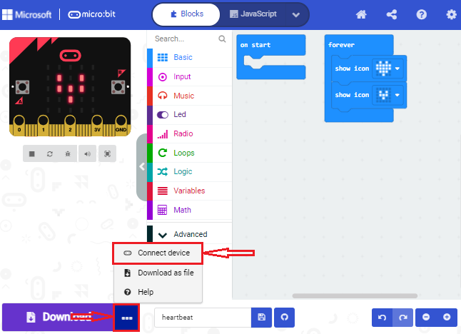

然后继续单击“Next”按钮。

再继续单击“Next”按钮。

在弹出窗口中选中对应的“设备”，然后单击“连接”按钮。
如果弹出窗口中没有设备，请参考以下内容：[https://makecode.microbit.org/device/usb/webusb/troubleshoot](https://makecode.microbit.org/device/usb/webusb/troubleshoot)

当然，如果你不想点击链接进入相关页面中查看，你也可以在本教程的文件夹中直接阅读“用WebUSB排除下载过程中的故障.pdf”。

如果你的micro:bit主板出现问题是需要更新micro:bit的固件，在本教程的文件夹“如何更新Micro:bit主板的固件”中的文件“如何更新micro:bit主板的固件.pdf”介绍了如何更新micro:bit的固件，其内容来自：[https://microbit.org/guide/firmware/](https://microbit.org/guide/firmware/)

单击“Done”，设备连接成功。

程序下载：

设备连接成功后，单击“下载”按钮，程序将直接下载到Micro:bit主板，如果程序成功下载到Micro:bit主板上，下载按钮会变成。

### 4.Makecode扩展库

为了轻松使用microbit智能家居，我们为microbit智能家居制作了一个makecode扩展库

#### 添加microbit智能家居扩展库

您可以通过以下方法添加microbit智能家居扩展库文件。

打开makecode，在任何项目下，先点击右上角的齿轮图标（设置），再点击扩展。

或者单击Advanced下的扩展。

在搜索框中输入链接：https://github.com/keyestudio2019/ks_IoT，然后单击搜索。

安装完成后，你可以在左侧找到DHT11/DHT22和I2C_LCD1602的扩展库，同时也下载安装了Neopixel扩展库。

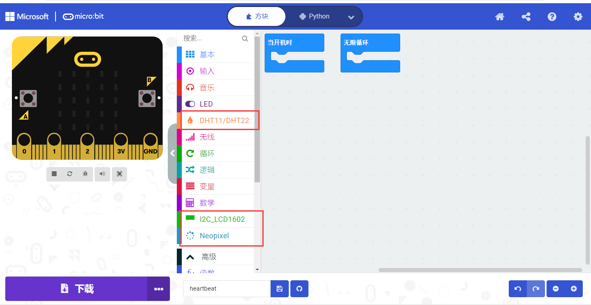

注意：添加到项目中的扩展库仅对该项目有效，而不会出现在其他项目中。
因此，当你创建新项目时，需要再次添加扩展库。

#### 更新或删除IoT_Keyestudiotudio扩展库： 

如果您需要更新或删除IoT_Keyestudiotudio扩展库文件，请按照以下说明进行操作。

点击 "Js JavaScript" 按钮切换到文本代码。

点击左边的Explorer.

在扩展列表中找到扩展库文件。单击垃圾箱图标以删除IoT_Keyestudio扩展库文件。单击刷新图标以更新IoT_Keyestudio扩展库文件。

### 5.资源和代码：

该工具包的资源和代码可以在下面链接下载：

下载链接：<https://pan.baidu.com/s/1VoQV70jyUUlfd9a5ruU0sQ>

提取码：kpsv

下载链接中内容如下：

### 6.导入代码：

我们为每个项目提供十六进制代码文件（项目文件）。十六进制代码文件包含项目的所有内容，可以直接导入，你也可以手动拖动代码块来完成每个项目的代码程序。如果选择通过手动拖动代码块来完成项目代码，则可能需要添加必要的扩展库。

对于简单项目，建议通过拖动代码块来完成项目。

对于复杂的项目，建议通过导入我们提供的十六进制代码文件来完成项目.

接下来，我们以“ Heatbeat”项目为例，介绍如何加载代码。

打开Web版本的makecode或Windows10 APP版本的makecode，单击“导入”。

在弹出的对话框中，单击“导入文件”。

选择文件“ ../Makecode 课程/Makecode代码/microbit基础课程/Project 1：Heart beat/Project 1\_ Heart beat.hex”。 然后点击“继续！√”

除了上述将提供的项目代码程序文件直接导入到Makecode编译器中的方法之外，也可以将我们提供的项目代码程序文件直接拖入到Makecode编译器中的代码编辑区，如下图所示：

几秒钟后，项目成功加载。

注意：如果你的电脑系统是Windows7/8而不是Windows 10，则在Google Chrome中是无法进行设备配对，从而读取不了一些传感器/模块的数字信号或模拟信号，可是又需要读取相应的传感器/模块的数字信号或模拟信号，那怎么办呢？这里就可以使用CoolTerm软件来读取串口数据的，下面是CoolTerm安装方法。

### 7.CoolTerm软件安装方法：

这里需要安装CoolTerm程序软件，CoolTerm程序软件是用来在下面的一些实验中读取串口通讯的，这里我们提供了CoolTerm程序软件的下载链接：<https://freeware.the-meiers.org/>

1.  现在，让我们来安装CoolTerm程序软件，这里我们是以PC     Windows系统为例，选择下载安装CoolTerm     Win，下载后解压并打开。（Mac系统和 Linux系统也类似）

（2）左键双击程序文件。（注意：必须保证micro:bit驱动已安装和micro:bit主板连接到电脑上）

该工具栏上的每个按钮的功能列出如下：

||打开一个新的终端机|
|-|-|
||打开保存的连接|
||保存|
||打开串行连接|
||关闭串行连接|
||清除接收到的数据|
||打开“连接选项”对话框|
||以十六进制格式显示终端数据|
||帮助|

## 3.2 micro:bit基础课程：

### Project 1: 闪烁心

1.实验介绍:

这个项目很简单，你可以用一个micro:bit主板、一根Micro USB线和电脑就可以实现的，首先在micro:bit LED点阵上显示一个大的“心”，然后显示小的“心”，这个循环看起来就像心跳。这也是一个入门实验，让你进入micro:bit的编程世界。

2.所需组件:

|  |  |
| ----------------------------------------------- | ------------------------------------------------ |
| Micro:bit主板*1                                 | Micro USB 线*1                                   |

3.实验接线:

通过micro USB线将micro:bit主板连接到你的电脑上。

4.示例代码:

根据下表路径加载代码 ，如下表格：

|文件类型|路径|文件名|
|-|-|-|
|Hex file|../Makecode 课程/Makecode代码/microbit基础课程/Project 1：Heart beat|Project 1：Heart beat.hex|

也可以自己通过拖动代码块来编写代码，
如果你不熟悉编码，别担心。首先，你可以输入这个链接:
[https://makecode.micro:bit.org/reference](https://makecode.microbit.org/reference)
来了解更多关于micro: bit blocks的信息。然后你可以直接进入链接：[https://makecode.micro:bit.org/](https://makecode.microbit.org/)
，编辑你的项目代码，如下：

寻找指令方块：

组合指令方块：

点击micro:
bit在线编程工具的“JSJavaScript”,你可以看到对应的JavaScript语言代码程序：

点击micro:
bit在线编程工具的“JSJavaScript”后面的下拉按钮，选择“Python”，你可以看到对应的Python语言代码程序：

5.实验现象:

按照之前的方式将示例代码下载到micro:bit主板，利用micro USB数据线上电，micro:bit主板上的LED点阵屏切换显示“❤”图案和“”图案，循环进行。
 
 

如果存在下载问题，请断开micro USB线和Micro:bit主板连接，然后重新连接它们并重新打开Makecode，以尝试再次下载。

### Project 2: 单个LED闪烁

1.  实验介绍:

在这个项目中，我们尝试控制micro:bit主板上的LED点阵中的某个LED闪烁效果。

2.所需组件:

|||
|-|-|
|Micro:bit主板*1|Micro USB 线*1|

3.实验接线:

通过micro USB线将micro:bit主板连接到你的电脑上。

4.元件介绍：

Micro:bit主板的LED点阵共由25个发光二极管组成，5个一组，分别对应X和Y方向，形成一个5×5的矩阵，且每个发光二极管是放置在行线（X）和列线（Y）的交叉点上，我们可以通过设置坐标点来实现对25个LED中某一个LED的控制。例如，想要LED点阵中第1行第1个LED点亮，可以设置坐标点为（0，0）；第1行第3个LED点亮，可以设置坐标点为（2，0）；第1列第5个LED点亮，可以设置坐标点为（0，4）；第3列第2个LED点亮，可以设置坐标点为（2，1），依此类推。

5.示例代码:

根据下表路径加载代码 ，如下表格：

|文件类型|路径|文件名|
|-|-|-|
|Hex file|../Makecode 课程/Makecode代码/microbit基础课程/Project 2：单个LED闪烁|Project 2：单个LED闪烁.hex|

也可以自己通过拖动代码块来编写代码，如下：

寻找指令方块：

组合指令方块：

6.实验现象:

按照之前的方式将示例代码下载到micro:bit主板，利用micro USB数据线上电，可以看到坐标点(1,0)的LED的闪烁，持续1s，接着切换到坐标点(3,4)的LED闪烁，持续1s。循环进行。

 
 

### Project 3: LED点阵显示

1.实验介绍:

点阵在我们生活中很常见，很多都有用到它，比如LED广告显示屏，电梯显示楼层，公交车报站等等。

Micro:bit主板的LED点阵共由25个发光二极管组成，上一课我们已经讲过通过设置坐标点来实现对LED点阵的25个LED中的某个LED的控制，这样可以通过设置多个坐标点控制多个LED的亮灭使得LED点阵能够显示图案、数字、字符串。我们也可以在特定代码中通过点击
LED点阵的灰白色小正方形点亮
LED点阵对应的LED来实现LED点阵显示图案、数字、字符串。除了上述方法还可以使用自定义图案使LED点阵显示图案。

2.所需组件:

|||
|-|-|
|Micro:bit主板*1|Micro USB 线*1|

3.实验接线:

通过micro USB线将micro:bit主板连接到你的电脑上。

4.示例代码:

根据下表路径加载代码 ，如下表格：

|文件类型|路径|文件名|
|-|-|-|
|Hex file|../Makecode 课程/Makecode代码/microbit基础课程/Project 3：LED点阵显示|Project 3：LED点阵显示.hex|

也可以自己通过拖动代码块来编写代码，如下：

寻找指令方块：

组合指令方块：

5.实验现象:

按照之前的方式将示例代码下载到micro:bit主板，利用micro USB数据线上电，我们就可以看到micro:bit主板的5×5 LED点阵开始显示数字1、2、3、4、5，然后循环显示“向下”图案、字符串“Hello!”、“心”图案、“东北”方向图案、“东南”方向图案、“西南”方向图案和“西北”方向图案！
 
 

### Project 4: 可编程按键

1.实验介绍:

按键可以控制电路的通断，把按键接入电路中，不按下按键的时候电路是断开的，一按下按键电路就通啦，但是松开之后就又断了。

Micro:bit主板有三个按键，反面的是复位按钮，正面的是两个可编程按键，通过对两个可编程按键组合可以有三种组合，作为输入元件。我们结合上节课的LED点阵，一起来学习按键吧。我们做一个按键三连，分别按A、B和AB同时按，对应显示屏分别显示A、B和AB。

2.所需组件:

|||
|-|-|
|Micro:bit主板*1|Micro USB 线*1|

3.实验接线:

通过micro USB线将micro:bit主板连接到你的电脑上。

4.示例代码1:

根据下表路径加载代码 ，如下表格：

|文件类型|路径|文件名|
|-|-|-|
|Hex file|../Makecode课程/Makecode代码/microbit基础课程/Project 4：可编程按键|Project 4：可编程按键-1.hex|

也可以自己通过拖动代码块来编写代码，如下：

寻找指令方块：

组合指令方块：

5.实验现象1:

按照之前的方式将示例代码1下载到micro:bit主板，利用micro USB数据线上电，按下micro:bit主板上正面按键A且松开，我们可以看到5×5 LED点阵显示字符“A”；按下micro:bit主板上正面按键B且松开，我们可以看到5×5 LED点阵显示字符“B”，同时按下micro:bit主板上正面按键A和B且都松开，我们就可以看到5×5 LED点阵显示字符“AB”。  
 

6.  示例代码2:

根据下表路径加载代码 ，如下表格：

|文件类型|路径|文件名|
|-|-|-|
|Hex file|../Makecode 课程/Makecode代码/microbit基础代码/Project 4：可编程按键|Project 4：可编程按键-2.hex|

也可以自己通过拖动代码块来编写代码，如下：

寻找指令方块：

组合指令方块：

7.实验现象2:

按照之前的方式将示例代码2下载到micro:bit主板，利用micro USB数据线上电，按下micro:bit
主板上正面按键A，增加条形图高度，表现为LED点阵亮的行数增加；按下正面按键B，减少条形图高度，表现为LED点阵亮的行数减少。
 
 

### Project 5: 温度检测

1.实验介绍:

本实验项目将介绍Micro:bit对外界温度的检测，micro:bit主板实际上并不带温度传感器，而是nNRF52833应用处理器内置的温度传感器进行温度检测，所以检测的温度更接近处理器的温度，可能与周围环境温度存在一定的误差。传感器检测范围为：-40℃~105℃。

2.所需组件:

|||
|-|-|
|Micro:bit主板*1|Micro USB 线*1|

3.实验接线:

通过micro USB线将micro:bit主板连接到你的电脑上。

4.示例代码1:

根据下表路径加载代码 ，如下表格：

|文件类型|路径|文件名|
|-|-|-|
|Hex file|../Makecode 课程/Makecode代码/microbit基础课程/Project 5：温度检测|Project 5：温度检测-1.hex|

也可以自己通过拖动代码块来编写代码，如下：

寻找指令方块：

组合指令方块：

5.实验现象1:

按照之前的方式将示例代码1下载至micro: bit主板，利用micro USB数据线上电，点击“显示控制台(设备)”按钮：    

显示串口输出数据，用手按住Micro:bit主板的nNRF52833应用处理器，一段时间后，温度开始慢慢上升，如下图所示：

如果你的电脑系统是Windows7/8而不是Windows 10，则在Google Chrome中是无法进行设备配对，这里需要使用CoolTerm软件来读取串口数字的。

打开CoolTerm软件，点击Options，选择SerialPort，设置COM口和波特率，波特率设置为115200（经过测试，micro:bit
主板的USB串口通讯波特率是115200），点击OK后，最后点击Connect。CoolTerm的串口监视器显示当前环境中的温度值变化，如下图：

6.示例代码2:

根据下表路径加载代码 ，如下表格：

|文件类型|路径|文件名|
|-|-|-|
|Hex file|../Makecode课程/Makecode代码/microbit基础课程/Project 5：温度检测|Project 5：温度检测-2.hex|

也可以自己通过拖动代码块来编写代码，如下：

寻找指令方块：

组合指令方块：
（注意：代码中的条件值35可以根据当地实际环境情况进行更改。）

7.实验结果2：

按照之前的方式将示例代码2下载到micro:bit主板，利用micro USB数据线上电，当外界环境中的温度小于35℃时，micro:bit主板上的LED点阵屏显示图案，用手按住micro:bit主板后面的温度传感器，当温度大于等于35℃时，LED点阵屏显示图案。
 
 

### Project 6: 地磁传感器

1.实验介绍：

本实验项目主要介绍micro:bit地磁传感器(磁力计)的使用，地磁传感器除了检测地磁场强度外，还能当作指南针确定方向，同时也是航姿参考系统(AHRS)的重要组成部分。micro:bit主板采用的是LSM303AGR地磁传感器，LSM303AGR包括支持标准、快速模式、快速模式plus和高速(100 kHz、400 kHz、1 MHz和3.4 MHz)的I2C串行总线接口和SPI串行标准接口与外部通信，磁场动态范围为±50 gauss。在micro:bit主板中，磁力检测、指南针积木块均用到了磁力计模块，本实验中，将先介绍指南针，然后查看磁力计原始数据。常见的指南针主要部件是一根磁针，在地磁场的作用下可以转动并指向地磁北极（地理南极附近），用来辨别方向。

注意：micro:bit主板内部的地磁传感器（磁力计、指南针），我们可以通过读取这个磁力计的读数来判断方位，得到相对于北磁极的数值，返回值是0到360之间的数值。在磁力计首次开始工作（带到新位置后）时系统会自动要求我们对micro:bit主板校准，正确的校准方式是旋转micro:bit主板。需要注意的是，附近要是有金属物件可能会影响读数和校准准确性。

2.所需组件:

|||
|-|-|
|Micro:bit主板*1|Micro USB 线*1|

3.实验接线:

通过micro USB线将micro:bit主板连接到你的电脑上。

4.示例代码1:

根据下表路径加载代码 ，如下表格：

|文件类型|路径|文件名|
|-|-|-|
|Hex file|../Makecode 课程/Makecode代码/microbit基础课程/Project 6：地磁传感器|Project 6：地磁传感器-1.hex|

也可以自己通过拖动代码块来编写代码，如下：

寻找指令方块：

组合指令方块：

代码说明：首先必须对micro:bit主板进行校准，因为每个地方地磁场不同，对结果有比较大的的影响，如果是第一次使用指南针，micro:bit主板会自动提示需要校准。

5.实验现象1：

按照之前的方式将示例代码1下载至micro: bit主板，micro USB数据线不要拔下来，利用micro USB数据线上电，按下micro:bit主板上正面按键A时，micro:bit主板首先提示校准，屏幕(LED点阵)提示:“TILT TO FILL SCREEN”,然后进入校准界面，校准方式为：旋转micro:bit主板，使得屏幕(LED点阵)画一个封闭的正方形（25个LED都点亮），如下图所示：

当封闭的正方形画好后，会显示一个“笑脸”图案，表示校准完成。校准完成后，按下按键A的时候，直接在屏幕上显示磁力计的读数，北、东、南、西对应0°、90°、180°、270°。
 
 

6.示例代码2:

根据下表路径加载代码 ，如下表格：

|文件类型|路径|文件名|
|Hex file|../Makecode 课程/Makecode 代码/microbit基础课程/Project 6：地磁传感器|Project 6：地磁传感器-2.hex|

这个模块意思是，在循环中，不断读取磁力计的读数，并根据读数范围判断所指方向，让箭头指向当前的地磁北极。

如图所示，如果读数在292.5和337.5之间，就让显示屏显示一个指向右上方的箭头，由于代码里不能输入0.5，所以取的判断数值是293和338。之后再加入其它逻辑判断条件，就得到了完整的代码。

也可以自己通过拖动代码块来编写项目代码，如下：

寻找指令方块：

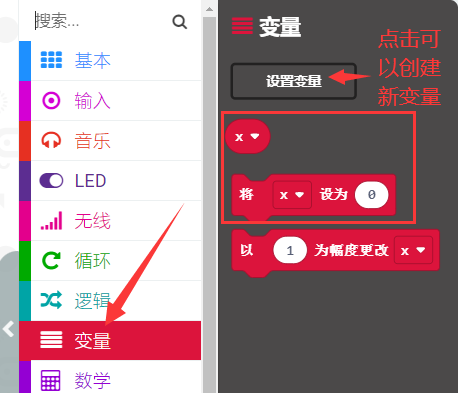

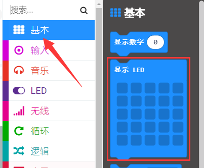

组合指令方块：

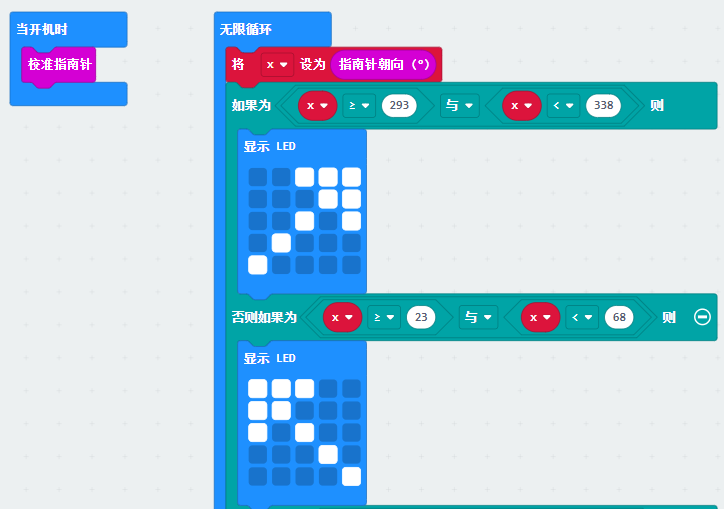

7.实验现象2:

按照之前的方式将示例代码2下载到micro:bit主板，利用micro USB数据线上电，提示校准（校准方法请参考:上面示例代码1部分），校准完成后，旋转micro:bit主板，可以看到micro:bit主板上LED点阵显示方向图案。
 
 

### Project 7: 加速度传感器

1.实验介绍:

micro:bit主板内置有LSM303AGR加速度传感器（加速度计），LSM303AGR包括支持标准、快速模式、快速模式plus和高速(100 kHz、400 kHz、1 MHz和3.4 MHz)的I2C串行总线接口和SPI串行标准接口与外部通信，8/10/12 bits的分辨率，可设置量程为±2g、±4g,、±8g。

当micro:bit主板处于静止或匀速运动状态时，加速度计仅检测到重力加速度；将micro:bit主板轻微甩动，加速度计检测到甩动的加速度远小于重力加速度，可忽略不计。因此，在使用micro:bit主板过程中，主要是检测当姿态变化时，重力加速度在x、y、z轴上的变化。

在本实验项目中，将介绍加速度传感器（加速度计）对几个特殊姿态的检测，之后来查看加速度传感器输出的三轴原始数据。

2.所需组件:

|||
|-|-|
|Micro:bit主板*1|Micro USB 线*1|

3.实验接线:

通过micro USB线将micro:bit主板连接到你的电脑上。

4.示例代码1:

根据下表路径加载代码 ，如下表格：

|文件类型|路径|文件名|
|-|-|-|
|Hex file|../Makecode 课程/Makecode代码/microbit基础课程/Project 7：加速度传感器|Project 7：加速度传感器-1.hex|

也可以自己通过拖动代码块来编写代码，如下：

寻找指令方块：

组合指令方块：

5.实验现象1:

按照之前的方式将示例代码1下载到micro:bit主板，利用micro USB数据线上电，将micro:bit主板晃动，则可见LED点阵显示数字1（表明只要有晃动，无论朝哪个方向晃动，该条件都将满足）。
 
 

当micro:bit主板的Logo朝上时，LED点阵显示数字2，Logo朝上示意图如下所示：

同理，micro:bit主板的Logo朝上时，LED点阵显示数字3(倒立的3)，Logo朝下示意图如下所示：

当屏幕朝上（指的是LED点阵朝上）时，LED点阵显示数字4。如下图所示：

同理，当屏幕朝下（指的是LED点阵朝下）时，LED点阵显示数字5。

当micro:bit主板向左倾斜（是指LED点阵先朝上，然后再往左边倾斜）时，LED点阵显示数字6。如下图所示：

同理，当micro:bit主板向右倾斜（是指LED点阵先朝上，然后再往右边倾斜）时，LED点阵显示数字7。如下图所示：

当不小心碰到micro:bit主板使其从桌面掉落，则为做自由落体运动，此时，micro:bit主板满足自由落体的条件，则LED点阵显示数字8。（注意：此方法操作时，很容易把micro:bit主板摔坏，不建议操作）

注意：（3g、6g、8g，
如果需要满足此条件，则需要达到3倍，6倍，8倍重力加速度甩动micro:bit主板。如果你们有兴趣的话，这部分代码可以自己添加）

6.示例代码2：

根据下表路径加载代码 ，如下表格：

|文件类型|路径|文件名|
|-|-|-|
|Hex file|../Makecode课程/Makecode代码/microbit基础课程/Project 7：加速度传感器|Project 7：加速度传感器-2.hex|

也可以自己通过拖动代码块来编写代码，如下：

寻找指令方块：

组合指令方块：

7.实验现象2：

按照之前的方式将示例代码2下载到micro:bit主板，利用micro USB数据线上电，点击“显示控制台(设备)”按钮：    

首先，查阅MMA8653FC数据手册，以及micro:bit主板的硬件原理图得知，micro:bit主板的加速度计坐标如下图所示：

显示出如下界面：分别显示了加速度在X轴，Y轴，Z轴的分解值，以及加速度的合成(重力加速度及其它外力作用的加速度合成):

如果你的电脑系统是Windows7/8而不是Windows 10，则在Google Chrome中是无法进行设备配对，这里需要使用CoolTerm软件来读取串口数字的。

打开CoolTerm，点击Options，选择SerialPort，设置COM口和波特率，波特率设置为115200（经过测试，micro:bit主板的USB串口通讯波特率是115200），点击OK后，最后点击Connect。CoolTerm串口监视器分别显示了加速度在X轴、Y轴、Z轴的分解，以及加速度的合成(重力加速度及其它外力作用的加速度合成)，可得数据变化如下图：

### Project 8: 光照强度检测

1.实验介绍:

本实验项目将介绍micro:bit主板对外界光照强度的检测，由于micro:bit主板并不自带光敏传感器，对外界光照强度的检测是通过micro:bit主板上的LED点阵屏进行的，LED点阵被用来感知周围的光，并反复地将LED转换成输入，并采样电压衰减时间，这样检测出来的光照强度是一个相对值。（注意：将光线亮度级别输出至串口，输出的是一个相对值。）

2.所需组件:

|||
|-|-|
|Micro:bit主板*1|Micro USB 线*1|

3.实验接线:

通过micro USB线将micro:bit主板连接到你的电脑上。

4.示例代码:

根据下表路径加载代码 ，如下表格：

|文件类型|路径|文件名|
|-|-|-|
|Hex file|../Makecode课程/Makecode代码/microbit基础课程/Project 8：光照强度检测|Project 8：光照强度检测.hex|

也可以自己通过拖动代码块来编写代码，如下：

寻找指令方块：

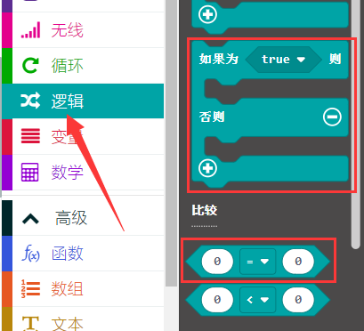

组合指令方块：

5.  实验现象:

按照之前的方式将示例代码下载到micro:bit主板，利用micro USB数据线上电，点击“显示控制台(设备)”按钮：    

显示串口输出数据，用手全部遮住micro:bit
主板的LED点阵，光线亮度级别约为0；然后将micro:bit主板的LED点阵放置于光照下，随着光照强度增强，亮度级别值也在逐渐增大。如下图所示：

代码中的20是一个随意设置的光照强度级别值，如果当前光照强度级别小于等于20，月亮就会出现在micro:bit主板的LED点阵上。如果大于20时，太阳就会出现。

如果你的电脑系统是Windows7/8而不是Windows 10，则在Google Chrome中是无法进行设备配对，这里需要使用CoolTerm软件来读取串口数字的。

打开CoolTerm，点击Options，选择SerialPort，设置COM口和波特率，波特率设置为115200（经过测试，micro:bit主板的USB串口通讯波特率是115200），点击OK后，最后点击Connect。这样，CoolTerm串口监视器显示光线亮度级别值。

### Project 9: 扬声器

1.  实验介绍：

micro:bit主板有内置扬声器，这使得在你的项目中添加声音变得非常容易。任何micro:bit主板都可以与扬声器一起工作创作声音项目，但有了新款的micro:bit主板，你也可以用一些新的声音来表达自己：让你的micro:bit主板的扬声器发出咯咯笑，问候你，或者让你知道它在打哈欠或悲伤等等。你也可以编写一首歌曲，你的micro:bit主板可以通过编程制作各种各样的声音——从单个音符、音调和节拍到你自己的音乐作品，例如：歌曲《欢乐颂》，让扬声器播放出来。

你也可以关闭micro:bit主板内置的扬声器，声音仍然会从引脚出来，所以你仍然可以享受连接在GND和P0的耳机播放出的优美音乐，在MakeCode中，则需要使用“关闭内置扬声器”的音乐块关闭micro:bit主板内置的扬声器。

2.所需组件:

|||
|-|-|
|Micro:bit主板*1|Micro USB 线*1|

3.实验接线:

通过micro USB线将micro:bit主板连接到你的电脑上。

4.示例代码1:

根据下表路径加载代码 ，如下表格：

|文件类型|路径|文件名|
|-|-|-|
|Hex file|../Makecode课程/Makecode代码/microbit基础课程/Project 9：扬声器|Project 9：扬声器-1.hex|

也可以自己通过拖动代码块来编写代码，如下：

寻找指令方块：

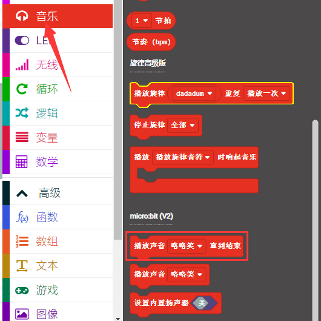

组合指令方块：

5.实验现象1:

按照之前的方式将示例代码1下载到micro:bit主板，利用micro USB数据线上电，micro:bit主板上的扬声器发出声音且LED点阵显示音乐标志图案。
 
 

6.示例代码2:

根据下表路径加载代码 ，如下表格：

|文件类型|路径|文件名|
|-|-|-|
|Hex file|../Makecode课程/Makecode代码/microbit基础课程/Project 9：扬声器|Project 9：扬声器-2.hex|

也可以自己通过拖动代码块来编写代码，如下：

寻找指令方块：

组合指令方块：

歌曲《欢乐颂》的简谱如下：

更多音乐简谱知识的相关链接：[https://en.wikipedia.org/wiki/Numbered_musical_notation](https://en.wikipedia.org/wiki/Numbered_musical_notation)

7.  实验现象2:

按照之前的方式将示例代码2下载到micro:bit主板，利用micro USB数据线上电，micro:bit主板上的内置扬声器播放一首《欢乐颂》歌曲。
 
 

### Project 10: 触摸感应logo

1.  实验介绍：

如果你有了新款的micro:bit主板，你可以在你的项目中使用金色的触摸感应logo作为另一个输入，这就像多了一个按钮。触摸感应采用的是电容式触摸传感器，当你手指按下（或触摸）它时，它就能感应到电场的微小变化----就像你的手机或平板电脑屏幕一样。当你像按按钮一样按下它时，你可以在程序中触发事件。

2.所需组件:

|||
|-|-|
|Micro:bit主板*1|Micro USB 线*1|

3.实验接线:

通过micro USB线将micro:bit主板连接到你的电脑上。

4.示例代码:

根据下表路径加载代码 ，如下表格：

|文件类型|路径|文件名|
|-|-|-|
|Hex file|../Makecode课程/Makecode代码/microbit基础课程/Project 10：触摸感应LOGO|Project 10：触摸感应LOGO.hex|

也可以自己通过拖动代码块来编写代码，如下：

寻找指令方块：

组合指令方块：

5.实验现象:

按照之前的方式将示例代码下载到micro:bit主板，利用micro USB数据线上电，手指按住micro:bit主板上“Logo”标志处，micro:bit主板上的LED点阵显示“❤”图案；手指松开micro:bit主板上“Logo”标志处，会出现数字，手指按得时间越久在松开，出现的数字越大。

### Project 11: 麦克风

1.实验介绍：

micro:bit主板有一个内置麦克风，它可以对嘈杂和安静的声音做出反应，也可以测量环境的嘈杂程度。你可以使用它作为一个简单的输入---当你鼓掌时，micro:bit主板上前面内置麦克风LED指示灯会被打开。它还可以测量声音的强度，所以你可以制作一个噪音等级表或与音乐合拍的迪斯科灯光。麦克风是在新款的micro:bit主板的背面，而在前面，你会发现一个内置麦克风LED指示灯，还有紧挨着让声音进入麦克风的孔。当你的micro:bit主板在测量声音级别时，它就会亮起来。

2.所需组件:

|||
|-|-|
|Micro:bit主板*1|Micro USB 线*1|

3.实验接线:

通过micro USB线将micro:bit主板连接到你的电脑上。

4.示例代码1:

根据下表路径加载代码 ，如下表格：

|文件类型|路径|文件名|
|-|-|-|
|Hex file|../Makecode课程/Makecode代码/microbit基础课程/Project 11：麦克风|Project 11：麦克风-1.hex|

也可以自己通过拖动代码块来编写代码，如下：

寻找指令方块：

组合指令方块：

5.实验现象1：

按照之前的方式将示例代码1下载到micro:bit主板，利用micro USB数据线上电，当你鼓掌时，micro:bit主板上的LED点阵显示“❤”图案；当外界环境安静时，micro:bit主板上的LED点阵显示“”图案。
 
 

6.  示例代码2:

根据下表路径加载代码 ，如下表格：

|文件类型|路径|文件名|
|-|-|-|
|Hex file|../Makecode课程/Makecode代码/microbit基础课程/Project 11：麦克风|Project 11：麦克风-2.hex|

也可以自己通过拖动代码块来编写代码，如下：

寻找指令方块：

组合指令方块：

7.  实验现象2：

按照之前的方式将示例代码2下载到micro:bit主板，利用micro USB数据线上电，点击“显示控制台(设备)”按钮：    

显示串口输出数据，当外界环境的声音增大时，串口输出的声音级别值也增大，如下图所示：

并且，当你按下micro:bit主板上的A键时，micro:bit主板上的LED点阵显示检测到的此时环境中最大声音级别值（这里需要注意：通过按micro:bit背面的重置按钮重置最大值。）；当鼓掌时，LED点阵显示声音级别大小图案。

### Project 12: 触摸Logo控制扬声器

1.实验介绍:

前面的实验项目中已经学习过microbit板上的金色logo工作原理及控制方法和扬声器发生的原理。在本项目中，我们将金色logo和扬声器相结合，通过触摸金色logo，扬声器播放音乐。

2.所需组件:

|||
|-|-|
|Micro:bit主板*1|Micro USB 线*1|

3.实验接线:

通过micro USB线将micro:bit主板连接到你的电脑上。

4.示例代码:

根据下表路径加载代码 ，如下表格：

|文件类型|路径|文件名|
|-|-|-|
|Hex file|../Makecode课程/Makecode代码/microbit基础课程/Project 12:触摸Logo控制扬声器|Project 12：触摸Logo控制扬声器.hex|

也可以自己通过拖动代码块来编写代码，如下：

寻找指令方块：

组合指令方块：

5.实验现象：

按照之前的方式将示例代码下载到micro:bit主板，利用micro USB数据线上电，当手触摸金色Logo时，micro:bit主板上的扬声器一首“生日歌”。
 
 

### Project 13: 躲子弹游戏

1.实验介绍:

前面的实验项目中已经学习过micro:bit主板上按键的工作原理及控制方法，在本项目中，将继续学习按键的控制方法，按键A和B与LED点阵屏相结合，使用按键A和B设计躲子弹游戏。

2.所需组件:

|||
|-|-|
|Micro:bit主板*1|Micro USB 线*1|

3.实验接线:

通过micro USB线将micro:bit主板连接到你的电脑上。

4.游戏玩法1：

子弹从LED点阵屏上面掉下来（一共有两颗子弹，分别是G1和G2），LED点阵屏最底下有一个角色G，用按键A和B控制角色G左右移动躲避子弹，当按键A按下时，角色G向左移动；当按键B按下时，角色G向右移动。如果角色G没有躲过子弹G1或G2，游戏结束。再同时按下按键A和B，游戏又重新开始。

5.示例代码1：

根据下表路径加载代码 ，如下表格：

|文件类型|路径|文件名|
|-|-|-|
|Hex file|../Makecode课程/Makecode代码/microbit基础课程/Project 13：躲子弹游戏|Project 13：躲子弹游戏-1.hex|

也可以自己通过拖动代码块来编写代码，如下：

寻找指令方块：

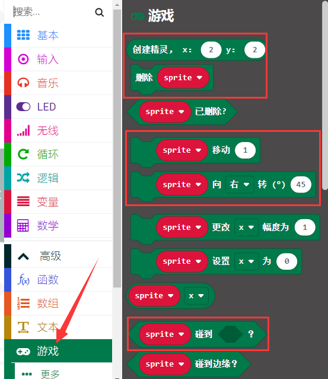

组合指令方块：

6.实验现象1：

按照之前的方式将示例代码1下载到micro:bit主板，这样，游戏开始，子弹从上面掉下来，按键A和B控制角色G左右移动躲避子弹，如果角色G没有躲过子弹，游戏结束。

7.游戏玩法2：

在游戏玩法1中加入了得分，并且随着得分的增加，难度也会逐渐增加。当角色G每躲过一颗子弹，得分加1，当角色G遇到子弹时，游戏暂停，显示分数，再结束游戏。然后同时按下按键A和B，游戏又重新开始。

8.示例代码2：

根据下表路径加载代码 ，如下表格：

|文件类型|路径|文件名|
|-|-|-|
|Hex file|../Makecode课程/Makecode代码/microbit基础课程/Project 13：躲子弹游戏|Project 13：躲子弹游戏-2.hex|

也可以自己通过拖动代码块来编写代码，如下：

寻找指令方块：

组合指令方块：

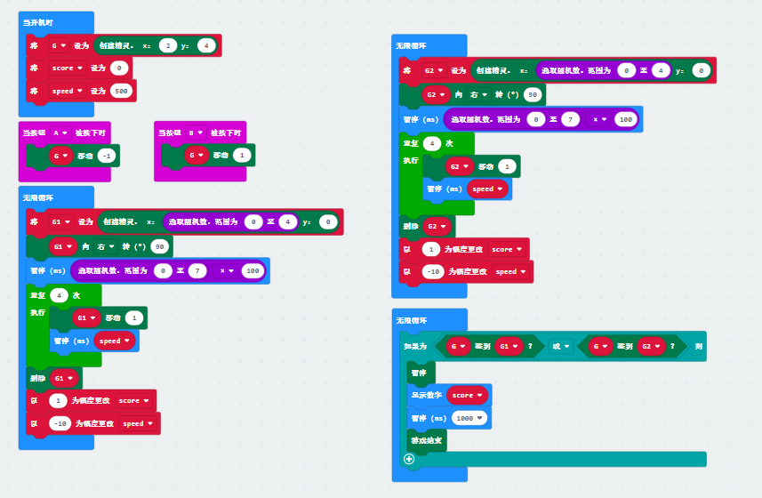

9.实验现象2：

按照以前的方式将示例代码2下载到micro:bit主板，这样，游戏开始，子弹从上面掉下来，按键A和B控制角色G左右移动躲避子弹，当角色G每躲过一颗子弹，得分加1，当角色G遇到子弹时，游戏暂停，显示分数，再结束游戏。

### Project 14: micro:bit的蓝牙无线通信

1.实验介绍：

micro:bit主板自带了[nRF52833](https://www.nordicsemi.com/Products/Low-power-short-range-wireless/nRF52833)处理器（内置蓝牙5.1低功耗的BLE(Bluetooth Low Energy)设备）以及2.4GHz天线，可进行蓝牙无线通信和2.4GHz无线通信。使得micro:bit主板可以与各种蓝牙设备进行通信，包括智能手机和平板电脑。

在本实验中，主要讲解micro:bit主板实现蓝牙无线通信功能，我们可以通过连接蓝牙，实现无线传输代码（信号）功能。我们利用一个苹果系统设备（手机/iPad）和micro:bit主板连接，实现无线传输功能。设置安卓系统手机实现无线传输方法和苹果系统设备（手机/iPad）类似，这里就不一一介绍了。

2.所需组件:

||||
|-|-|-|
|Micro:bit主板*1|Micro USB 线*1|智能手机/IPad*1|

3.实验接线:

通过micro USB线将micro:bit主板连接到你的电脑上。

4.实验步骤：

（1）如果你的智能手机/iPad是苹果系统的，需要先在电脑上进入网页：

<https://www.microbit.org/get-started/user-guide/ble-ios/>
，往下翻点击“Download pairing HEX file”下载micro:bit的固件到创建的文件夹中或电脑桌面上，并将下载好的micro:bit固件烧入micro:bit主板中。（这一步只针对于苹果系统的智能手机/iPad，安卓系统智能手机/不需要这一步）

（2）在苹果系统设备（手机/iPad）上打开，在App Store的搜索框中输入“micro bit”，然后选中micro:bit
选项，会出现下载界面（如下图所示：），点击“”，就可以下载安装对应的APP。

（3）苹果系统设备（手机/iPad）和micro:bit主板配对连接。

打开苹果系统设备（手机/iPad）上的蓝牙。

APP安装成功后，点击打开APP，先确定micro USB数据线已经将micro:bit主板和电脑连接上，再点击APP的第一项“Choose micro:bit”，开始配对蓝牙。

1.  点击配对一个新的micro:bit，开始配对。

2.  根据提示，首先同时按住micro:bit主板上的按键A和B，然后按下micro:bit主板后面的复位&电源按钮几秒钟（按键A和B不能松开），再松开复位&电源按钮，micro:bit主板上LED点阵会显示一个密码图案。最后松开micro：bit主板上的按键A和B，接着点击“下一步”。

3.  在苹果系统手机/iPad上设置密码图案，使图案和micro:bit主板上显示的密码图案一样，点击“下一步”。

4.  点击“下一步”，出现对话框，在对话框中点击“Pair”。几秒钟后，配对成功，同时micro:bit主板上的LED点阵显示“√”图案。

（3）蓝牙配对成功后，开始利用APP编写代码，并上传代码。

a.点击第二项“Create Code”，进入编程界面，开始编写代码程序。（点击，出现对话框，在对话框中直接点击“Create
√”后就进入编程界面）

b\.
将代码程序项目名称设置为“1”，点击保存图案“”，保存代码程序。

c\.
项目代码程序保存成功后，点击第三项“Flash”进入上传代码程序界面。默认选择代码程序是刚刚保存的项目名称为“1”的代码程序，然后点击“Flash”上传代码程序“1”。

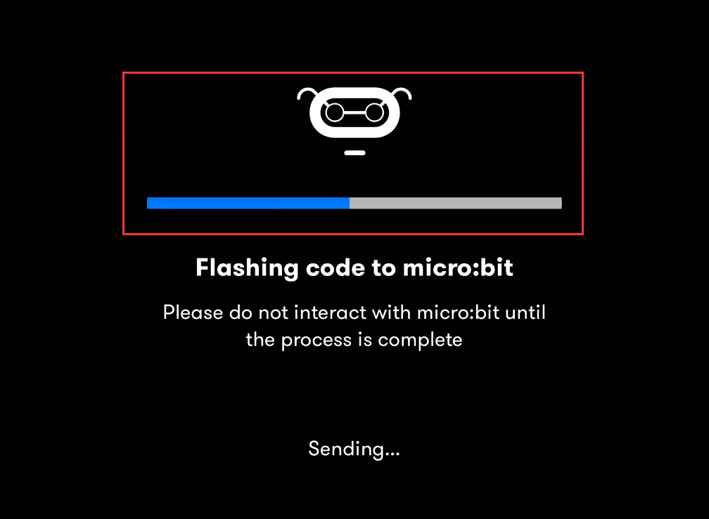

d.几秒钟后，代码程序“1”上传成功，会显示如下图。然后micro:bit主板上的LED点阵显示跳跃的“心”对应图案。

## micro:bit扩展课程：

前面已经学习了micro:bit基础课程，现在，让我们直接进入micro:bit拓展课程项目。在这个套件中，包括14个传感器和模块。我们将从简单的传感器和模块入手，让你深入了解micro:bit智能家居功能。但是，如果你对micro:bit相关知识和各传感器/模块相关知识都掌握的很好。你可以跳过这些步骤，直接跳到最后一课实验项目实现micro:bit蓝牙控制micro:bit智能家居多功能效果。

注意：本项目中的各传感器/模块上标有（G）表示负极，是连接到控制板或传感器扩展板上的G或-或GND；标有（V）表示正极，是连接到控制板或传感器扩展板上的V或VCC或+或5V，在烧入程序后需要接通外接电源，否则可能供电不足导致无效。

### Project 1：LED闪烁

1.  实验介绍：

前面我们已经组装好了microbit智能家居。接下来的项目我们就要由简单到复杂，一步一步探索micro:bit的世界了。首先我们要来完成经典的“micro:bit点亮LED”，也就是Blink项目。Blink对于学习micro:bit的爱好者而言，是最基础的项目，也是新手必须经历的一个练习。

LED，即发光二极管的简称。由含镓（Ga）、砷（As）、磷（P）、氮（N）等的[化合物](https://baike.baidu.com/item/%E5%8C%96%E5%90%88%E7%89%A9/1142931)制成。当电子与[空穴](https://baike.baidu.com/item/%E7%A9%BA%E7%A9%B4/3517781)复合时能辐射出可见光，因而可以用来制成发光二极管。在电路及仪器中作为指示灯，或者组成文字或数字显示。砷化镓二极管发红光，磷化镓二极管发绿光，碳化硅二极管发黄光，氮化镓二极管发蓝光。因化学性质又分有机发光二极管OLED和无机发光二极管LED。

为了实验的方便，我们将LED发光二极管做成了一个LED模块，在这个项目中，我们用一个最基本的测试代码来控制LED，亮一秒钟，灭一秒钟，来实现闪烁的效果。你可以改变代码中LED灯亮灭的时间，实现不同的闪烁效果。LED模块信号端S为高电平时LED亮起，S为低电平时LED熄灭。

2.黄色LED模块的规格参数：

|工作电压:|DC 3.3-5V|
|-|-|
|工作电流：|&lt; 20mA|
|最大功率：|0.1W|
|控制接口:|数字口（数字输入）|
|工作温度：|-10°C ~ +50°C|
|LED显示颜色：|黄色|

3.示例代码：

根据下表路径加载代码 ，如下表格：

|文件类型|路径|文件名|
|-|-|-|
|Hex file|../Makecode课程/Makecode代码/microbit扩展课程/Project 1：LED闪烁|Project 1：LED闪烁.hex|

也可以自己通过拖动代码块来编写代码，如下：

寻找指令方块：

组合指令方块：

|Microbit扩展板|黄色LED模块|
|-|-|
|GND|G|
|5V|V|
|S（16）|S|

4.实验现象：

按照之前的方式将示例代码上传到micro:bit主板，上传成功后，外接电源供电，将扩展板上的拨码开关拨到ON端，再将船型开关上的“1”端按下，micro:bit主板上的LED点阵显示“笑脸”图案，同时黄色LED亮1000毫秒，灭1000毫秒，循环交替。

### Project 2：LED亮度调节

1.实验介绍：

前面课程中，我们详细的介绍了通过测试代码控制LED亮灭，实现闪烁的效果。这节课我们使用PWM来控制LED亮度不断地变化，模拟我们呼吸的效果。

PWM是使用数字手段来控制模拟输出的一种手段。使用数字控制产生占空比不同的方波（一个不停在高电平与低电平之间切换的信号)来控制模拟输出。一般来说端口的输出电压只有两个0V与3V。如果想要改变灯的亮度怎么办呢个？有同学说串联电阻，对，这个方法是正确的。但是，如果想要得到不同的亮度，且在不同亮度之间来回变动怎么办呢？不可能不停地切换电阻吧。这种情况下就需要使用PWM了，那它是怎么控制的呢？

对于micro:bit的数字端口电压输出只有LOW与HIGH两个，对应的就是0V与3V的电压输出，可以把LOW定义为0，HIGH定义为1，1秒内让micro:bit输出500个0或者1的信号。如果这500个全部为1，那就是完整的3V，如果全部为0，那就是0V。如果010101010101这样输出，刚好一半，端口输出的平均电压就为1.5V了。这个和放映电影是一个道理，咱们所看的电影并不是完全连续的，它其实是每秒输出25张图片。在这种情况下，人的肉眼是分辨不出来的，看上去就是连续的了。PWM也是同样的道理，如果想要不同的电压，就控制0与1的输出比例控制就可以了。当然这和真实的连续输出还是有差别的，单位时间内输出的0,1信号越多，控制的就越精确。（输出电压=（开启时间/脉冲时间）\*最大电压值）

在下图中，绿线之间代表一个周期，其值也是PWM频率的倒数。换句话说，如果micro:bit的PWM频率是500Hz，那么两绿线之间的周期就是2毫秒。
analogWrite()
命令中可以操控的范围为0-255，analogWrite(255)表示100%占空比（常开），analogWrite(127)占空比大约为50%（一半的时间）。

脉冲宽度调制（PWM）有多种应用：灯亮度调节、电机调速、发声等。
以下是PMW的四个基本参数：

（1）脉冲宽度的振幅（最小/最大）

（2）脉冲周期（1秒内脉冲频率的倒数）

（3）电压水平（如：0V-3V）

（4）micro:bit主板上有6个常用的PMW接口，即P0、P1、P2、P3、P4和P10。还有13个不常用的PMW接口，即P5、P6、P7、P8、P9、P11、P12、P13、P14、P15、P16、P19和P20。

实验中，我们将黄色LED模块的信号端S接到microbit扩展板上的S（16），从micro:bit主板引脚说明我们知道P16还可以当做PWM接口。我们通过P16引脚控制外接LED亮度，先是逐渐变亮，然后是逐渐变暗，循环交替，模拟人体呼吸现象。

2.黄色LED模块的规格参数：

|工作电压:|DC 3.3-5V|
|-|-|
|工作电流：|&lt; 20mA|
|最大功率：|0.1W|
|控制接口:|数字口（数字输入）|
|工作温度：|-10°C ~ +50°C|
|LED显示颜色：|黄色|

3.示例代码：

根据下表路径加载代码 ，如下表格：

|文件类型|路径|文件名|
|-|-|-|
|Hex file|../Makecode课程/Makecode代码/microbit扩展课程/Project 2：呼吸灯|Project 2：呼吸灯.hex|

也可以自己通过拖动代码块来编写代码，如下：

寻找指令方块：

组合指令方块：

|Microbit扩展板|黄色LED模块|
|-|-|
|GND|G|
|5V|V|
|S（16）|S|

4.实验现象：

按照之前的方式将示例代码上传到micro:bit主板，上传成功后，外接电源供电，将扩展板上的拨码开关拨到ON端，再将船型开关上的“1”端按下，micro:bit主板上的LED点阵显示“笑脸”图案，同时可以看到黄色LED会有个逐渐由亮到灭的一个缓慢过程，而不是直接的亮灭，如同呼吸一般，均匀变化。循环交替。

### Project 3：6812 2x2全彩RGB

1.实验介绍：

6812 2x2
全彩RGB模块是一个集控制电路与发光电路于一体的智能外控LED光源。每个LED原件其外型与一个5050LED灯珠相同，每个元件即为一个像素点。像素点内部包含了智能数字接口数据锁存信号整形放大驱动电路，还包含有高精度的内部振荡器和12V高压可编程定电流控制部分，有效保证了像素点光的颜色高度一致。

数据协议采用单线归零码的通讯方式，像素点在上电复位以后，S端接受从控制器传输过来的数据，首先送过来的24bit数据被第一个像素点提取后，送到像素点内部的数据锁存器。LED具有低电压驱动，环保节能，亮度高，散射角度大，一致性好，超低功率，超长寿命等优点。

2.6812 2x2全彩RGB的规格参数：

|工作电压：|DC 3.3-5V|最大工作电流：|200mA|最大功率:|1W|
|-|-|-|-|-|-|
|工作温度：|-10℃~+50℃|光源：|SMD 5050 RGB|IC型号：|4颗/WS2811|
|灰度等级：|256级|发光角度：|180°|发光颜色:|可以通过控制器调为红，黄，蓝，绿，白等|

3.添加库文件

(注意：如果直接使用资料的代码则不用添加库文件，直接将代码文件拖进makecode软件里即可，如果需要自己编写代码则需要添加库文件)

1.  添加IoT_Keyestudio的库文件，添加方法如下:

利用库文件设置代码，在下图模块添加库文件，点击“扩展”。

（2）在搜索框中输入链接：https://github.com/keyestudio2019/ks_IoT，然后单击搜索并搜索，显示如下图，点击”IoT_Keyestudio“库文件，这样IoT_Keyestudio库就下载并安装好了，NeoPixel库文件包含在IoT_Keyestudio库中。

（3）在模块区域就可以看到对应的NeoPixel相关模块。

4.示例代码1：

根据下表路径加载代码，如下表格：

|文件类型|路径|文件名|
|-|-|-|
|Hex file|../Makecode课程/Makecode代码/microbit扩展课程/Project 3: 6812 2x2全彩RGB|Project 3：6812 2x2全彩RGB-1.hex|

也可以自己通过拖动代码块来编写代码，如下：

寻找指令方块：

组合指令方块：

|Microbit扩展板|6812 2x2全彩RGB模块|
|-|-|
|GND|G|
|5V|V|
|S（14）|S|

5.实验现象1:

按照之前的方式将示例代码1上传到micro:bit主板，上传成功后，外接电源供电，将扩展板上的拨码开关拨到ON端，再将船型开关上的“1”端按下，可以看到6812 2x2
全彩RGB模块上的4个WS2812RGB灯全亮，且颜色依次红、橙、黄、绿、蓝、靛蓝、紫罗兰、紫、白，循环进行。

6.示例代码2:

根据下表路径加载代码，如下表格：

|文件类型|路径|文件名|
|-|-|-|
|Hex file|../Makecode课程/Makecode代码/microbit扩展课程/Project 3：6812 2x2全彩RGB|Project 3：6812 2x2全彩RGB-2.hex|

也可以自己通过拖动代码块来编写代码，如下：

寻找指令方块：

组合指令方块：

7.实验现象2:

按照之前的方式将示例代码2上传到micro:bit主板，上传成功后，外接电源供电，将扩展板上的拨码开关拨到ON端，再将船型开关上的“1”端按下，可以看到6812 2x2
全彩RGB模块上的4个WS2812RGB灯以流水灯的形式点亮，一圈一种颜色，循环。

8.示例代码3:

根据下表路径加载代码，如下表格：

|文件类型|路径|文件名|
|-|-|-|
|Hex file|../Makecode课程/Makecode代码/microbit扩展课程/Project 3：6812 2x2全彩RGB|Project 3：6812 2x2全彩RGB-3.hex|

也可以自己通过拖动代码块来编写代码，如下：

寻找指令方块：

组合指令方块：

9.实验现象3:

按照之前的方式将示例代码3上传到micro:bit主板，上传成功后，外接电源供电，将扩展板上的拨码开关拨到ON端，再将船型开关上的“1”端按下，可以看到6812 2x2
全彩RGB模块上的5个WS2812RGB灯以流水灯的形式点亮，每个灯亮起都是一种随机颜色，循环。

### Project 4：人体红外热释电传感器

1.实验介绍：

人体红外热释电传感器是一款基于热释电效应的人体热释电红外运动传感器，能检测运动的人体或动物身上发出的红外信号，配合菲涅尔透镜能使传感器探测范围更远更广。它主要采用RE200B-P传感器元件，当附近有人或动物运动时，人体红外热释电传感器能根据检测到的红外线，将红外线信号转化为数字信号并输出一个高电平。它可以应用于多种场合来检测人体的运动。传统的热释电红外传感器体积大，电路复杂，可靠性低。

现在我们推出这款一款新的热释电红外运动传感器，该传感器集成了数字热释电红外传感器和连接管脚。具有灵敏度高、可靠性强、超低功耗，体积小、重量轻，超低电压工作模式和外围电路简单等特点。

2.人体红外热释电传感器的规格参数：

|工作电压：|DC 4.5-6.5V|
|-|-|
|最大工作电流：|50MA|
|静态电流:|&lt;50uA|
|控制接口：|数字输出(高电平为3.3V，低电平0V)|
|控制信号：|数字信号1/0|
|工作温度：|-10 ~ 50 ℃|
|最大探测距离：|4米|
|感应角度：|＜100°锥角|
|触发方式:|L 不可重复触发/H 重复触发|

特别说明：

（1）测试过程中最大距离为4米。

（2）测试时，首先打开白色镜头，可以看到矩形感应部分。当矩形传感部分的长线与地面平行时，距离最好。

（3）测试时，传感器需要覆盖白色镜片，否则会影响距离。

（4）在25℃时检测距离最好，超过30℃时检测距离缩短。

（5）启动并上传完代码后，您需要等待5~10秒，然后开始测试，否则不敏感。

3.示例代码：

根据下表路径加载代码，如下表格：

|文件类型|路径|文件名|
|-|-|-|
|Hex file|../Makecode课程/Makecode代码/microbit扩展课程/Project 4：人体红外热释电传感器|Project 4：人体红外热释电传感器.hex|

也可以自己通过拖动代码块来编写代码，如下：

寻找指令方块：

组合指令方块：

|Microbit扩展板|人体红外热释电传感器|
|-|-|
|GND|G|
|5V|V|
|S（15）|S|

5.实验现象:

按照之前的方式将示例代码下载到micro:bit主板，利用micro USB数据线上电，并且外接电源供电，将扩展板上的拨码开关拨到ON端，再将船型开关上的“1”端按下。这样，microbit主板上的LED点阵屏显示“笑脸”图案，同时点击“显示控制台(设备)”按钮：

显示串口输出数据，当人体红外热释电传感器检测到附近有人运动时，串口输出数字信号1（高电平），且模块上的指示灯不亮；否则，当人体红外热释电传感器未检测到附近有人运动时，串口输出数字信号0（低电平），且模块上的指示灯点亮。如下图所示：

如果你的电脑系统是Windows7/8而不是Windows 10，则在Google Chrome中是无法进行设备配对，这里需要使用CoolTerm软件来读取串口数字的。

打开CoolTerm，点击Options，选择SerialPort，设置COM口和波特率，波特率设置为115200（经过测试，micro:bit主板的USB串口通讯波特率是115200），点击OK后，最后点击Connect。当人体红外热释电传感器检测到附近有人运动时，串口输出数字信号1（高电平），且模块上的指示灯不亮；否则，当人体红外热释电传感器未检测到附近有人运动时，串口输出数字信号0（低电平），且模块上的指示灯点亮。可得数据变化如下图：

### Project 5：感应灯

1.实验介绍：

在前面的项目实验中，我们已经了解了人体红外热释电传感器的工作原理及其控制方法。在本项目实验中，我们结合人体红外热释电传感器和黄色LED，通过人体红外热释电传感器来控制LED的亮、灭，模拟生活中的感应灯。

2.示例代码：

根据下表路径加载代码，如下表格：

|文件类型|路径|文件名|
|-|-|-|
|Hex file|../Makecode课程/Makecode代码/microbit扩展课程/Project 5：感应灯|Project 5：感应灯.hex|

也可以自己通过拖动代码块来编写代码，如下：

寻找指令方块：

3.实验现象：

按照之前的方式将示例代码下载到micro:bit
主板，外接电源供电，并将扩展板上的拨码开关拨到ON端，再将船型开关上的“1”端按下。microbit主板上的LED点阵屏显示“笑脸”图案。当人体红外热释电传感器检测到附近有人运动时，黄色LED灯点亮；否则，当人体红外热释电传感器未检测到附近有人运动时，黄色LED灯熄灭。

### Project 6：舵机角度调节

1.实验介绍：

当我们在制作智能家居时，经常会将舵机和门、窗等固定在一起。这样，我们就可以利用舵机转动，带动门、窗等开或关，从而起到家居生活的智能化功能。在这课程中我们着重介绍下智能家居套件中的舵机的原理和使用方法。

舵机是一种位置伺服的驱动器，主要是由外壳、电路板、无核心马达、齿轮与位置检测器所构成。与马达不同，我们一般控制马达的转速和方向。而舵机更多的是控制指定的角度。常用的舵机可旋转的角度范围是0°到180°。舵机引线为3线，分别用棕、红、橙三种颜色进行区分，舵机品牌和生产厂家不同，会有些许差异，使用之前需查看资料。我们使用的是最常见的舵机，棕、红、橙分别对应“电源负极，电源正极，控制信号”。

2.舵机的控制原理：

舵机的伺服系统由可变宽度的脉冲来进行控制，橙色的控制线是用来传送脉冲的。一般而言，PWM控制舵机的基准信号周期为20ms（50Hz），理论上脉宽应在1ms到2ms之间，对应控制舵机角度是0°～180°。但是，实际上更多控制舵机的脉宽范围是0.5ms
到2.5ms，具体需要自己实际调试下。

经过实测，舵机的脉冲范围为0.65ms~2.5ms。180度舵机，对应的控制关系是这样的：

|高电平时间|舵机角度|基准信号周期时间（20ms）|
|-|-|-|
|0.65ms|0度|0.65ms高电平+19.35ms低电平|
|1.5ms|90度|1.5ms高电平+18.5ms低电平|
|2.5ms|180度|2.5ms高电平+17.5ms低电平|

这里要注意，不要使用电脑和USB数据线供电，因为如果电流需求大于500mA，会有烧坏舵机的可能，推荐使用电池外置供电。

4.示例代码：

根据下表路径加载代码，如下表格：

|文件类型|路径|文件名|
|-|-|-|
|Hex file|../Makecode课程/Makecode代码/microbit扩展课程/Project 6：舵机角度调节|Project 6：舵机角度调节.hex|

也可以自己通过拖动代码块来编写代码，如下：

寻找指令方块：

组合指令方块：

|Microbit扩展板|舵机|
|-|-|
|GND|棕线|
|5V|红线|
|S（8）|橙线|

5.实验现象：

按照之前的方式将示例代码上传到micro:bit主板，上传成功后，外接电源供电，并将扩展板上的拨码开关拨到ON端，再将船型开关上的“1”端按下。microbit主板上LED点阵屏显示“笑脸”图案，舵机从0°~45°~90°~135°~180°~0°，循环进行。

### Project 7：小风扇转动

1.实验介绍：

130电机模块是采用HR1124S芯片控制电机的。HR1124S是应用于直流电机方案的单通道H桥驱动器芯片。HR1124S的H桥驱动部分采用低导通电阻的PMOS和NMOS功率管。低导通电阻保证芯片低的功率损耗，使得芯片安全工作更长时间。此外HR1124S拥有低待机电流，低静态工作电流，这些性能使HR1124S易用于玩具方案。

该电机模块兼容各种单片机控制板，如microbit系列单片机。模块上自带的防反插白色端子兼具为2.54mm，使用时，我们可以利用杜邦线连接到microbit扩展板。实验中，我们可通过输出到两个信号端IN+和IN-的电压方向来控制电机的转动方向，控制输出PWM信号来控制电机转动的速度。

2\. 130电机模块的规格参数：

|工作电压：|3.3-5V(DC)|最大电流：|200mA (DC5V)|
|-|-|-|-|
|最大功率：|1W|控制接口：|双数字口（数字输入）|
|工作温度：|-10°C ~+50°C|环保属性：|ROHS|

|

3.示例代码1：（高低电平控制）

根据下表路径加载代码，如下表格：

|文件类型|路径|文件名|
|-|-|-|
|Hex file|../Makecode课程/Makecode代码/microbit扩展课程/Project 7：小风扇转动|Project 7：小风扇转动-1.hex|

也可以自己通过拖动代码块来编写代码，如下：

寻找指令方块：

组合指令方块：

|Microbit扩展板|电机|
|-|-|
|GND|G|
|5V|V|
|S（13）|IN+|
|S（12）|IN-|

示例代码说明：

|IN+（数字口P12）|IN-（数字口P13）|电风扇|
|-|-|-|
|高电平（1）|低电平（0）|顺时针转动|

|

|IN+（数字口P12）|IN-（数字口P13）|电风扇|
|-|-|-|
|低电平（0）|高电平（1）|逆时针转动|

|

|IN+（数字口P12）|IN-（数字口P13）|电风扇|
|-|-|-|
|低电平（0）|低电平（0）|不转|

|

|IN+（数字口P12）|IN-（数字口P13）|电风扇|
|-|-|-|
|高电平（1）|高电平（1）|不转|

|

4.示例代码2：（PWM调速控制）

根据下表路径加载代码，如下表格：

|文件类型|路径|文件名|
|-|-|-|
|Hex file|../Makecode课程/Makecode代码/microbit扩展课程/Project 7：小风扇转动|Project 7：小风扇转动-2.hex|

也可以自己通过拖动代码块来编写代码，如下：

寻找指令方块：

组合指令方块：

示例代码说明：

|IN+（数字口P12）|IN-（数字口P13）|电风扇|
|-|-|-|
|高电平（1）|PWM 600|顺时针转动|

|

|IN+（数字口P12）|IN-（数字口P13）|电风扇|
|-|-|-|
|低电平（0）|PWM 400|逆时针转动|

|

|IN+（数字口P12）|IN-（数字口P13）|电风扇|
|-|-|-|
|低电平（0）|PWM 0|不转动|

|

|IN+（数字口P12）|IN-（数字口P13）|电风扇|
|-|-|-|
|高电平（1）|PWM 1023|不转动|

|

5.实验现象：

按照之前的方式将示例代码上传到micro:bit主板，上传成功后，外接电源供电，并将扩展板上的拨码开关拨到ON端，再将船型开关上的“1”端按下。电风扇顺时针转动5s，停止1s，逆时针转动5s，停止1s，循环进行。

### Project 8：太阳能与USB充电锂电池电源模块

1.实验介绍：

本模块集成一片充放电芯片，通过PH2.0MM接口可以外接可充电电池，我们使用了单节锂电池。模块有一个micro USB充电口与一个太阳板充电口，通过任意一个口都可以对外接的锂电池进行充电。模块上也集成一个升压模块，可将电池电压升到6.6V。通过3P黄色弯排针G、V脚可以输出6.6V电压，排针的S脚可以读取电阻1/2分压后的电池电压，模块上的拨动开关就是3P弯针6.6V的电压输出开关。

2.模块规格参数：

|充电接口|Micro USB 与 HP2.0MM太阳能板接口|
|-|-|
|太阳能板接口输入电压|4.4-6V|
|电池恒压充电值|4.15-4.24V|
|最大充电电流|800mA|
|输出接口|3 P 2.54mm 弯针排针|
|输入电压|6.6V|
|最大输出电流|1A|
|外接电池|单节锂电池|
|环保属性|ROHS|

3.模块的原理图：

4.模块的简单功能：

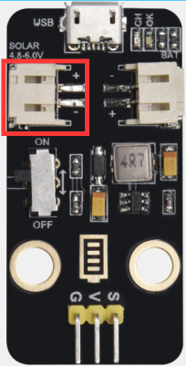SOLAR4.8-6.0V
端是接太阳能板，太阳能通过太阳能板转化成电能，是电源输入端。

BAT端是接电池盒（可充电电池）的，是电源输出端，给电池充电，可将电能储存在电池内。

这个拨动开关是电源开关，拨到ON端是接通外接单节锂电池，这样单节锂电池的电流通过G、V引脚流向microbit扩展板，给microbit扩展板供电；反之，拨到OFF端是断开外接单节锂电池的电流。

通过microUSB线连接到USB接口和电脑是可以给外接单节锂电池充电的。

测试太阳能电池板是否能实际工作：

先将原来已经安装在模块上BAT端的电池盒红黑线的白色端子换成我们提供的另一根红黑线的白色端子插入BAT端，同时将LED的长引脚（正极）插入红导线中，短引脚（负极）插入黑导线中，然后把太阳能板放入太阳光照射下，一会儿就会看到LED点亮。这说明太阳能板发生了光电反应，太阳能转为电能，有电流产生，电流大小达到一定值时，LED就会点亮。如下图所示：

### Project 9：1602 LCD

1.实验介绍：

Keyes I2C 1602 LCD模块是可以显示2行，每行16个字符的液晶显示器模块。液晶显示器显示蓝底白字，自带I2C通信模块，使用时只需连接单片机I2C通信接口，大大节约了单片机资源。最初的1602 LCD需要7个IO端口来启动和运行，而Keyes I2C 1602 LCD模块内置Arduino IIC/I2C接口，节省了5个IO端口。和Arduino液晶库文件兼容，用起来很简单。

LCD非常适合打印数据和显示数字。可以显示32个字符(16x2)。在Keyes I2C 1602 LCD模块的背面有一个蓝色的电位器，可以转动电位器来调整对比度。连接时请注意，LCD的GND和VCC不能接反，否则会损坏LCD。

2.I2C LCD 1602模块规格参数：

|工作电压：|DC5V|I2C地址：|0x27|控制接口：|I2C|
|-|-|-|-|-|-|
|工作电流：|&lt; 130mA|工作环境温度：|0°C ~ 45°C（推荐）|驱动芯片：|PCF8574T|
|GND：一个接地的引脚|：一个连接到+5V电源的引脚||SDA：一个连接到SDA（或A4）的引脚，用于IIC通信|
|SCL：一个连接到SCL（或A5）的引脚，用于IIC通信|背光（蓝底白字）|可调对比度|

3.添加库文件：

(注意：如果直接使用资料的代码则不用添加库文件，直接将代码文件拖进makecode软件里即可，如果需要自己编写代码则需要添加库文件)

（1）添加IoT_Keyestudio的库，添加方法如下:

利用库文件设置代码，在下图模块添加库，点击“扩展”。

（2）在搜索框中输入链接：<https://github.com/keyestudio2019/ks_IoT>，然后单击搜索并搜索，显示如下图，点击IoT_Keyestudio库文件，这样IoT_Keyestudio库就下载并安装好了，I2C LCD 1602库文件包含在IoT_Keyestudio库中。

（3）在模块区域就可以看到对应的I2C LCD 1602库。

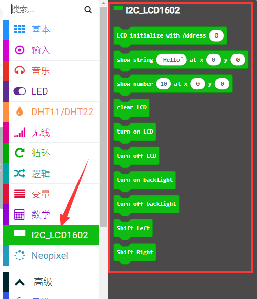

4.示例代码：

根据下表路径加载代码，如下表格：

|文件类型|路径|文件名|
|-|-|-|
|Hex file|../Makecode课程/Makecode代码/microbit扩展课程/Project 9：1602 LCD|Project 9：1602 LCD.hex|

也可以自己通过拖动代码块来编写代码，如下：

寻找指令方块：

组合指令方块：

|Microbit扩展板|I2C 1602 LCD 模块|
|-|-|
|GND|GND|
|5V|5V|
|SDA|SDA|
|SCL|SCL|

5.实验结果：

按照之前的方式将示例代码下载到micro:bit主板，外接电源供电后，并将扩展板上的拨码开关拨到ON端，再将船型开关上的“1”端按下。microbit主板上LED点阵屏显示“笑脸”图案，再旋转1602LCD液晶显示屏模块后面的电位器调节1602LCD液晶显示屏的亮度后，1602 LCD液晶显示屏模块的显示屏上第一行显示“Keyes”字符，第二行显示数字，每过0.5s，数字加1。

特别注意：上传代码成功，上电后，显示屏没有字符显示时，可以调节1602 I2C模块反面上的电位器，调节背光，使Keyes 1602 I2C模块上的LCD屏幕显示对应字符串。

### Project 10：水滴水蒸气传感器

1.实验介绍：

这是一个常用的水滴水蒸气传感器。它的原理是通过电路板上裸露的金属花纹区检测水量的大小。水量越多，就会有更多的导线被联通，随着导电的接触面积增大，输出的电压就会逐步上升。除了可以检测水量的大小，它还可以检测空气中的水蒸气。即：水滴传感器是一种模拟传感器，可以作为一个简单的雨水探测器和液位开关。当传感器表面的湿度升高时，输出电压将升高，读取到的模拟值即增大。

该传感器兼容各种单片机控制板，如micro:bit系列单片机。使用时，将传感器信号端输入到micro:bit系列单片机的模拟口，感知模拟值的变化，并在串口监视器上显示出对应的模拟值。

注意事项：连接部位不防水，请勿放入水中。

2.水滴水蒸气传感器的规格参数：

|工作电压：|DC 3.3-5V|
|-|-|
|工作温度范围：|－10℃～＋70℃|
|最大工作电流：|5uA (DC5V，或者当水滴传感器两脚直接短接)|
|控制接口：|模拟输出|

3.示例代码：

根据下表路径加载代码，如下表格：

|文件类型|路径|文件名|
|-|-|-|
|Hex file|../Makecode课程/Makecode代码/microbit扩展课程/Project 10：水滴水蒸气传感器|Project 10：水滴水蒸气传感器.hex|

也可以自己通过拖动代码块来编写代码，如下：

寻找指令方块：

组合指令方块：

|Microbit扩展板|水滴水蒸气传感器|
|-|-|
|GND|G|
|3V3|V|
|S(0)|S|

4.实验现象:

按照之前的方式将示例代码下载到micro:bit主板，利用micro USB数据线上电。这样，microbit主板上LED点阵屏显示“❤”图案，同时点击“显示控制台(设备)”按钮：

显示串口输出数据，水滴水蒸气传感器读取到信号端的模拟信号，裸露的金属花纹区的水量越多，模拟值越大。如下图所示：

如果你的电脑系统是Windows7/8而不是Windows 10，则在Google Chrome中是无法进行设备配对，这里需要使用CoolTerm软件来读取串口数字的。

打开CoolTerm，点击Options，选择SerialPort，设置COM口和波特率，波特率设置为115200（经过测试，micro:bit主板的USB串口通讯波特率是115200），点击OK后，最后点击Connect。水滴水蒸气传感器读取到信号端的模拟信号，裸露的金属花纹区的水量越多，模拟值越大。利用CoolTerm串口监视器上看到显示结果，显示如下图。

### Project 11：下雨警报

1.实验介绍：

水滴水蒸气传感器在生活中应用是比较广泛的，例如：下雨警报器，汽车自动刮水系统、智能灯光系统和智能天窗系统等。在前面的项目实验中，我们已经知道了水滴水蒸气传感器的工作原理，那么在本项目实验中，我们将水滴水蒸气传感器，microbit上的扬声器和黄色LED相结合，制作一个简单的下雨警报器。

2.示例代码：

根据下表路径加载代码，如下表格：

|文件类型|路径|文件名|
|-|-|-|
|Hex file|../Makecode课程/Makecode代码/microbit扩展课程/Project 11：下雨警报|Project 11：下雨警报.hex|

也可以自己通过拖动代码块来编写代码，如下：

寻找指令方块：

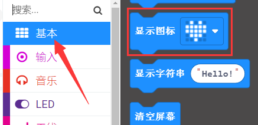

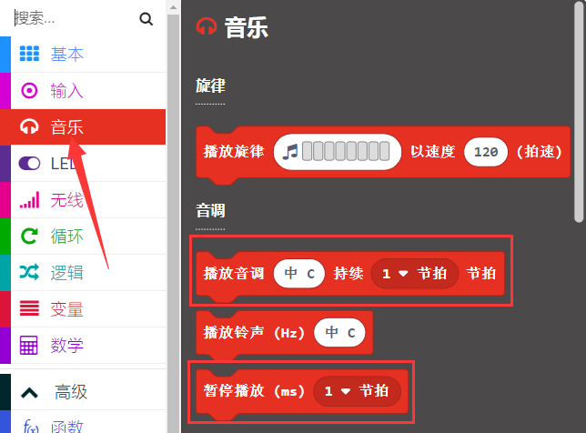

3.实验结果：

按照之前的方式将示例代码下载到micro:bit主板，并且外接电源供电，将扩展板上的拨码开关拨到ON端，再将船型开关上的“1”端按下。Microbit主板上的LED点阵显示“笑脸”图案，水滴水蒸气传感器检测到的模拟信号大于500时，microbit主板上的扬声器发出急促的“滴滴”声音，同时黄色LED闪烁；否则，扬声器不发声，黄色LED熄灭。

### Project 12：模拟气体（MQ-2）传感器

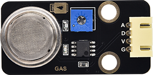

1.实验介绍：

气体传感器（MQ-2）可用于家庭用气体泄漏报警器、工业用可燃气体报警器以及便携式气体检测仪器，适宜于液化气、苯、烷、酒精、氢气、烟雾等的探测，被广泛运用到各种[消防报警系统](https://baike.so.com/doc/5909700-6122605.html)中。故因此，气体传感器（MQ-2）可以准确来说是一个多种气体探测器，同时还具有灵敏度高、响应快、稳定性好、寿命长、驱动电路简单等优点。

气体传感器（MQ-2）检测可燃气体与烟雾的浓度范围是300~10000ppm，对天然气、液化石油气等烟雾有很高的灵敏度，尤其对烷类烟雾更为敏感。在使用之前必须加热一段时间，这样输出的电阻和电压较准确。但是加热电压不宜过高，否则会导致内部的信号线熔断。

模拟气体（MQ-2）传感器属于二氧化锡半导体气敏材料，属于表面离子式N型半导体。处于200~300摄氏度时，二氧化锡吸附空气中的氧，形成氧的负离子吸附，使半导体中的电子密度减少，从而使其电阻值增加。当与空气中可燃气体和烟雾烟雾接触时，如果晶粒间界处的势垒收到烟雾的调至而变化，就会引起表面导电率的变化。利用这一点就可以获得烟雾或可燃气体存在的信息，空气中烟雾或可燃气体的浓度越大，导电率越大，输出电阻越低，则输出的模拟信号就越大。

此外，通过旋转电位器可以调整气体传感器（MQ-2）灵敏度。上电后，传感器上的一个指示灯亮绿灯，并且还可以调节蓝色的正方体电位器，使模块上另一个指示灯介于不亮与亮之间的临界点时，灵敏度最高。

2.模拟气体（MQ-2）传感器的规格参数：

|工作电压：|3.3-5V|
|-|-|
|工作电流：|160mA (DC5V)|
|工作温度：|0°C ~ 40°C|
|控制接口：|数字、模拟输出|
|检测浓度：|300-10000ppm(可燃气体)|
|浓度斜率：|≤0.6(R3000ppm/R1000ppm C3H8)|
|灵敏度：|Rs(in air)/Rs(1000ppm异丁烷)≥5|
|敏感体表面电阻（Rs）|2KΩ-20KΩ(in 2000ppm C3H8 )|

MQ-2特点：

（1）具有信号输出指示。

（2）双路信号输出（模拟量输出及TTL电平输出）

（3）TTL输出有效信号为低电平。（当输出低电平时信号灯亮，可直接接单片机） 

（4）模拟量输出0~5V电压，浓度越高电压越高。

（5）对液化气，天然气，城市煤气有较好的灵敏度。

（6）具有长期的使用寿命和可靠的稳定性

（7）快速的响应恢复特性。

3.示例代码：

根据下表路径加载代码，如下表格：

|文件类型|路径|文件名|
|-|-|-|
|Hex file|../Makecode课程/Makecode代码/microbit扩展课程/Project 12：模拟气体（MQ-2）传感器|Project 12：模拟气体（MQ-2）传感器.hex|

也可以自己通过拖动代码块来编写代码，如下：

寻找指令方块：

组合指令方块：

|Microbit扩展板|模拟气体（MQ-2）传感器|
|-|-|
|GND|G|
|5V|V|
|S（1）|D|

4.实验现象:

按照之前的方式将示例代码下载到micro:bit主板，利用micro USB数据线上电，并且外接电源供电，将扩展板上的拨码开关拨到ON端。这样，microbit主板上的LED点阵屏显示“笑脸”图案。而且，气体传感器（MQ-2）的一个指示灯亮绿灯，并且还可以调节蓝色的正方体电位器，使模块上另一个指示灯介于不亮与亮之间的临界点时，灵敏度最高。同时点击“显示控制台(设备)”按钮：

显示串口输出数据，未用打火机气体对着气体传感器（MQ-2）时，串口显示的是数字信号1；当用打火机气体对着气体传感器（MQ-2）时，串口显示的是数字信号0，同时模块上的一个指示灯亮红灯。如下图所示：

如果你的电脑系统是Windows7/8而不是Windows 10，则在Google Chrome中是无法进行设备配对，这里需要使用CoolTerm软件来读取串口数字的。

打开CoolTerm，点击Options，选择SerialPort，设置COM口和波特率，波特率设置为115200（经过测试，micro:bit主板的USB串口通讯波特率是115200），点击OK后，最后点击Connect。未用打火机气体对着模拟气体（MQ-2）传感器时，串口显示的是数字信号1；当用打火机气体对着模拟气体（MQ-2）传感器时，串口显示的是数字信号0，同时模块上的一个指示灯亮红灯。如下图所示：

### Project 13：气体泄露检测仪

1.实验介绍：

一些家庭里会使用到煤气，煤气的主要成分有：CO、CO2、N2、H2、CH4，其中的主要可燃成分是一氧化碳CO，而CO会和人体中的血红蛋白结合。当人吸入的煤气多了就会出现煤气中毒，就是CO中毒，病人会头痛、头晕、无力等多种症状。当被测气体发生泄漏时，浓度值显示值增加。超过报警设定值时，报警指示灯闪烁，报警器鸣响。当探头移入泄漏源时，气体检测浓度显示器上的值在增加,，并记录读数。所以这时我们需要一个可以检测煤气是否泄漏的装置。

那么在本项目实验中，我们将气体传感器（MQ-2）、黄色LED、microbit主板上的扬声器和1602 LCD相结合，也来模拟一个简易的气体泄露检测仪。

2.添加1602 LCD的库：

需要添加1602 LCD模块的库文件，库文件链接：

<https://github.com/keyestudio2019/ks_IoT> ，添加方法参照Project 9：1602 LCD。

3.示例代码：

根据下表路径加载代码，如下表格：

|文件类型|路径|文件名|
|-|-|-|
|Hex file|../Makecode课程/Makecode代码/microbit扩展课程/Project 13：气体泄露检测仪|Project 13：气体泄露检测仪.hex|

也可以自己通过拖动代码块来编写代码，如下：

寻找指令方块：

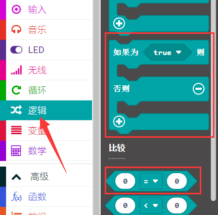

4.实验结果：

按照之前的方式将示例代码下载到micro:bit主板，并且外接电源供电，将扩展板上的拨码开关拨到ON端，再将船型开关上的“1”端按下。Microbit主板上的LED点阵显示“笑脸”图案，用打火机气体对着模拟气体（MQ-2）传感器时，1602 LCD第一行显示“MQ-2”，第二行显示“gas leakage”，同时microbit主板上的扬声器发出急促的“滴滴”声音，黄色LED闪烁；否则，扬声器不发声，黄色LED熄灭，1602 LCD不显示。 

### Project 14：XHT11温湿度传感器

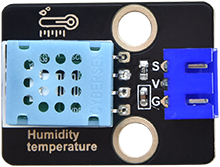

1.实验介绍：

XHT11温湿度传感器（XHT11完全兼容DHT11）是一款含有已校准数字信号输出的温湿度复合传感器，其精度：湿度±5%RH，
温度±2℃；量程：湿度20-90%RH，
温度0~50℃。XHT11温湿度传感器应用专用的数字模块采集技术和温湿度传感技术，确保产品具有极高的可靠性和卓越的长期稳定性。XHT11温湿度传感器包括一个电阻式感湿元件和一个NTC测温元件，非常适用于对精度和实时性要求不高的温湿度测量场合。

XHT11有三个引脚，分别为V，G，和S。S为数据输出的引脚，使用的是串行通讯。

2.XHT11温湿度传感器的规格参数：

|工作电压：|3.3V-5V（DC）|
|-|-|
|最大工作电流：|50mA|
|最大功率：|0.25W|
|控制接口：|数字双向单总线|
|温度范围：|0-50℃（±2℃）|
|湿度范围：|20-90%RH（±5%RH）|
|工作温度：|-25℃~+60℃|

3.有关XHT11温湿度传感器的其它知识：

XHT11温湿度传感器的单总线格式定义：

|名称|单总线格式定义|
|-|-|
|起始信号|微处理器把数据总线（SDA）拉低一段时间至少 18ms（最大不得超过30ms），通知传感器准备数据。|
|响应信号|传感器把数据总线（SDA）拉低 83µs，再接高 87µs以响应主机的起始信号。|
|湿度|湿度高位为湿度整数部分数据，湿度低位为湿度小数部分数据|
|温度|温度高位为温度整数部分数据，温度低位为温度小数部分数据，且温度低位Bit8 为 1 则表示负温度，否则为正温度。|
|校验位|校验位＝湿度高位+湿度低位+温度高位+温度低位|

HT11温湿度传感器数据时序图：

用户主机（MCU）发送一次开始信号后，XHT11
从低功耗模式转换到高速模式，待主机开始信号结束后，XHT11
发送响应信号，送出 40bit 的数据，并触发一次信采集。信号发送如图所示。

4.添加DHT11库（XHT11完全兼容DHT11）：

（1）添加DHT11的库文件，添加方法如下:

利用库文件设置代码，在下图模块添加库文件，点击“扩展”。

（2）在搜索框中输入链接：<https://github.com/keyestudio2019/ks_IoT>，然后单击搜索并搜索，显示如下图，点击IoT_Keyestudio库文件，这样IoT_Keyestudio库就下载并安装好了，DHT11温湿度传感器的库文件包含在IoT_Keyestudio库中。

（3）在模块区域就可以看到对应的DHT11温湿度传感器的库。

5.示例代码：

根据下表路径加载代码，如下表格：

|文件类型|路径|文件名|
|-|-|-|
|Hex file|../Makecode课程/Makecode代码/microbit扩展课程/Project 14：XHT11温湿度传感器|Project 14：XHT11温湿度传感器.hex|

也可以自己通过拖动代码块来编写代码，如下：

寻找指令方块：

组合指令方块：

|Microbit扩展板|XHT11温湿度传感器|
|-|-|
|GND|G|
|5V|V|
|S（2）|S|

4.实验现象:

按照之前的方式将示例代码下载到micro:bit主板，利用micro USB数据线上电。并且外接电源供电，将扩展板上的拨码开关拨到ON端，再将船型开关上的“1”端按下。这样，microbit主板上的LED点阵屏显示“笑脸”图案。同时点击“显示控制台(设备)”按钮：

显示串口输出数据，XHT11温湿度传感器检测到当前环境中的温湿度数值。如下图所示：

如果你的电脑系统是Windows7/8而不是Windows 10，则在Google Chrome中是无法进行设备配对，这里需要使用CoolTerm软件来读取串口数字的。

打开CoolTerm，点击Options，选择SerialPort，设置COM口和波特率，波特率设置为115200（经过测试，micro:bit主板的USB串口通讯波特率是115200），点击OK后，最后点击Connect。CoolTerm的串口监视器显示DHT11温湿度传感器检测到当前环境中的温湿度数值。如下图所示：

### Project 15：环境温湿度表

1.实验介绍：

在冬季时，空气中的湿度很低，就是空气很干燥，再加上寒冷，人体的皮肤就容易过于干燥而裂，所以需要再用加湿器给家里的空气增加湿度，但是怎么知道空气过于干燥了呢？那就需要检测空气湿度的设备。前面我们已经了解过XHT11温湿度传感器的工作原理，那么在本项目试验中，我们结合温湿度传感器和1602 LCD来做个简易的环境温湿度表。

2.添加1602 LCD库和DHT11库：

需要添加库文件的链接：<https://github.com/keyestudio2019/ks_IoT>，添加方法参照Project 9：1602 LCD或Project 14：DHT11温湿度传感器。

3.示例代码：

根据下表路径加载代码 ，如下表格：

|文件类型|路径|文件名|
|-|-|-|
|Hex file|../Makecode课程/Makecode代码/microbit扩展课程/Project 15：环境温湿度表|Project 15：环境温湿度表.hex|

也可以自己通过拖动代码块来编写代码，如下：

寻找指令方块：

4.实验结果：

按照之前的方式将示例代码下载到micro:bit主板，microbit主板上的LED点阵显示“笑脸”图案。外接电源供电，将扩展板上的拨码开关拨到ON端，再将船型开关上的“1”端按下。1602 LCD显示DHT11温湿度传感器检测到当前环境中的温湿度值。

 

### Project 16：多功能

1.  实验介绍：

将多个模块结合一起，模仿智能家居，例如密码锁、智能灯、自动关窗等。

2.实验准备：

（1）已安装好Micro:bit主板的microbit智能家居。

（2）通过micro USB线连接micro:bit主板和电脑。

（3）添加库文件，链接：<https://github.com/keyestudio2019/ks_IoT>

3示例代码:

4.  实验现象及操作:

①手在人体红外热释传感器移动时，黄色LED点亮，否则黄色LED熄灭。

②向水滴水蒸气传感器上滴点水，其模拟信号＞300时，窗户关闭，而模拟信号≤300时，窗户打开。

③摩斯密码锁，通过按microbit主板上按键A和B输入密码，LCD屏显示输入的密码，同时按下A和B确认密码。A输入的是‘.’，B输入的是‘-’确认密码，如果密码正确，LED点阵屏显示图案，I2C1602LCD屏幕上第一行显示“Successful”，第二行显示“Open the door”，同时门打开，6812 2x2全彩RGB亮紫色灯。如果密码错误，LCD显示Error两秒后再显示Enter password”，可重新输入密码。

④用手按一下microbit主板上的Logo标志，I2C1602LCD屏幕上第一行先显示“Close the door”再显示“Enter password”，同时门关上，6812 2x2全彩RGB熄灭。

⑤当microbit主板上的温度传感器检测到环境中的温度≥30℃时，小风扇转动。

### Project 17：蓝牙控制LED灯

1.实验介绍：

蓝牙APP的简单使用，控制一个LED亮灭。

2.实验准备：

（1） 安装我们提供的蓝牙APP

Android：直接使用我们提供的安装包APK（在文件夹下的Android APK里面）

ios：在App Store中搜索IoT microbit就可以找到了。如下图

（2）添加蓝牙库文件，在扩展里面直接搜索bluetooth就可以找到蓝牙扩展库文件，如下图

3示例代码:

注意：写完代码后，需要将项目设置改为无需配对并保存，如下图操作

4.实验现象及操作:

（1）烧录程序到microbit主板，打开智能家居的电源开关，打开蓝牙APP并点击Connect进行连接，如下图

（2）点击搜索到的microbit主板蓝牙名称

（3）连接成功后，点击一下LED灯的按钮

成功的话，可以看到智能家居的LED亮起，再点击一下LED按钮，LED灯便会熄灭。

### Project 18：蓝牙智能家居

1.实验介绍：

实现使用蓝牙作为通讯的智能家居。这课的代码是在Project 16和Project 17这两课的基础之上，建议先学完这两课。

2.实验准备：

（1） 安装我们提供的蓝牙APP

APP安装方法看Project 17.

蓝牙APP按钮所发送的字符，如下图

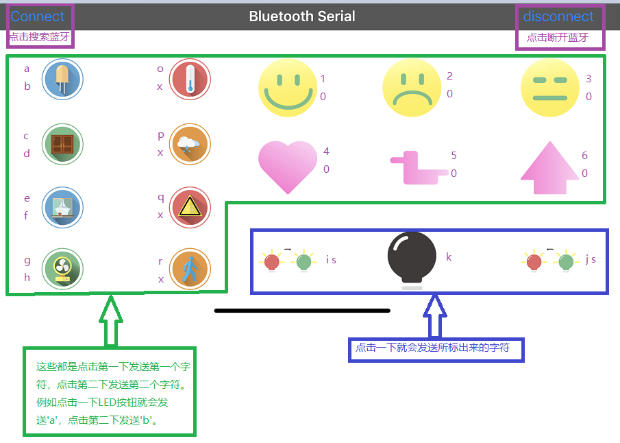

（2）添加蓝牙库文件，在扩展里面直接搜索bluetooth就可以找到蓝牙扩展库文件，如下图

添加我们提供的库文件，链接：<https://github.com/keyestudio2019/ks_IoT>

3示例代码:

由于代码比较大，这里就不贴出来，自己打开我们提供的代码查看。

4.实验现象及操作:

（1）烧录程序到microbit主板，打开智能家居的电源开关，打开蓝牙APP并点击Connect进行蓝牙连接。

（2）蓝牙APP操作和现象如下图

（3）摩斯密码锁，通过按microbit主板上按键A和B输入密码，LCD屏显示输入的密码，同时按下A和B确认密码。A输入的是‘.’，B输入的是‘-’确认密码，如果密码正确，LED点阵屏显示图案，I2C1602LCD屏幕上第一行显示“Successful”，第二行显示“Open the door”，同时门打开，6812 2x2全彩RGB亮紫色灯。如果密码错误，LCD显示Error两秒后再显示Enter password”，可重新输入密码。触摸microbit的logo，关门。
