# 4. Python

以下的步骤说明基于Windows操作系统，如果你使用的是其他操作系统，可以将其作为参考。

本教程是为Python语言编写的，如果想要使用图形化代码编程，请参阅手册“Makecode Tutorial.pdf"。在您下载的资源的根目录中，有一个名为“Python tutorial”的文件夹，其中保存了Microbit smart home的所有Python代码，Python代码文件是以“.py”结尾的文件。

## 4.1 Python

Python是一种脚本语言，经过多年的发展，其生态已经非常庞大。目前火热的人工智能，很多都是使用Python编写的，值得我们去学习。

micro：bit可以用Python语言编程。由于micro：bit主板是一个微控制器，硬件的不同使得micro：bit不能完全支持Python。这里有一个是MicroPython，它是专门为micro：bit设计的，MicroPython是python3编程语言的一个精简而高效实现，它包含Python标准库的一小部分，并且经过优化，可以在micro：bit微控制器上运行。BBC micro:bit使用的Python版本称为MicroPython。
非常适合那些想要继续深入学习编程的人群，用一系列代码段、各种预制图像和音乐帮助你进行编程。BBC microbit MicroPython的官方说明链接：<https://microbit-micropython.readthedocs.io/en/latest/tutorials/introduction.html>

Python代码有两种类型的编辑器（web版和离线版）。

1.  Python代码编辑器的web版本（Micro:bit官方链接）如下：<https://python.microbit.org/v/1.1>

Micro:bit官方在线代码编写平台，使用常用浏览器直接打开上述网址即可使用。

2.  离线的编译工具Mu，方便在没有网络连接的时候也可以进行创意和教学。对于Windows和MAC用户，可以使用独立软件Mu(离线的编译工具)     。 (Mu软件下载链接：<https://codewith.mu/en/download>)

本教程也基于在本地离线模式使用Mu软件作为Python代码编辑器来完成项目实验。

## 4.2 Mu

Mu的官方网站：<https://codewith.mu/>

Mu是一个面向初学者程序员的Python代码编辑器，它基于教师和学生。获得Mu最简单和最容易的方法是通过Windows或Mac OSX的官方安装程序(Mu不再支持32位Windows)。目前推荐的版本是Mu 1.1.0-beta 2。建议你们通过每个支持的操作系统的链接更新到这个版本。

步骤1-确定版本并且下载Mu安装程序

先了解您的计算机是Windows系统还是Mac OSX系统；再打开资源管理器，鼠标右键点击”此电脑”，并选择属性，了解您的Windows系统是32位还是64位。

查看系统类别，类型将显示在操作系统下，64位系统或者32位系统：

打开链接：<https://codewith.mu/en/download>下载对应的Mu软件版本。

步骤2-运行安装程序：

找到你刚刚下载的安装程序（它可能在你的下载文件夹中），双击打开安装程序文件。

这里我们概述了在Windows10系统上安装Mu所需的额外步骤（Windows的其他版本也将类似）。

Mac OSX系统安装Mu方法对应链接：<https://codewith.mu/en/howto/1.1/install_macos>
。

Windows 10 系统

Windows Defender将弹出一条警告消息。你应该点击“更多信息”链接。

消息将更改，提供有关安装程序的更多信息，并显示“Run anyway”按钮。单击“Run anyway”按钮。

步骤3-许可协议

检查许可证，选择复选框并单击“Install”。

步骤4-安装

当Mu在你的电脑上安装时，需要几秒钟。

第5步-完成

安装已成功完成，请单击“完成”关闭安装程序。

第9步-启动Mu

你可以点击开始菜单中的图标启动Mu，也可以在搜索框中输入Mu(下面两种方法都有显示)。在第一次开始时，这可能需要一些时间。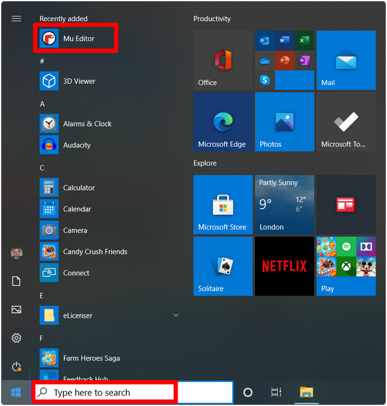

Mu的主界面如下图所示：

## 4.3 micro:bit基础课程

### Project 1：Heart beat

1.  实验说明：

首先先来练习一个不需要其他辅助元件，只需要一块micro：bit主板和一根micro USB数据线的简单实验，让micro：bit显示“闪烁的心”，这是一个让micro：bit主板和PC机通信的实验，这也是一个入门实验，希望可以带领大家进入micro：bit的魔幻世界。

2.  准备：

（1）通过micro USB线连接micro：bit和电脑。

（2）打开离线版本的Mu软件。

3.  示例代码：

micro：bit”之后，单击“OK”。

点击“Load”按钮，选择我们提供的示例代码“Project 1：Heart beat.py”文件，然后单击“打开”。加载文件路径如下表所示：

|文件类型|路径|文件名|
|-|-|-|
|Python file|../Python 课程/Python代码/microbit基础课程/Project 1：Heart beat|Project 1：Heart beat.py|

除了上述Mu软件加载（导入）代码方法之外，还有一种更简单的加载代码方法：先打开Mu软件，然后选中“microbit-Heart beat.py”文件，并继续按下鼠标左键，将选中的文件拖动到Mu软件中。

成功加载如下所示。你也可以自己在编辑窗口输入代码。（注意！所有英文及符号均须以英文填写，最后一行必须有空格。）

以下是内置图像的列表：

• Image.HEART

• Image.HEART_SMALL

• Image.HAPPY

• Image.SMILE

• Image.SAD

• Image.CONFUSED

• Image.ANGRY

• Image.ASLEEP

• Image.SURPRISED

• Image.SILLY

• Image.FABULOUS

• Image.MEH

• Image.YES

• Image.NO

• Image.CLOCK12, Image.CLOCK11, Image.CLOCK10, Image.CLOCK9, Image.CLOCK8, Image.CLOCK7, Image.CLOCK6, Image.CLOCK5,Image.CLOCK4, Image.CLOCK3, Image.CLOCK2,Image.CLOCK1

• Image.ARROW_N, Image.ARROW_NE, Image.ARROW_E, Image.ARROW_SE, Image.ARROW_S, Image.ARROW_SW, Image.ARROW_W, Image.ARROW_NW

• Image.TRIANGLE

• Image.TRIANGLE_LEFT

• Image.CHESSBOARD

• Image.DIAMOND

• Image.DIAMOND_SMALL

• Image.SQUARE

• Image.SQUARE_SMALL

• Image.RABBIT

• Image.COW

• Image.MUSIC_CROTCHET

• Image.MUSIC_QUAVER

• Image.MUSIC_QUAVERS

• Image.PITCHFORK

• Image.PACMAN

• Image.TARGET

• Image.TSHIRT

• Image.ROLLERSKATE

• Image.DUCK

• Image.HOUSE

• Image.TORTOISE

• Image.BUTTERFLY

• Image.STICKFIGURE

• Image.GHOST

• Image.SWORD

• Image.GIRAFFE

• Image.SKULL

• Image.UMBRELLA

• Image.SNAKE，Image.ALL_CLOCKS，Image.ALL_ARROWS

通过micro USB线连接micro：bit和电脑，点击“刷入”按钮将代码下载到micro：bit。

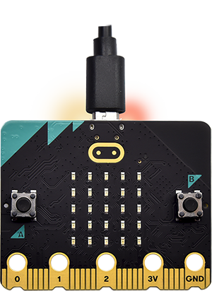

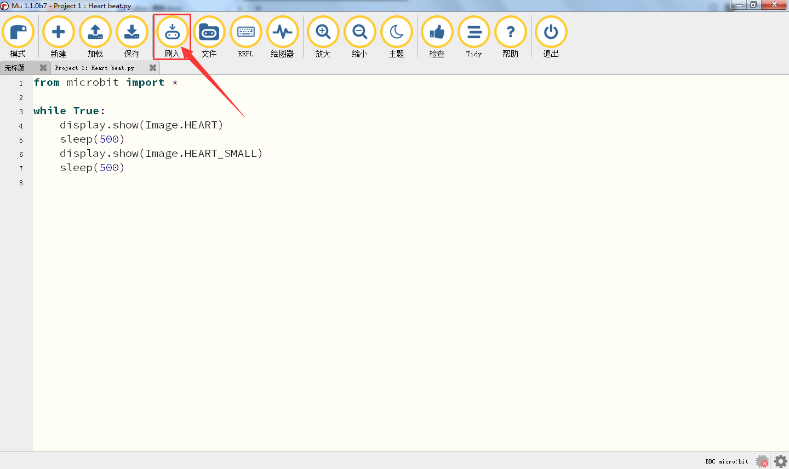

如果代码有错误，也可以将代码成功下载到micro：bit，但无法正常工作。如果sleep写为sleeps，点击“刷入”按钮，代码也会被下载到micro:bit主板。

下载完成后，led矩阵提示一些错误信息，以及错误的行号。点击“REPL”按钮之后，再按下micro：bit主板的重置按钮（背面的复位按钮，不是A、B按键），错误信息将显示在REPL框中，如下所示：

再次单击“REPL”按钮，将关闭REPL模式，然后你就可以刷新新代码了。为了确保代码正确，完成代码后，单击“检查”按钮检查代码是否有错误。如下图所示，点击“检查”按钮，然后在Mu将指示代码的错误。

根据错误提示，正确修改代码。然后再点击“检查”按钮，Mu在下面的栏上显示没有问题。

有关使用Mu的更多教程，请参阅：<https://codewith.mu/en/tutorials/>

4.  实验结果:

代码完成之后，经过点击“检查”按钮检查代码无误，再点击“刷入”按钮，将代码上传到micro：bit主板，上传成功后，利用micro USB数据线上电，就可以看到micro:bit上的LED点阵屏循环显示“❤”图案和“”图案。

5.  代码说明：

|from microbit import *|导入micro：bit的库文件|
|-|-|
|while True:|这是一个永久循环，它使micro：bit永远执行这个循环中的代码。|
|display.show(Image.HEART)|micro：bit上的LED点阵显示“❤”图案|
|sleep(500)|延时500毫秒|
|display.show(Image.HEART_SMALL)|micro：bit上的LED点阵显示“”图案|

### Project 2：单个LED闪烁

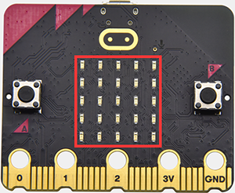

1.  实验说明：

micro：bit主板的LED点阵共由25个发光二极管组成，5个一组，分别对应X和Y方向，形成一个5×5的矩阵，且每个发光二极管是放置在行线（X）和列线（Y）的交叉点上，我们可以通过设置坐标点来实现对25个LED中某一个LED的控制。例如，想要LED点阵中第1行第1个LED点亮，可以设置坐标点为（0，0）；第1行第3个LED点亮，可以设置坐标点为（2，0）；第1列第5个LED点亮，可以设置坐标点为（0，4）；第3列第2个LED点亮，可以设置坐标点为（2，1），依此类推。

2.  准备：

（1）通过micro USB线连接micro：bit和电脑。

（2）打开离线版本的Mu软件。

3\. 示例代码：

用Mu软件打开“Project 2：Single LED
刷入ing.py“文件，加载代码的路径如下：（[How to load the project code?](#AS)）

|文件类型|路径|文件名|
|-|-|-|
|Python file|../Python 课程/Python代码/microbit基础课程/Project 2：单个LED闪烁|Project 2：Single LED 刷入ing .py|

加载完成后，如下图所示，你也可以打开Mu软件，在编辑窗口输入代码。（注意！所有英文及符号均须以英文填写，最后一行必须有空格。）

您需要单击“检查”按钮来检查代码是否有错误。如果一行出现光标或下划线，则表明该行的程序有错误。

确定程序代码无误之后，你还需要确定micro USB线已连接到micro:bit和电脑，然后单击“刷入”按钮将代码下载到micro:bit主板。

4.实验结果：

代码成功下载到micro：bit主板之后，利用micro USB数据线上电，就可以看到micro:bit上处于坐标点(1,0)的LED的亮灭状态，持续0.5s；再次切换坐标点(3,4)的LED的亮灭状态，持续0.5s。循环进行。

6.  参考文献：

sleep(ms) ：在给定的毫秒数内休眠（延时）。

关于休眠（延时）功能的细节，请参考链接[:
https://microbit-micropython.readthedocs.io/en/latest/utime.html](E:\\readthedocs keyestudio\\pandoc\\docx\\ https:\\microbit-micropython.readthedocs.io\\en\\latest\\utime.html)

### Project 3：LED点阵显示

1.  实验说明：

点阵在我们生活中很常见，很多都有用到它，比如LED广告显示屏，电梯显示楼层，公交车报站等等。

micro：bit主板的LED点阵共由25个发光二极管组成，上一课我们已经讲过通过设置坐标点来实现对LED点阵的25个LED中的某个LED的控制，这样可以通过设置多个坐标点控制多个LED的亮灭使得LED点阵能够显示图案、数字、字符串。我们也可以在特定代码中通过点击
LED点阵的灰白色小正方形点亮
LED点阵对应的LED来实现LED点阵显示图案、数字、字符串。除了上述方法还可以使用自定义图案使LED点阵显示图案。

2.  准备：

（1）通过micro USB线连接micro：bit和电脑。

（2）打开离线版本的Mu软件。

3\. 示例代码：

用Mu软件打开“Project 3：LED dot matrix display.py“，加载代码的路径如下：（[How to load the project code?](#AS)）

|File Type|Route|File Name|
|-|-|-|
|Python file|../Python 课程/Python代码/microbit基础课程/Project 3：LED点阵显示|Project 3：LED dot matrix display.py|

加载完成后，如下图所示。你也可以打开Mu软件，在编辑窗口输入代码。（注意！所有英文及符号均须以英文填写，最后一行必须有空格。）

您需要单击“检查”按钮来检查代码是否有错误。如果一行出现光标或下划线，则表明该行的程序有错误。

确定程序代码无误之后，你还需要确定micro USB线已连接到micro:bit主板和电脑，然后单击“刷入”按钮将代码下载到micro:bit主板。

4.实验结果：

代码成功下载到micro：bit主板之后，利用micro USB数据线上电，就可以看到micro：bit主板的5×5 LED点阵开始显示数字1、2、3、4、5，然后循环显示“向下”图案、字符串“Hello!”、“心”图案、“东北”方向图案、“东南”方向图案、“西南”方向图案和“西北”方向图案。

6.参考文献：

display.scroll()
：在显示器上水平滚动数值。如果值是整数或浮点，则首先使用str（）将其转换为字符串。

有关详细信息，请参阅链接：<https://microbit-micropython.readthedocs.io/en/latest/utime.html>

### Project 4：可编程按键

1.  实验说明：

按键可以控制电路的通断，把按键接入电路中，不按下按键的时候电路是断开的，一按下按键电路就通啦，但是松开之后就又断了。可是为什么按下才通电呢？这得从按键的内部构造说起。没按下之前，电流从按键的一端过不去另一端，按键的两端就像两座山，中间隔着一条河，我们在这座山过不去另一座山；按下的时候，按键内部的金属片把两边连接起来让电流通过，就像搭了一座桥，把两座山连接起来。

按键内部结构如图：，未按下按键之前，1、2就是导通的，3、4也是导通的，但是1、3或1、4或2、3或2、4是断开（不通）的；只有按下按键时，1、3或1、4或2、3或2、4才是导通的。

micro：bit主板有三个按键，反面的是复位按钮，正面的是两个可编程按键，通过对两个可编程按键组合可以有三种组合，作为输入元件。我们结合上节课的LED点阵，一起来学习按键吧。我们做一个按键三连，分别按A、B和AB同时按，对应显示屏分别显示A、B和AB。

2.  准备：

（1）通过micro USB线连接micro：bit和电脑。

（2）打开离线版本的Mu软件。

3\. 示例代码1：

用Mu软件打开“Project 4：Programmable Buttons-1.py“文件，加载代码的路径如下：（[How to load the project code?](#AS)）

|文件类型|路径|文件名|
|-|-|-|
|Python file|../Python 课程/Python代码/microbit基础课程/Project 4：可编程按键|Project 4：Programmable Buttons-1.py|

加载完成后，如下图所示。你也可以打开Mu软件，在编辑窗口输入代码。（注意！所有英文及符号均须以英文填写，最后一行必须有空格。）

您需要单击“检查”按钮来检查代码是否有错误。如果一行出现光标或下划线，则表明该行的程序有错误。

确定程序代码无误之后，你还需要确定micro USB线已连接到micro:bit主板和电脑，然后单击“刷入”按钮将代码下载到micro:bit主板。

4.实验结果1：

代码成功下载到micro：bit 主板之后，利用micro USB数据线上电，按下micro：bit主板上正面按键A，我们可以看到5×5 LED点阵显示字符“A”；按下micro：bit主板上正面按键B，我们可以看到5×5 LED点阵显示字符“B”；同时按下micro：bit主板上正面按键A和B，我们就可以看到5×5 LED点阵显示字符“AB”。

5.示例代码2：

用Mu软件打开“Project 4：Programmable Buttons-2.py“文件，加载代码的路径如下：（[How to load the project code?](#AS)）

|文件类型|路径|文件名|
|-|-|-|
|Python file|../Python 课程/Python代码/microbit基础课程/Project 4：可编程按键|Project 4：Programmable Buttons-2.py|

加载完成后，如下图所示。你也可以打开Mu软件，在编辑窗口输入代码。（注意！所有英文及符号均须以英文填写，最后一行必须有空格。）

您需要单击“检查”按钮来检查代码是否有错误。如果一行出现光标或下划线，则表明该行的程序有错误。

但是，单击“检查”按钮来检查代码是否有错误时，即使代码没有错误时也会出现如下提示语，这提示语只是一些警告语，而不是代码错误提示语。也就是说整个代码是没有错误的。例如，类似于如下所示：

确定程序代码无误之后，你还需要确定micro USB线已连接到micro:bit主板和电脑，然后单击“刷入”按钮将代码下载到micro:bit主板。

6.实验结果2：

代码成功下载到micro：bit主板之后，利用micro USB数据线上电，按下micro：bit主板上正面按键A，条形图高度值增加，表现为LED点阵亮的行数增加；按下正面按键B，减少条形图高度，表现为LED点阵亮的行数减少。

### Project 5：温度检测

1.  实验说明：

micro:bit主板实际上并不带温度传感器，而是采用nRF52833芯片内置的温度传感器进行温度检测，所以检测的温度更接近芯片的温度，可能与周围环境温度存在一定的误差。在这一课程中，我们先利用该传感器测试当前环境中的温度，并将测试结果在显示数据(设备)中显示，再通过设置该传感器检测的温度范围来控制LED点阵显示不同的图案。

注意：micro:bit主板的温度传感器在这里：

2.  准备：

（1）通过micro USB线连接micro：bit和电脑。

（2）打开离线版本的Mu软件。

3\. 示例代码1：

用Mu软件打开“Project 5：Temperature Measurement
-1.py“文件，加载代码的路径如下：（[How to load the project code?](#AS)）

|文件类型|路径|文件名|
|-|-|-|
|Python file|../Python 课程/Python代码/microbit基础课程/Project 5：温度检测|Project 5：Temperature Measurement -1.py|

加载完成后，如下图所示。你也可以打开Mu软件，在编辑窗口输入代码。（注意！所有英文及符号均须以英文填写，最后一行必须有空格。）

您需要单击“检查”按钮来检查代码是否有错误。如果一行出现光标或下划线，则表明该行的程序有错误。

确定程序代码无误之后，你还需要确定micro USB线已连接到micro:bit主板和电脑，然后单击“刷入”按钮将代码下载到micro:bit主板。

4.实验结果1：

代码成功下载到micro：bit主板之后，并且利用micro USB数据线上电。先点击“REPL”按钮，再按一下micro:bit主板后面的复位按钮，这样，BBC microbit REPL窗口打印并显示了micro：bit的温度传感器检测到当前环境中的温度值，如下图：（这里的字母C表示摄氏温度单位，而摄氏温度单位（℃）会导致乱码）

注意：如果没有显示温度请按micro bit板的复位键

5.示例代码2：

用Mu软件打开“Project 5：Temperature Measurement-2.py“文件，加载代码的路径如下：（[How to load the project code?](#AS)）

|文件类型|路径|文件名|
|-|-|-|
|Python file|../Python 课程/Python代码/microbit基础课程/Project 5：温度检测|Project 5：Temperature Measurement-2.py|

加载完成后，如下图所示。你也可以打开Mu软件，在编辑窗口输入代码。（注意！所有英文及符号均须以英文填写，最后一行必须有空格。）

这里设置的温度值35可以根据实际情况重新设置

您需要单击“检查”按钮来检查代码是否有错误。如果一行出现光标或下划线，则表明该行的程序有错误。

确定程序代码无误之后，你还需要确定micro USB线已连接到micro:bit主板和电脑，然后单击“刷入”按钮将代码下载到micro:bit主板。

6.实验结果2：

代码2成功下载到micro：bit之后，利用micro USB数据线上电，当外界环境中的温度小于35℃时，micro：bit主板的5×5 LED点阵中显示图案；用手按住micro：bit主板的温度传感器，温度大于等于35℃时，5×5 LED点阵中显示图案。

### Project 6：地磁传感器

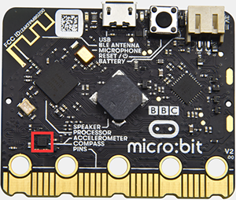

1.  实验说明：

本实验项目主要介绍micro:bit地磁传感器(磁力计)的使用，地磁传感器除了检测地磁场强度外，还能当作指南针确定方向，同时也是航姿参考系统(AHRS)的重要组成部分。micro:bit主板采用的是LSM303AGR地磁传感器，LSM303AGR包括支持标准、快速模式、快速模式plus和高速(100 kHz、400 kHz、1 MHz和3.4 MHz)的I2C串行总线接口和SPI串行标准接口与外部通信，磁场动态范围为±50 gauss。在micro:bit主板中，磁力检测、指南针积木块均用到了磁力计模块，本实验中，将先介绍指南针，然后查看磁力计原始数据。常见的指南针主要部件是一根磁针，在地磁场的作用下可以转动并指向地磁北极（地理南极附近），用来辨别方向。

注意：micro:bit主板内部的地磁传感器（磁力计、指南针），我们可以通过读取这个磁力计的读数来判断方位，得到相对于北磁极的数值，返回值是0到360之间的数值。在磁力计首次开始工作（带到新位置后）时系统会自动要求我们对micro:bit主板校准，正确的校准方式是旋转micro:bit主板。需要注意的是，附近要是有金属物件可能会影响读数和校准准确性。

2.  准备：

（1）通过micro USB线连接micro：bit和电脑。

（2）打开离线版本的Mu软件。

3\. 示例代码1：

用Mu软件打开“Project 6：Magnetic sensor
-1.py“文件，加载代码的路径如下：（[How to load the project code?](#AS)）

|文件类型|路径|文件名|
|-|-|-|
|Python file|../Python 课程/Python 代码/microbit基础课程/Project 6：地磁传感器|Project 6：Magnetic sensor-1.py|

加载完成后，如下图所示。你也可以打开Mu软件，在编辑窗口输入代码。（注意！所有英文及符号均须以英文填写，最后一行必须有空格。）

您需要单击“检查”按钮来检查代码是否有错误。如果一行出现光标或下划线，则表明该行的程序有错误。

确定程序代码无误之后，你还需要确定micro USB线已连接到micro:bit主板和电脑，然后单击“刷入”按钮将代码下载到micro:bit主板。

代码说明：首先必须对micro:bit进行校准，因为每个地方地磁场不同，对结果有比较大的的影响，如果是第一次使用指南针，micro:bit会自动提示需要校准。

4.实验结果1：

代码成功下载到micro：bit主板之后，利用micro USB数据线上电。按下micro:bit主板上正面按键A时，micro:bit主板首先提示校准，屏幕(LED点阵)提示:“TILT TO FILL SCREEN”,然后进入校准界面，校准方式为：旋转micro:bit主板，使得屏幕(LED点阵)画一个封闭的正方形（25个LED都点亮），如下图所示：

当封闭的正方形画好后，会显示一个“笑脸”图案，表示校准完成。

校准完成后，当每次按下按键A的时候，直接在屏幕上显示磁力计读数，北、东、南、西对应0°、90°、180°、270°。

5.示例代码2：

如图所示，如果读数在292.5和337.5之间，就让显示屏显示一个指向右上方的箭头，由于代码里不能输入0.5，所以取的判断数值是293和338。之后再加入其它逻辑加载完成后，如下图所示：

用Mu软件打开“Project 6：Magnetic sensor
-2.py“文件，加载代码的路径如下：（[How to load the project code?](#AS)）

|File Type|Route|File Name|
|-|-|-|
|Python file|../Python 课程/Python 代码/microbit基础课程/Project 6：地磁传感器|Project 6：Magnetic sensor -2.py|

加载完成后，如下图所示。你也可以打开Mu软件，在编辑窗口输入代码。（注意！所有英文及符号均须以英文填写，最后一行必须有空格。）

您需要单击“检查”按钮来检查代码是否有错误。如果一行出现光标或下划线，则表明该行的程序有错误。

确定程序代码无误之后，你还需要确定micro USB线已连接到micro:bit主板和电脑，然后单击“刷入”按钮将代码下载到micro:bit主板。

4.实验结果2：

代码成功下载到micro：bit主板之后，利用micro USB数据线上电。micro:bit提示校准（校准方法请参考:上面代码1部分），校准完成后，旋转移动micro:bit主板，可以看到micro:bit主板上LED点阵显示方向图案。

### Project 7：加速度传感器

1.  实验说明：

micro:bit V2主板内置有LSM303AGR
重力加速度传感器（加速度计），其具有8/10/12 bits的分辨率，代码可设置量程为1g、2g、4g,、8g。

我们常使用加速度计来检测机器的姿态。

在本实验项目中，将介绍加速度传感器（加速度计）对几个特殊姿态的检测，之后来查看加速度传感器输出的三轴原始数据。

2.  准备：

（1）通过micro USB线连接micro：bit和电脑。

（2）打开离线版本的Mu软件。

3\. 示例代码1：

用Mu软件打开“microbit-Three-axis acceleration sensor
-1.py“文件，加载代码的路径如下：（[How to load the project code?](#AS)）

|文件类型|路径|文件名|
|-|-|-|
|Python file|../Python 课程/Python代码/microbit基础课程/Project 7：加速度传感器|Project 7：Accelerometer-1.py|

加载完成后，如下图所示。你也可以打开Mu软件，在编辑窗口输入代码。（注意！所有英文及符号均须以英文填写，最后一行必须有空格。）

您需要单击“检查”按钮来检查代码是否有错误。如果一行出现光标或下划线，则表明该行的程序有错误。

确定程序代码无误之后，你还需要确定micro USB线已连接到micro:bit主板和电脑，然后单击“刷入”按钮将代码下载到micro:bit主板。

4.实验结果1：

代码成功下载到micro：bit主板之后，利用micro USB数据线上电。将micro:bit主板晃动，则可见micro:bit显示数字1（表明只要有晃动，无论朝哪个方向晃动，该条件都将满足）。

当micro:bit主板的Logo朝上时，LED点阵显示数字2，Logo朝上示意图如下所示：

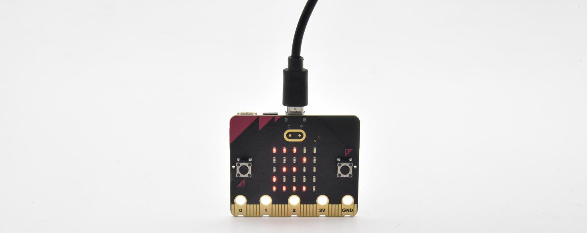

同理，micro:bit主板的Logo朝上时，LED点阵显示数字3(倒立的3)，Logo朝下示意图如下所示：

当屏幕朝上（指的是LED点阵朝上）时，LED点阵显示数字4。如下图所示：

同理，当屏幕朝下（指的是LED点阵朝下）时，LED点阵显示数字5。

当micro:bit
主板向左倾斜（是指LED点阵先朝上，然后再往左边倾斜）时，LED点阵显示数字6。如下图所示：

同理，当micro:bit主板向右倾斜（是指LED点阵先朝上，然后再往右边倾斜）时，LED点阵显示数字7。如下图所示：

当不小心碰到micro:bit主板使其从桌面掉落，则为做自由落体运动，此时，micro:bit主板满足自由落体的条件，则LED点阵显示数字8。（注意：此方法操作时，很容易把micro:bit主板摔坏，不建议操作）

注意：（3g、6g、8g，
如果需要满足此条件，则需要达到3倍，6倍，8倍重力加速度甩动micro:bit主板。如果你们有兴趣的话，这部分代码可以自己添加）

5.示例代码2：

用Mu软件打开“microbit-Three-axis acceleration sensor
-2.py“文件，加载代码的路径如下：（[How to load the project code?](#AS)）

|文件类型|路径|文件名|
|-|-|-|
|Python file|../Python 课程/Python代码/microbit基础课程/Project 7：加速度传感器|Project 7：Accelerometer-2.py|

加载完成后，如下图所示。你也可以打开Mu软件，在编辑窗口输入代码。（注意！所有英文及符号均须以英文填写，最后一行必须有空格。）

您需要单击“检查”按钮来检查代码是否有错误。如果一行出现光标或下划线，则表明该行的程序有错误。

确定程序代码无误之后，你还需要确定micro USB线已连接到micro:bit主板和电脑，然后单击“刷入”按钮将代码下载到micro:bit主板。

首先，查阅MMA8653FC数据手册，以及micro:bit的硬件原理图得知，micro:bit加速度计坐标如下图所示：

6.实验结果2：

代码成功下载到micro：bit主板之后，利用micro USB数据线上电。先点击“REPL”按钮，再按一下micro:bit主板后面的复位按钮，这样，BBC microbit REPL窗口打印并显示了micro：bit的加速度在X轴、Y轴、Z轴的分解，可得数据变化如下图：

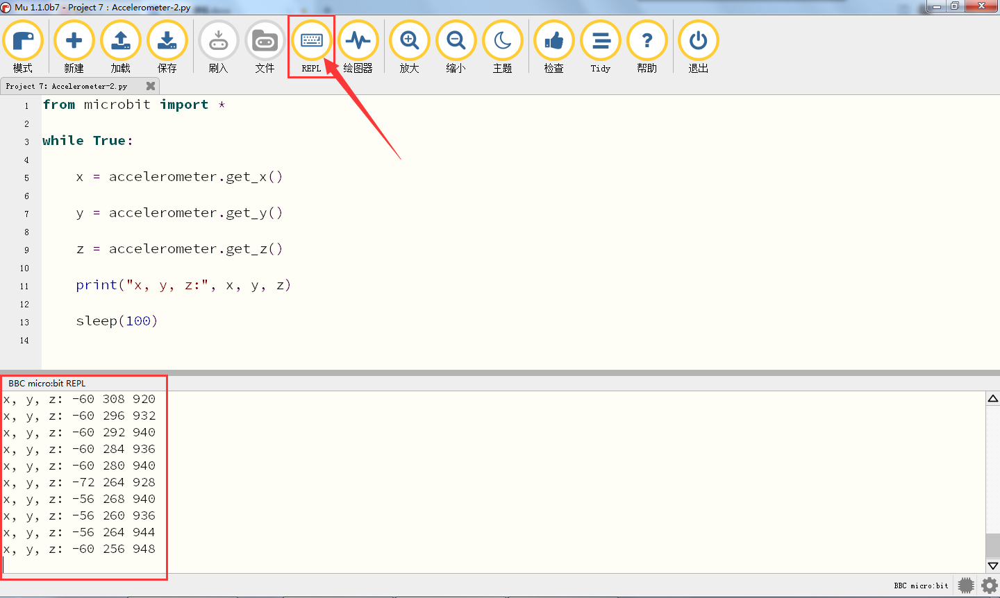

### Project 8：光照强度检测

1.  实验说明：

本实验将介绍micro:bit对外界光照强度的检测，由于micro:bit并不自带光敏传感器，对外界光照强度的检测是通过LED矩阵进行的，LED矩阵被用来感知周围的光，并反复地将LED转换成输入，并采样电压衰减时间。这样检测出来的光照强度是一个相对值。

2.  准备：

（1）通过micro USB线连接micro：bit和电脑。

（2）打开离线版本的Mu软件。

3.  示例代码：

用Mu软件打开“Project 8：Light Intensity Detection.py“文件，加载代码的路径如下：（[How to load the project code?](#AS)）

|文件类型|路径|文件名|
|-|-|-|
|Python file|../Python 课程/Python代码/microbit基础课程/Project 8：光照强度检测|Project 8：Light Intensity Detection.py|

加载完成后，如下图所示。你也可以打开Mu软件，在编辑窗口输入代码。（注意！所有英文及符号均须以英文填写，最后一行必须有空格。）

您需要单击“检查”按钮来检查代码是否有错误。如果一行出现光标或下划线，则表明该行的程序有错误。

确定程序代码无误之后，你还需要确定micro USB线已连接到micro:bit主板和电脑，然后单击“刷入”按钮将代码下载到micro:bit主板。

4.  实验结果：

代码成功下载到micro：bit主板之后，利用micro USB数据线上电。先点击“REPL”按钮，再按一下micro:bit主板后面的复位按钮，这样，BBC microbit REPL窗口打印并显示了micro：bit中光线传感器检测到的环境中光线强度值，如下图所示。当用手全部遮住micro:bit的LED点阵，亮度级别约为0；然后将micro:bit的LED点阵放置于光照下，随着环境中的光线强度增强时，亮度级别值也在逐渐增大；反之，亮度级别值在逐渐减少。代码中的20是一个随意设置的光照强度级别值，如果当前光照强度级别小于等于20，月亮就会出现在micro:bit主板的LED点阵上。如果大于20时，太阳就会出现。

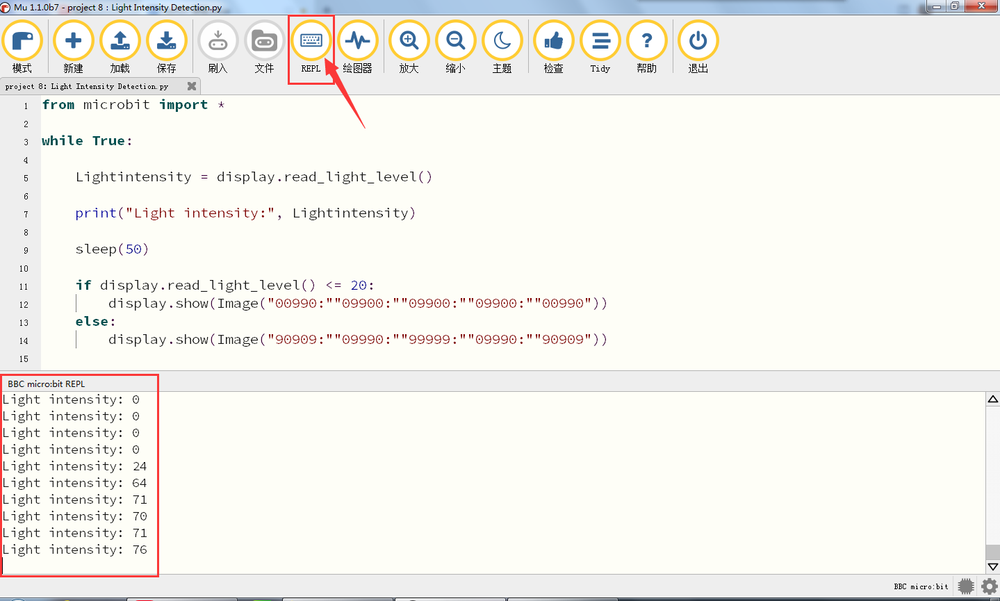

### Project 9：扬声器

1.实验说明：

micro:bit主板有内置扬声器，这使得在你的项目中添加声音变得非常容易。通过编程使扬声器发出各种各样的音调，例如编写一首歌曲：《欢乐颂》，让扬声器播放出来。

2.准备：

（1）通过micro USB线连接micro：bit和电脑。

（2）打开离线版本的Mu软件。

3.示例代码1：

用Mu软件打开“Project 9：Speaker-1 .py“文件，加载代码的路径如下：（[How to load the project code?](#AS)）

|文件类型|路径|文件名|
|-|-|-|
|Python file|../Python 课程/Python代码/microbit基础课程/Project 9：扬声器 |Project 9：Speaker-1.py|

加载完成后，如下图所示。你也可以打开Mu软件，在编辑窗口输入代码。（注意！所有英文及符号均须以英文填写，最后一行必须有空格。）

您需要单击“检查”按钮来检查代码是否有错误。如果一行出现光标或下划线，则表明该行的程序有错误。（图中红色框出来的部分可以忽略不管，这是因为MU软件没有识别到存在MicroPython里面的‘Sound’，实际它是可以正常执行的）

确定程序代码无误之后，你还需要确定micro USB线已连接到micro:bit主板和电脑，然后单击“刷入”按钮将代码下载到micro:bit主板。

4.实验结果1：

代码成功下载到micro：bit主板之后，利用micro USB数据线上电，micro:bit主板上的扬声器发出声音且LED点阵显示音乐标志图案。

5.示例代码2：

用Mu软件打开“Project 9：Speaker-2 .py“文件，加载代码的路径如下：（[How to load the project code?](#AS)）

|文件类型|路径|文件名|
|-|-|-|
|Python file|../Python 课程/Python代码/microbit基础课程/Project 9：扬声器 |Project 9：Speaker-2.py|

加载完成后，如下图所示。你也可以打开Mu软件，在编辑窗口输入代码。（注意！所有英文及符号均须以英文填写，最后一行必须有空格。）

您需要单击“检查”按钮来检查代码是否有错误。如果一行出现光标或下划线，则表明该行的程序有错误。

确定程序代码无误之后，你还需要确定micro USB线已连接到micro:bit主板和电脑，然后单击“刷入”按钮将代码下载到micro:bit主板。

歌曲《欢乐颂》的简谱如下：

更多音乐简谱知识的相关链接：<https://en.wikipedia.org/wiki/Numbered_musical_notation>

6.实验结果2：

代码成功下载到micro：bit主板之后，利用micro USB数据线上电，micro:bit主板上的扬声器演奏一首《欢乐歌》且LED点阵显示音乐标志图案。

### Project 10：触摸感应logo

1.  实验说明：

如果你有了新版micro:bit主板，你可以在你的项目中使用金色的触摸感应logo作为另一个输入，这就像多了一个按钮。触摸感应采用的是电容式触摸传感器，当你手指按下（或触摸）它时，它就能感应到电场的微小变化----就像你的手机或平板电脑屏幕一样。当你像按按钮一样按下它时，你可以在程序中触发事件。

2.准备：

（1）通过micro USB线连接micro：bit和电脑。

（2）打开离线版本的Mu软件。

3.示例代码：

用Mu软件打开“Project 10：Touch Sensitive Logo
.py“文件，加载代码的路径如下：（[How to load the project code?](#AS)）

|文件类型|路径|File Name|
|-|-|-|
|Python file|../Python 课程/Python代码/microbit基础课程/Project 10：触摸感应LOGO |Project 10：Touch Sensitive Logo.py|

加载完成后，如下图所示。你也可以打开Mu软件，在编辑窗口输入代码。（注意！所有英文及符号均须以英文填写，最后一行必须有空格。）

代码说明（怎样工作的？）：（1）micro:bit以毫秒(数千分一秒)记录它被启动的时间。这被称为运行时间。

（2）当你按下按钮A时，一个名为start的变量被设置为当前运行时间。

（3）当你按下按钮B时，开始时间将从新的运行时间中减去，以计算出从你启动秒表以来已经过去了多少时间。这个差异被加到总时间中，总时间存储在一个名为time的变量中。

（4）如果你按下金色LOGO图标，程序就会在LED显示屏上显示经过的总时间。它通过除以1000将时间从毫秒(千分之一秒)转换为秒。它使用整数除法运算符给出整数(整型)的结果。

（5）该程序还使用一个名为running的布尔变量来控制该程序。布尔变量只能有两个值:true或false。如果“running”为“true”，则表示秒表已经启动。如果“running”为假，则表示秒表未启动或已停止。

（6）如果“running”为真，则跳动的心脏循环显示在LED点阵屏。

（7）如果秒表已经停止，如果“running”为假时，当你按下金色LOGO图标时，它将只显示时间。

（8）如果秒表已经启动，如果“running”为真时，则确保只有按下按钮B时，时间变量才会更改，代码还可防止错误读数。

您需要单击“检查”按钮来检查代码是否有错误。如果一行出现光标或下划线，则表明该行的程序有错误。（图中红色框出来的部分可以忽略不管，这是因为MU软件没有识别到存在MicroPython里面集成的函数，实际它是可以正常执行的）

确定程序代码无误之后，你还需要确定micro USB线已连接到micro:bit主板和电脑，然后单击“刷入”按钮将代码下载到micro:bit主板。

4.实验结果：

代码成功下载到micro：bit主板之后，利用micro USB数据线上电，按下按钮A开始秒表运行。当计时时，LED点阵屏上就会显示一个跳动的心脏。按按钮B停止，你可以随时启动和停止它，它会不断增加时间，就像一个真正的秒表。按下micro:bit主板前面的金色LOGO标志，以秒为单位显示测量的时间。要将时间重置为零，请按micro:bit主板背面的复位按钮。

### Project 11：麦克风

1.实验说明：

micro:bit
主板有一个内置麦克风，可以测量环境的声音程度。你可以使用它作为一个简单的输入---当你鼓掌时，micro:bit主板上前面内置麦克风LED指示灯会被打开。它还可以测量声音的强度，所以你可以制作一个噪音等级表或与音乐合拍的迪斯科灯光。麦克风是在micro:bit
主板的背面，而在前面，你会发现一个内置麦克风LED指示灯，还有紧挨着让声音进入麦克风的孔。当你micro:bit主板在测量声音级别时，它就会亮起来。

2.准备：

（1）通过micro USB线连接micro：bit和电脑。

（2）打开离线版本的Mu软件。

3.示例代码：

用Mu软件打开“Project 11：Microphone-1.py“文件，加载代码的路径如下：（[How to load the project code?](#AS)）

|文件类型|路径|文件名|
|-|-|-|
|Python file|../Python 课程/Python代码/microbit基础课程/Project 11：麦克风 |Project 11：Microphone-1.py|

加载完成后，如下图所示。你也可以打开Mu软件，在编辑窗口输入代码。（注意！所有英文及符号均须以英文填写，最后一行必须有空格。）

您需要单击“检查”按钮来检查代码是否有错误。如果一行出现光标或下划线，则表明该行的程序有错误。（图中红色框出来的部分可以忽略不管，这是因为MU软件没有识别到存在MicroPython里面集成的函数，实际它是可以正常执行的）

确定程序代码无误之后，你还需要确定micro USB线已连接到micro:bit主板和电脑，然后单击“刷入”按钮将代码下载到micro:bit主板。

4.实验结果：

代码成功下载到micro：bit之后，利用micro USB数据线上电。当你鼓掌时，micro:bit
主板上的LED点阵显示“❤”图案；当外界环境安静时，micro:bit
主板上的LED点阵显示“

”图案。

5.示例代码2：

用Mu软件打开“Project 11：Microphone-2.py“文件，加载代码的路径如下：（[How to load the project code?](#AS)）

|文件类型|路径|文件名|
|-|-|-|
|Python file|../Python 课程/Python代码/microbit基础课程/Project 11：麦克风|Project 11：Microphone-2.py|

加载完成后，如下图所示。你也可以打开Mu软件，在编辑窗口输入代码。（注意！所有英文及符号均须以英文填写，最后一行必须有空格。）

您需要单击“检查”按钮来检查代码是否有错误。如果一行出现光标或下划线，则表明该行的程序有错误。

确定程序代码无误之后，你还需要确定micro USB线已连接到micro:bit主板和电脑，然后单击“刷入”按钮将代码下载到micro:bit主板。

6.实验结果：

代码成功下载到micro：bit主板之后，利用micro USB数据线上电，并且，当你按下micro:bit主板上的A键时，micro:bit主板上的LED点阵显示检测到的此时环境中最大声音级别值（这里需要注意：通过按micro:bit背面的重置按钮重置最大值。）；当鼓掌时，测量的声音越大，LED点阵屏的25个LED就越亮。

### Project 12: 触摸Logo控制扬声器

1.实验介绍:

前面的实验项目中已经学习过microbit板上的金色logo工作原理及控制方法和扬声器发生的原理。在本项目中，我们将金色logo和扬声器相结合，通过触摸金色logo，扬声器播放音乐。

2.所需组件:

||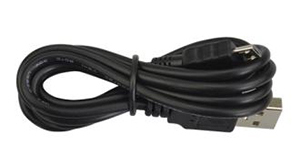|
|-|-|
|Micro:bit主板*1|Micro USB 线*1|

3.实验接线:

通过micro USB线将micro:bit主板连接到你的电脑上。

4.示例代码:

用Mu软件打开“Project 12：Touch the Logo to control the speaker.py“文件，加载代码的路径如下：（[How to load the project code?](#AS)）

|文件类型|路径|文件名|
|-|-|-|
|Python file|../Python 课程/Python代码/microbit基础课程/Project 12:触摸Logo控制扬声器|Project 12：Touch the Logo to control the speaker.py|

加载完成后，如下图所示。你也可以打开Mu软件，在编辑窗口输入代码。（注意！所有英文及符号均须以英文填写，最后一行必须有空格。）

您需要单击“检查”按钮来检查代码是否有错误。如果一行出现光标或下划线，则表明该行的程序有错误。（图中红色框出来的部分可以忽略不管，这是因为MU软件没有识别到存在MicroPython里面集成的函数，实际它是可以正常执行的）

确定程序代码无误之后，你还需要确定micro USB线已连接到micro:bit主板和电脑，然后单击“刷入”按钮将代码下载到micro:bit主板。

5.实验现象：

代码成功下载到micro：bit主板之后，利用micro USB数据线上电，当手触摸金色Logo时，micro:bit主板上的扬声器播放一首“生日歌”。

6.代码说明：

|from microbit import *|导入micro：bit的库文件|
|-|-|
|while True:|这是一个永久循环，它使micro：bit永远执行这个循环中的代码。|
|display.show（Image.MUSIC_QUAVER）|microbit主板上的LED点阵显示音乐符号|
|if pin_logo. is_touched( ):|如果microbit主板上的Logo标志被触摸时，执行以下命令|
|music.play（music.BIRTHDAY）|microbit主板上的扬声器播放“生日歌”|

### Project 13：micro:bit的蓝牙无线通信

虽然micro:bit拥有一个低功耗蓝牙模块，可以进行蓝牙连接发送数据等，但它只有16k的RAM。BLE堆栈占用了12k RAM，这意味着没有足够的空间来运行microPython；也意味着在同一时刻，microPython和蓝牙服务只能运行一个。

在将来可能配备32k RAM的版本就可以支持蓝牙服务了，在此之前，microPython还无法支持蓝牙。

<https://microbit-micropython.readthedocs.io/en/latest/ble.html>

## 4.4 micro:bit扩展课程

前面已经学习了micro:bit基础课程，现在，让我们直接进入micro:bit拓展课程项目。在这个套件中，包括14个传感器和模块。我们将从简单的传感器和模块入手，让你深入了解micro:bit智能家居功能。但是，如果你对micro:bit相关知识和各传感器/模块相关知识都掌握的很好。你可以跳过这些步骤，直接跳到最后一课实验项目实现micro:bit蓝牙控制micro:bit智能家居多功能效果。

注意：本项目中的各传感器/模块上标有（G或GND）表示负极，是连接到控制板或传感器扩展板上的G或GND；标有（V或VCC）表示正极，是连接到控制板或传感器扩展板上的V或VCC或5V，在烧入程序后需要接通外接电源，否则可能供电不足导致无效。

### Project 1：LED闪烁

1.  实验介绍：

前面我们已经组装好了microbit智能家居。接下来的项目我们就要由简单到复杂，一步一步探索micro:bit的世界了。首先我们要来完成经典的“micro:bit点亮LED”，也就是Blink项目。Blink对于学习micro:bit的爱好者而言，是最基础的项目，也是新手必须经历的一个练习。

LED，即发光二极管的简称。由含镓（Ga）、砷（As）、磷（P）、氮（N）等的[化合物](https://baike.baidu.com/item/%E5%8C%96%E5%90%88%E7%89%A9/1142931)制成。当电子与[空穴](https://baike.baidu.com/item/%E7%A9%BA%E7%A9%B4/3517781)复合时能辐射出可见光，因而可以用来制成发光二极管。在电路及仪器中作为指示灯，或者组成文字或数字显示。砷化镓二极管发红光，磷化镓二极管发绿光，碳化硅二极管发黄光，氮化镓二极管发蓝光。因化学性质又分有机发光二极管OLED和无机发光二极管LED。

为了实验的方便，我们将LED发光二极管做成了一个LED模块，在这个项目中，我们用一个最基本的测试代码来控制LED，亮一秒钟，灭一秒钟，来实现闪烁的效果。你可以改变代码中LED灯亮灭的时间，实现不同的闪烁效果。LED模块信号端S为高电平时LED亮起，S为低电平时LED熄灭。

2.黄色LED模块的规格参数：

|工作电压:|DC 3.3-5V|
|-|-|
|工作电流：|&lt; 20mA|
|最大功率：|0.1W|
|控制接口:|数字口（数字输入）|
|工作温度：|-10°C ~ +50°C|
|LED显示颜色：|黄色|

3.示例代码：

|Microbit扩展板|黄色LED模块|
|-|-|
|GND|G|
|5V|V|
|S（16）|S|

用Mu软件打开“Project 1：LED
刷入ing.py“文件，加载代码的路径如下：（[How to load the project code?](#AS))

|文件类型|路径|文件名|
|-|-|-|
|Python file|../Python 课程/Python代码/microbit扩展课程/Project 1：LED闪烁|Project 1：LED 刷入ing.py|

加载完成后，如下图所示。你也可以打开Mu软件，在编辑窗口输入代码。（注意！所有英文及符号均须以英文填写，最后一行必须有空格。）

您需要单击“检查”按钮来检查代码是否有错误。如果一行出现光标或下划线，则表明该行的程序有错误。

确定程序代码无误之后，你还需要确定micro USB线已连接到micro:bit主板和电脑，然后单击“刷入”按钮将代码下载到micro:bit主板。

4.实验现象：

将示例代码上传到micro:bit主板，上传成功后，并且外接电源供电，将扩展板上的拨码开关拨到ON端，再将船型开关上的“1”端按下。microbit主板上的的LED点阵显示“笑脸”图案，黄色LED亮1000毫秒，灭1000毫秒，循环交替。

5.代码说明：

|from microbit import *|导入micro：bit的库文件|
|-|-|
|display.show(Image.HAPPY)|microbit主板上的LED点阵显示“笑脸”图案|
|while True:|这是一个永久循环，它使micro：bit永远执行这个循环中的代码。|
|Pin16.write_digital(1)|控制引脚16输出高电平，点亮LED|
|Pin16.write_digital(0)|控制引脚16输出低电平，熄灭LED|
|sleep(1000)|延时1000毫秒|

### Project 2：LED亮度调节

1.实验介绍：

前面课程中，我们详细的介绍了通过测试代码控制LED亮灭，实现闪烁的效果。这节课我们使用PWM来控制LED亮度不断地变化，模拟我们呼吸的效果。

PWM是使用数字手段来控制模拟输出的一种手段。使用数字控制产生占空比不同的方波（一个不停在高电平与低电平之间切换的信号)来控制模拟输出。一般来说端口的输入电压只有两个0V与3V。如果想要改变灯的亮度怎么办呢个？有同学说串联电阻，对，这个方法是正确的。但是，如果想要得到不同的亮度，且在不同亮度之间来回变动怎么办呢？不可能不停地切换电阻吧。这种情况下就需要使用PWM了，那它是怎么控制的呢？

对于micro:bit的数字端口电压输出只有LOW与HIGH两个，对应的就是0V与3V的电压输出，可以把LOW定义为0，HIGH定义为1，1秒内让micro:bit输出500个0或者1的信号。如果这500个全部为1，那就是完整的3V，如果全部为0，那就是0V。如果010101010101这样输出，刚好一半，端口输出的平均电压就为1.5V了。这个和放映电影是一个道理，咱们所看的电影并不是完全连续的，它其实是每秒输出25张图片。在这种情况下，人的肉眼是分辨不出来的，看上去就是连续的了。PWM也是同样的道理，如果想要不同的电压，就控制0与1的输出比例控制就可以了。当然这和真实的连续输出还是有差别的，单位时间内输出的0,1信号越多，控制的就越精确。（输出电压=（开启时间/脉冲时间）\*最大电压值）  
在下图中，绿线之间代表一个周期，其值也是PWM频率的倒数。换句话说，如果micro:bit的PWM频率是500Hz，那么两绿线之间的周期就是2毫秒。
analogWrite()命令中可以操控的范围为0-255，analogWrite(255)表示100%占空比（常开），analogWrite(127)占空比大约为50%（一半的时间）。

脉冲宽度调制（PWM）有多种应用：灯亮度调节、电机调速、发声等。
以下是PMW的三个基本参数：

（1）脉冲宽度的振幅（最小/最大）

（2）脉冲周期（1秒内脉冲频率的倒数）

（3）电压水平（如：0V-3V）

（4）micro:bit主板上有6个常用的PMW接口，即P0、P1、P2、P3、P4和P10。还有13个不常用的PMW接口，即P5、P6、P7、P8、P9、P11、P12、P13、P14、P15、P16、P19和P20。

实验中，我们将黄色LED模块的信号端S接到microbit扩展板上的S（6），从micro:bit主板引脚说明我们知道P6还可以当做PWM接口。我们通过P6引脚控制外接LED亮度，先是逐渐变亮，然后是逐渐变暗，循环交替，模拟人体呼吸现象。

2.黄色LED模块的规格参数：

|工作电压:|DC 3.3-5V|
|-|-|
|工作电流：|&lt; 20mA|
|最大功率：|0.1W|
|控制接口:|数字口（数字输入）|
|工作温度：|-10°C ~ +50°C|
|LED显示颜色：|黄色|

3.示例代码：

|Microbit扩展板|黄色LED模块|
|-|-|
|GND|G|
|5V|V|
|S（16）|S|

用Mu软件打开“Project 2：Breathing lamp.py“文件，加载代码的路径如下：（[How to load the project code?](#AS))

|文件类型|路径|文件名|
|-|-|-|
|Python file|../Python 课程/Python代码/microbit扩展课程/Project 2：呼吸灯|Project 2：Breathing lamp.py|

加载完成后，如下图所示。你也可以打开Mu软件，在编辑窗口输入代码。（注意！所有英文及符号均须以英文填写，最后一行必须有空格。）

您需要单击“检查”按钮来检查代码是否有错误。如果一行出现光标或下划线，则表明该行的程序有错误。

确定程序代码无误之后，你还需要确定micro USB线已连接到micro:bit主板和电脑，然后单击“刷入”按钮将代码下载到micro:bit主板。

4.实验现象：

将示例代码上传到micro:bit主板，上传成功后，并且外接电源供电，将扩展板上的拨码开关拨到ON端，再将船型开关上的“1”端按下。microbit主板上的的LED点阵显示“笑脸”图案，可以看到黄色LED会有个逐渐由亮到灭的一个缓慢过程，而不是直接的亮灭，如同呼吸一般，均匀变化。循环交替。

5.代码说明：

|from microbit import *|导入micro：bit的库文件|
|-|-|
|display.show(Image.HAPPY)|microbit主板上的LED点阵显示“笑脸”图案|
|while True:|这是一个永久循环，它使micro：bit永远执行这个循环中的代码。|
|for index in range(0, 255):|range()是一个函数， for index in range(0, 255)就是将0~255赋值给index|
|pin16.write_analog(index)|控制引脚16模拟输出index|
|sleep(10)|延时10毫秒|

### Project 3：6812 2x2全彩RGB

1.实验介绍：

6812 2x2
全彩RGB模块是一个集控制电路与发光电路于一体的智能外控LED光源。每个LED原件其外型与一个5050LED灯珠相同，每个元件即为一个像素点。像素点内部包含了智能数字接口数据锁存信号整形放大驱动电路，还包含有高精度的内部振荡器和12V高压可编程定电流控制部分，有效保证了像素点光的颜色高度一致。

数据协议采用单线归零码的通讯方式，像素点在上电复位以后，S端接受从控制器传输过来的数据，首先送过来的24bit数据被第一个像素点提取后，送到像素点内部的数据锁存器。LED具有低电压驱动，环保节能，亮度高，散射角度大，一致性好，超低功率，超长寿命等优点。

2.6812 2x2全彩RGB的规格参数：

|工作电压：|DC 3.3-5V|最大工作电流：|200mA|最大功率:|1W|
|-|-|-|-|-|-|
|工作温度：|-10℃~+50℃|光源：|SMD 5050 RGB|IC型号：|4颗/WS2811|
|灰度等级：|256级|发光角度：|180°|发光颜色:|可以通过控制器调为红，黄，蓝，绿，白等|

3.示例代码1：

|Microbit扩展板|6812 2x2全彩RGB模块|
|-|-|
|GND|G|
|5V|V|
|S（14）|S|

用Mu软件打开“Project 3：6812 2x2 full color RGB-1.py“文件，加载代码的路径如下：（[How to load the project code?](#AS))

|文件类型|路径|文件名|
|-|-|-|
|Python file|../Python 课程/Python代码/microbit扩展课程/Project 3：6812 2x2全彩RGB|Project 3：6812 2x2 full color RGB-1.py|

加载完成后，如下图所示。你也可以打开Mu软件，在编辑窗口输入代码。（注意！所有英文及符号均须以英文填写，最后一行必须有空格。）

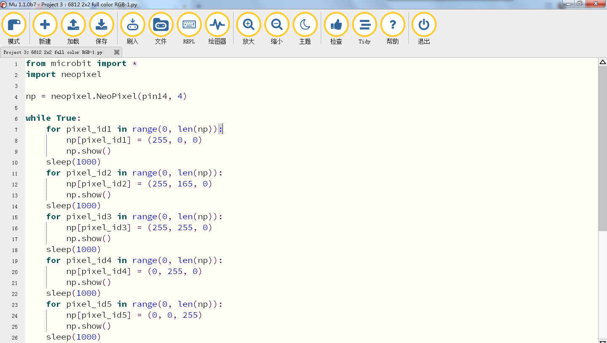

您需要单击“检查”按钮来检查代码是否有错误。如果一行出现光标或下划线，则表明该行的程序有错误。

确定程序代码无误之后，你还需要确定micro USB线已连接到micro:bit主板和电脑，然后单击“刷入”按钮将代码下载到micro:bit主板。

4.实验现象1：

将示例代码1上传到micro:bit主板，上传成功后，并且外接电源供电，将扩展板上的拨码开关拨到ON端，再将船型开关上的“1”端按下。可以看到6812 2x2
全彩RGB模块上的5个WS2812RGB灯全亮，且颜色依次红、橙、黄、绿、蓝、靛蓝、紫罗兰、紫、白，循环进行。

5.示例代码2：

用Mu软件打开“Project 3：6812 2x2 full color RGB-2.py“文件，加载代码的路径如下：（[How to load the project code?](#AS))

|文件类型|路径|文件名|
|-|-|-|
|Python file|../Python 课程/Python代码/microbit扩展课程/Project 3：6812 2x2全彩RGB|Project 3：6812 2x2 full color RGB-2.py|

加载完成后，如下图所示。你也可以打开Mu软件，在编辑窗口输入代码。（注意！所有英文及符号均须以英文填写，最后一行必须有空格。）

您需要单击“检查”按钮来检查代码是否有错误。如果一行出现光标或下划线，则表明该行的程序有错误。

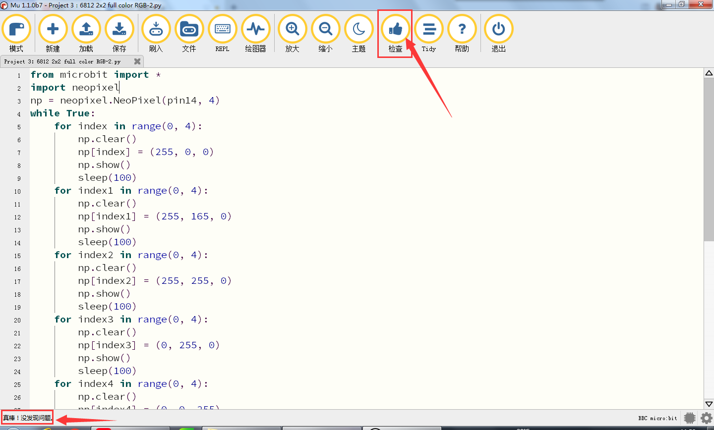

确定程序代码无误之后，你还需要确定micro USB线已连接到micro:bit主板和电脑，然后单击“刷入”按钮将代码下载到micro:bit主板。

6.实验现象2：

将示例代码2上传到micro:bit主板，上传成功后，并且外接电源供电，将扩展板上的拨码开关拨到ON端，再将船型开关上的“1”端按下。可以看到6812 2x2
全彩RGB模块上的4个WS2812RGB灯以流水灯的形式点亮，一圈一种颜色，循环。

7.示例代码3：

用Mu软件打开“Project 3：6812 2x2 full color RGB-3.py“文件，加载代码的路径如下：（[How to load the project code?](#AS))

|文件类型|路径|文件名|
|-|-|-|
|Python file|../Python 课程/Python代码/microbit扩展课程/Project 3：6812 2x2全彩RGB|Project 3：6812 2x2 full color RGB-3.py|

加载完成后，如下图所示。你也可以打开Mu软件，在编辑窗口输入代码。（注意！所有英文及符号均须以英文填写，最后一行必须有空格。）

您需要单击“检查”按钮来检查代码是否有错误。如果一行出现光标或下划线，则表明该行的程序有错误。

确定程序代码无误之后，你还需要确定micro USB线已连接到micro:bit主板和电脑，然后单击“刷入”按钮将代码下载到micro:bit主板。

8.实验现象3：

将示例代码3上传到micro:bit主板，上传成功后，并且外接电源供电，将扩展板上的拨码开关拨到ON端，再将船型开关上的“1”端按下。可以看到6812 2x2
全彩RGB模块上的4个WS2812RGB灯以流水灯的形式点亮，每个灯亮起都是一种随机颜色，循环。

### Project 4：人体红外热释电传感器

1.实验介绍：

人体红外热释电传感器是一款基于热释电效应的人体热释电红外运动传感器，能检测运动的人体或动物身上发出的红外信号，配合菲涅尔透镜能使传感器探测范围更远更广。它主要采用RE200B-P传感器元件，当附近有人或动物运动时，人体红外热释电传感器能根据检测到的红外线，将红外线信号转化为数字信号并输出一个高电平。它可以应用于多种场合来检测人体的运动。传统的热释电红外传感器体积大，电路复杂，可靠性低。

现在我们推出这款一款新的热释电红外运动传感器，该传感器集成了数字热释电红外传感器和连接管脚。具有灵敏度高、可靠性强、超低功耗，体积小、重量轻，超低电压工作模式和外围电路简单等特点。

2.人体红外热释电传感器的规格参数：

|工作电压：|DC 4.5-6.5V|
|-|-|
|最大工作电流：|50MA|
|静态电流:|&lt;50uA|
|控制接口：|数字输出(高电平为3.3V，低电平0V)|
|控制信号：|数字信号1/0|
|工作温度：|-10 ~ 50 ℃|
|最大探测距离：|4米|
|感应角度：|＜100°锥角|
|触发方式:|L 不可重复触发/H 重复触发|

特别说明：

（1）测试过程中最大距离为4米。

（2）测试时，首先打开白色镜头，可以看到矩形感应部分。当矩形传感部分的长线与地面平行时，距离最好。

（3）测试时，传感器需要覆盖白色镜片，否则会影响距离。

（4）在25℃时检测距离最好，超过30℃时检测距离缩短。

（5）启动并上传完代码后，您需要等待5~10秒，然后开始测试，否则不敏感。

3.示例代码：

|Microbit扩展板|人体红外热释电传感器|
|-|-|
|GND|G|
|5V|V|
|S（15）|S|

用Mu软件打开“Project 4：PIR motion sensor.py“文件，加载代码的路径如下：（[How to load the project code?](#AS))

|文件类型|路径|文件名|
|-|-|-|
|Python file|../Python课程/Python代码/microbit扩展课程/Project 4：人体红外热释电传感器|Project 4：PIR motion sensor.py|

加载完成后，如下图所示。你也可以打开Mu软件，在编辑窗口输入代码。（注意！所有英文及符号均须以英文填写，最后一行必须有空格。）

您需要单击“检查”按钮来检查代码是否有错误。如果一行出现光标或下划线，则表明该行的程序有错误。

确定程序代码无误之后，你还需要确定micro USB线已连接到micro:bit主板和电脑，然后单击“刷入”按钮将代码下载到micro:bit主板。

4.实验现象：

代码成功下载到micro：bit主板之后，利用micro USB数据线上电，并且外接电源供电，将扩展板上的拨码开关拨到ON端，再将船型开关上的“1”端按下。主板上的LED点阵屏显示“笑脸”图案。先点击“REPL”按钮，再按一下micro:bit主板后面的复位按钮，当人体红外热释电传感器检测到附近有人运动时，串口输出数字信号1（高电平），且模块上的指示灯不亮；否则，当人体红外热释电传感器未检测到附近有人运动时，串口输出数字信号0（低电平），且模块上的指示灯点亮。

如果没有显示，请按micro bit板上的复位键

### Project 5：感应灯

1.实验介绍：

在前面的项目实验中，我们已经了解了人体红外热释电传感器的工作原理及其控制方法。在本项目实验中，我们结合人体红外热释电传感器和黄色LED，通过人体红外热释电传感器来控制LED的亮、灭，模拟生活中的感应灯。

用Mu软件打开“Project 5：sensor light.py“文件，加载代码的路径如下：（[How to load the project code?](#AS))

|文件类型|路径|文件名|
|-|-|-|
|Python file|../Python 课程/Python代码/microbit扩展课程/Project 5：感应灯|Project 5：sensor light.py|

加载完成后，如下图所示。你也可以打开Mu软件，在编辑窗口输入代码。（注意！所有英文及符号均须以英文填写，最后一行必须有空格。）

您需要单击“检查”按钮来检查代码是否有错误。如果一行出现光标或下划线，则表明该行的程序有错误。

确定程序代码无误之后，你还需要确定micro USB线已连接到micro:bit主板和电脑，然后单击“刷入”按钮将代码下载到micro:bit主板。
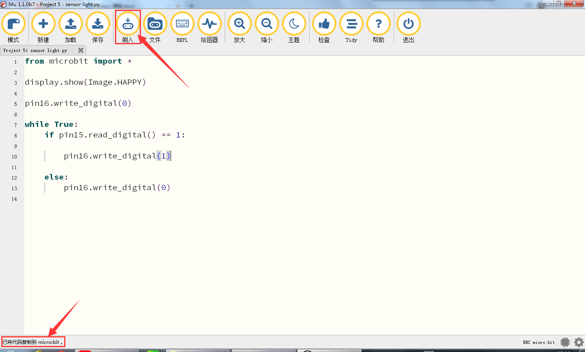

4.实验现象：

将示例代码下载到micro:bit主板，并且外接电源供电，将扩展板上的拨码开关拨到ON端，再将船型开关上的“1”端按下。microbit主板上的LED点阵显示“笑脸”图案，当人体红外热释电传感器检测到附近有人运动时，黄色LED灯点亮；否则，当人体红外热释电传感器未检测到附近有人运动时，黄色LED灯熄灭。

### Project 6：舵机角度调节

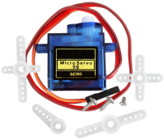

1.实验介绍：

当我们在制作智能家居时，经常会将舵机和门、窗等固定在一起。这样，我们就可以利用舵机转动，带动门、窗等开或关，从而起到家居生活的智能化功能。在这课程中我们着重介绍下智能家居套件中的舵机的原理和使用方法。

舵机是一种位置伺服的驱动器，主要是由外壳、电路板、无核心马达、齿轮与位置检测器所构成。与马达不同，我们一般控制马达的转速和方向。而舵机更多的是控制指定的角度。常用的舵机可旋转的角度范围是0°到180°。舵机引线为3线，分别用棕、红、橙三种颜色进行区分，舵机品牌和生产厂家不同，会有些许差异，使用之前需查看资料。我们使用的是最常见的舵机，棕、红、橙分别对应“电源负极，电源正极，控制信号”。

2.舵机的控制原理：

舵机的伺服系统由可变宽度的脉冲来进行控制，橙色的控制线是用来传送脉冲的。一般而言，PWM控制舵机的基准信号周期为20ms（50Hz），理论上脉宽应在1ms到2ms之间，对应控制舵机角度是0°～180°。但是，实际上更多控制舵机的脉宽范围是0.5ms
到2.5ms，具体需要自己实际调试下。

经过实测，舵机的脉冲范围为0.65ms~2.5ms。180度舵机，对应的控制关系是这样的：

|高电平时间|舵机角度|基准信号周期时间（20ms）|
|-|-|-|
|0.65ms|0度|0.65ms高电平+19.35ms低电平|
|1.5ms|90度|1.5ms高电平+18.5ms低电平|
|2.5ms|180度|2.5ms高电平+17.5ms低电平|

这里要注意，不要使用电脑和USB数据线供电，因为如果电流需求大于500mA，会有烧坏舵机的可能，推荐使用电池外置供电。

4.示例代码：

|Microbit扩展板|舵机|
|-|-|
|GND|棕线|
|5V|红线|
|S（8）|橙线|

用Mu软件打开“Project 6：adjust the angle of a servo.py“文件，加载代码的路径如下：（[How to load the project code?](#AS))

|文件类型|路径|文件名|
|-|-|-|
|Python file|../Python 课程/Python代码/microbit扩展课程/Project 6：舵机角度调节|Project 6：adjust the angle of a servo.py|

加载完成后，如下图所示。你也可以打开Mu软件，在编辑窗口输入代码。（注意！所有英文及符号均须以英文填写，最后一行必须有空格。）

您需要单击“检查”按钮来检查代码是否有错误。如果一行出现光标或下划线，则表明该行的程序有错误。（图中红色框出来的部分可以忽略不管，这是因为MU软件没有识别到存在MicroPython里面集成的函数，实际它是可以正常执行的）

确定程序代码无误之后，你还需要确定micro USB线已连接到micro:bit主板和电脑，然后单击“刷入”按钮将代码下载到micro:bit主板。

4.实验现象：

将示例代码上传到micro:bit主板，上传成功后，microbit主板上的LED点阵显示“笑脸”图案，并且外接电源供电，将扩展板上的拨码开关拨到ON端，再将船型开关上的“1”端按下，舵机从0°~45°~90°~135°~180°~0°，循环进行。

### Project 7：小风扇转动

1.实验介绍：

130电机模块是采用HR1124S芯片控制电机的。HR1124S是应用于直流电机方案的单通道H桥驱动器芯片。HR1124S的H桥驱动部分采用低导通电阻的PMOS和NMOS功率管。低导通电阻保证芯片低的功率损耗，使得芯片安全工作更长时间。此外HR1124S拥有低待机电流，低静态工作电流，这些性能使HR1124S易用于玩具方案。

该电机模块兼容各种单片机控制板，如microbit系列单片机。模块上自带的防反插白色端子兼具为2.54mm，使用时，我们可以利用杜邦线连接到microbit扩展板。实验中，我们可通过输出到两个信号端IN+和IN-的电压方向来控制电机的转动方向，控制输出PWM信号来控制电机转动的速度。

2\. 130电机模块的规格参数：

|工作电压：|3.3-5V(DC)|最大电流：|200mA (DC5V)|
|-|-|-|-|
|最大功率：|1W|控制接口：|双数字口（数字输入）|
|工作温度：|-10°C ~+50°C|环保属性：|ROHS|

3.示例代码1：（高低电平控制）

|Microbit扩展板|电机|
|-|-|
|GND|G|
|5V|V|
|S（13）|IN+|
|S（12）|IN-|

用Mu软件打开“Project 7：Small fan rotation-1.py“文件，加载代码的路径如下：（[How to load the project code?](#AS))

|文件类型|路径|文件名|
|-|-|-|
|Python file|../Python 课程/Python代码/microbit扩展课程/Project 7：小风扇转动|Project 7：Small fan rotation-1.py|

加载完成后，如下图所示。你也可以打开Mu软件，在编辑窗口输入代码。（注意！所有英文及符号均须以英文填写，最后一行必须有空格。）

您需要单击“检查”按钮来检查代码是否有错误。如果一行出现光标或下划线，则表明该行的程序有错误。

确定程序代码无误之后，你还需要确定micro USB线已连接到micro:bit主板和电脑，然后单击“刷入”按钮将代码下载到micro:bit主板。

4.示例代码2：（PWM调速控制）

用Mu软件打开“Project 7：Small fan rotation-2.py“文件，加载代码的路径如下：（[How to load the project code?](#AS))

|文件类型|路径|文件名|
|-|-|-|
|Python file|../Python代码/microbit扩展课程/Project 7：小风扇转动|Project 7：Small fan rotation-2.py|

加载完成后，如下图所示。你也可以打开Mu软件，在编辑窗口输入代码。（注意！所有英文及符号均须以英文填写，最后一行必须有空格。）

您需要单击“检查”按钮来检查代码是否有错误。如果一行出现光标或下划线，则表明该行的程序有错误。

确定程序代码无误之后，你还需要确定micro USB线已连接到micro:bit主板和电脑，然后单击“刷入”按钮将代码下载到micro:bit主板。

5.实验现象：

按照之前的方式将示例代码上传到micro:bit主板，上传成功后，并且外接电源供电，将扩展板上的拨码开关拨到ON端，再将船型开关上的“1”端按下。电风扇顺时针转动5s，停止1s，逆时针转动5s，停止1s，循环进行。

### Project 8：太阳能与USB充电锂电池电源模块

1.实验介绍：

本模块集成一片充放电芯片，通过PH2.0MM接口可以外接可充电电池，我们使用了单节锂电池。模块有一个micro USB充电口与一个太阳板充电口，通过任意一个口都可以对外接的锂电池进行充电。模块上也集成一个升压模块，可将电池电压升到6.6V。通过3P黄色弯排针G、V脚可以输出6.6V电压，排针的S脚可以读取电阻1/2分压后的电池电压，模块上的拨动开关就是3P弯针6.6V的电压输出开关。

2.模块规格参数：

|充电接口|Micro USB 与 HP2.0MM太阳能板接口|
|-|-|
|太阳能板接口输入电压|4.4-6V|
|电池恒压充电值|4.15-4.24V|
|最大充电电流|800mA|
|输出接口|3 P 2.54mm 弯针排针|
|输入电压|6.6V|
|最大输出电流|800mA|
|外接电池|单节锂电池|
|环保属性|ROHS|

3.模块的原理图：

4.模块的简单功能：

SOLAR4.8-6.0V
端是接太阳能板，太阳能通过太阳能板转化成电能，是电源输入端。

BAT端是接电池盒（可充电电池）的，是电源输出端，给电池充电，可将电能储存在电池内。

这个拨动开关是电源开关，拨到ON端是接通外接单节锂电池，这样单节锂电池的电流通过G、V引脚流向microbit扩展板，给microbit扩展板供电；反之，拨到OFF端是断开外接单节锂电池的电流。

通过microUSB线连接到USB接口和电脑是可以给外接单节锂电池充电的。

测试太阳能电池板是否能实际工作：

先将原来已经安装在模块上BAT端的电池盒红黑线的白色端子换成我们提供的另一根红黑线的白色端子插入BAT端，同时将LED的长引脚（正极）插入红导线中，短引脚（负极）插入黑导线中，然后把太阳能板放入太阳光照射下，一会儿就会看到LED点亮。这说明太阳能板发生了光电反应，太阳能转为电能，有电流产生，电流大小达到一定值时，LED就会点亮。如下图所示：

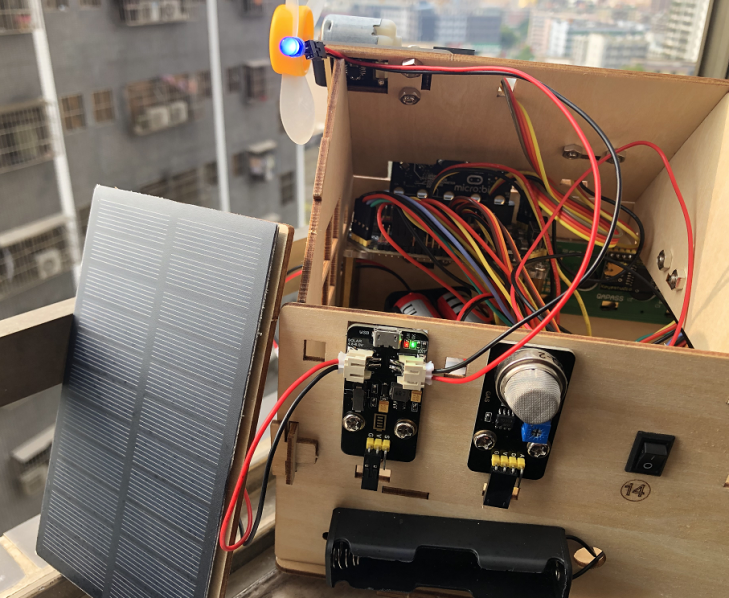

### Project 9：1602 LCD

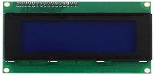

1.实验介绍：

Keyes I2C 1602 LCD模块是可以显示2行，每行16个字符的液晶显示器模块。液晶显示器显示蓝底白字，自带I2C通信模块，使用时只需连接单片机I2C通信接口，大大节约了单片机资源。最初的1602 LCD需要7个IO端口来启动和运行，而Keyes I2C 1602 LCD模块内置Arduino IIC/I2C接口，节省了5个IO端口。和Arduino液晶库文件兼容，用起来很简单。

LCD非常适合打印数据和显示数字。可以显示32个字符(16x2)。在Keyes I2C 1602 LCD模块的背面有一个蓝色的电位器，可以转动电位器来调整对比度。连接时请注意，LCD的GND和VCC不能接反，否则会损坏LCD。

2.1602 I2C模块规格参数：

|工作电压：|DC5V|I2C地址：|0x27|控制接口：|I2C|
|-|-|-|-|-|-|
|工作电流：|&lt; 130mA|工作环境温度：|0°C ~ 45°C（推荐）|驱动芯片：|PCF8574T|
|GND：一个接地的引脚|VCC：一个连接到+5V电源的引脚|SDA：一个连接到SDA（或A4）的引脚，用于IIC通信|
|SCL：一个连接到SCL（或A5）的引脚，用于IIC通信|背光（蓝底白字）|可调对比度|

3.示例代码：

|Microbit扩展板|1602 LCD 模块|
|-|-|
|GND|GND|
|5V|5V|
|SDA|SDA|
|SCL|SCL|

用Mu软件打开“Project 7：Small fan rotation-2.py“文件，加载代码的路径如下：（[How to load the project code?](#AS))

|文件类型|路径|文件名|
|-|-|-|
|Python file|../Python 课程/Python代码/microbit扩展课程/Project 9：1602 LCD|Project 9：1602 LCD.py|

加载完成后，如下图所示。你也可以打开Mu软件，在编辑窗口输入代码。（注意！所有英文及符号均须以英文填写，最后一行必须有空格。）

您需要单击“检查”按钮来检查代码是否有错误。如果一行出现光标或下划线，则表明该行的程序有错误。

确定程序代码无误之后，你还需要确定micro USB线已连接到micro:bit主板和电脑，然后单击“刷入”按钮将代码下载到micro:bit主板。

5.实验现象：

按照之前的方式将示例代码下载到micro:bit主板，并且外接电源供电，将扩展板上的拨码开关拨到ON端，再将船型开关上的“1”端按下。microbit主板上LED点阵屏显示“笑脸”图案，再旋转1602LCD液晶显示屏模块后面的电位器调节1602LCD液晶显示屏的亮度后，1602 LCD液晶显示屏模块的显示屏上第一行显示“Hello microbit!”字符，第二行显示数字，每过0.5s，数字加1。

特别注意：上传代码成功，上电后，显示屏没有字符显示时，可以调节1602 I2C模块反面上的电位器，调节背光，使Keyes 1602 I2C模块上的LCD屏幕显示对应字符串。

### Project 10：水滴水蒸气传感器

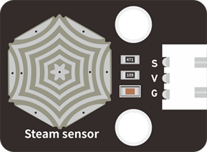

1.实验介绍：

这是一个常用的水滴水蒸气传感器。它的原理是通过电路板上裸露的金属花纹区检测水量的大小。水量越多，就会有更多的导线被联通，随着导电的接触面积增大，输出的电压就会逐步上升。除了可以检测水量的大小，它还可以检测空气中的水蒸气。即：水滴传感器是一种模拟传感器，可以作为一个简单的雨水探测器和液位开关。当传感器表面的湿度升高时，输出电压将升高，读取到的模拟值即增大。

该传感器兼容各种单片机控制板，如micro:bit系列单片机。使用时，将传感器信号端输入到micro:bit系列单片机的模拟口，感知模拟值的变化，并在串口监视器上显示出对应的模拟值。

注意事项：连接部位不防水，请勿放入水中。

2.水滴水蒸气传感器的规格参数：

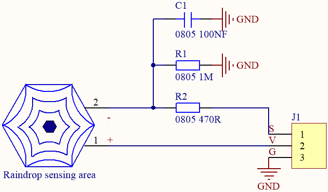

|工作电压：|DC 3.3-5V|
|-|-|
|工作温度范围：|－10℃～＋70℃|
|最大工作电流：|5uA (DC5V，或者当水滴传感器两脚直接短接)|
|控制接口：|模拟输出|

3.示例代码：

|Microbit扩展板|水滴水蒸气传感器|
|-|-|
|GND|G|
|3V3|V|
|S(0)|S|

用Mu软件打开“Project 10：Drop sensor.py“文件，加载代码的路径如下：（[How to load the project code?](#AS))

|文件类型|路径|文件名|
|-|-|-|
|Python file|../Python 课程/Python代码/microbit扩展课程/Project 10：水滴水蒸气传感器|Project 10：Drop sensor.py|

加载完成后，如下图所示。你也可以打开Mu软件，在编辑窗口输入代码。（注意！所有英文及符号均须以英文填写，最后一行必须有空格。）

您需要单击“检查”按钮来检查代码是否有错误。如果一行出现光标或下划线，则表明该行的程序有错误。

确定程序代码无误之后，你还需要确定micro USB线已连接到micro:bit主板和电脑，然后单击“刷入”按钮将代码下载到micro:bit主板。

4.实验现象：

代码成功下载到micro：bit主板之后，利用micro USB数据线上电，主板上的LED点阵屏显示“笑脸”图案。先点击“REPL”按钮，再按一下micro:bit主板后面的复位按钮，显示串口输出数据，水滴水蒸气传感器读取到信号端的模拟信号，裸露的金属花纹区的水量越多，模拟值越大。如下图所示：

### Project 11：下雨警报

1.实验介绍：

水滴水蒸气传感器在生活中应用是比较广泛的，例如：下雨警报器，汽车自动刮水系统、智能灯光系统和智能天窗系统等。在前面的项目实验中，我们已经知道了水滴水蒸气传感器的工作原理，那么在本项目实验中，我们将水滴水蒸气传感器，microbit上的扬声器和黄色LED相结合，制作一个简单的下雨警报器。

用Mu软件打开“Project 11：The rain warning.py“文件，加载代码的路径如下：（[How to load the project code?](#AS))

|文件类型|路径|文件名|
|-|-|-|
|Python file|../Python 课程/Python代码/microbit扩展课程/Project 11：下雨警报|Project 11：The rain warning.py|

加载完成后，如下图所示。你也可以打开Mu软件，在编辑窗口输入代码。（注意！所有英文及符号均须以英文填写，最后一行必须有空格。）

您需要单击“检查”按钮来检查代码是否有错误。如果一行出现光标或下划线，则表明该行的程序有错误。

确定程序代码无误之后，你还需要确定micro USB线已连接到micro:bit主板和电脑，然后单击“刷入”按钮将代码下载到micro:bit主板。

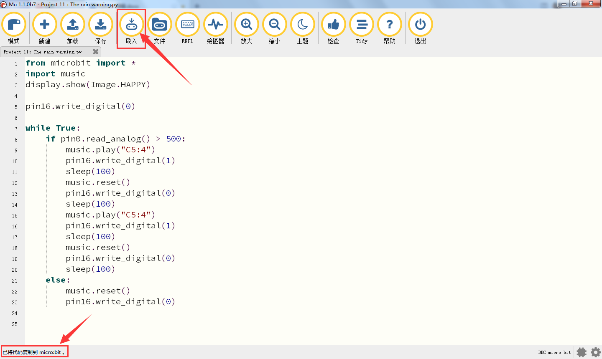

3.实验结果：

按照之前的方式将示例代码下载到micro:bit主板，microbit主板上的点阵显示“笑脸”图案，给外接电源供电，将扩展板上的拨码开关拨到ON端，再将船型开关上的“1”端按下。水滴水蒸气传感器检测到的模拟信号大于500时，microbit主板上的扬声器发出急促的“滴滴”声音，同时黄色LED闪烁；否则，扬声器不发声，黄色LED熄灭。

### Project 12：模拟气体(MQ-2)传感器

1.实验介绍：

模拟气体(MQ-2)传感器可用于家庭用气体泄漏报警器、工业用可燃气体报警器以及便携式气体检测仪器，适宜于液化气、苯、烷、酒精、氢气、烟雾等的探测，被广泛运用到各种[消防报警系统](https://baike.so.com/doc/5909700-6122605.html)中。故因此，模拟气体(MQ-2)传感器可以准确来说是一个多种气体探测器，同时还具有灵敏度高、响应快、稳定性好、寿命长、驱动电路简单等优点。

模拟气体(MQ-2)传感器检测可燃气体与烟雾的浓度范围是300~10000ppm，对天然气、液化石油气等烟雾有很高的灵敏度，尤其对烷类烟雾更为敏感。在使用之前必须加热一段时间，这样输出的电阻和电压较准确。但是加热电压不宜过高，否则会导致内部的信号线熔断。

模拟气体(MQ-2)传感器属于二氧化锡半导体气敏材料，属于表面离子式N型半导体。处于200~300摄氏度时，二氧化锡吸附空气中的氧，形成氧的负离子吸附，使半导体中的电子密度减少，从而使其电阻值增加。当与空气中可燃气体和烟雾烟雾接触时，如果晶粒间界处的势垒收到烟雾的调至而变化，就会引起表面导电率的变化。利用这一点就可以获得烟雾或可燃气体存在的信息，空气中烟雾或可燃气体的浓度越大，导电率越大，输出电阻越低，则输出的模拟信号就越大。

此外，通过旋转电位器可以调整模拟气体(MQ-2)传感器灵敏度。上电后，模拟气体(MQ-2)传感器上的一个指示灯亮绿灯，并且还可以调节蓝色的正方体电位器，使模块上另一个指示灯介于不亮与亮之间的临界点时，灵敏度最高。

2.模拟气体（MQ-2）传感器的规格参数：

|工作电压：|3.3-5V|
|-|-|
|工作电流：|160mA (DC5V)|
|工作温度：|0°C ~ 40°C|
|控制接口：|数字、模拟输出|
|检测浓度：|300-10000ppm(可燃气体)|
|浓度斜率：|≤0.6(R3000ppm/R1000ppm C3H8)|
|灵敏度：|Rs(in air)/Rs(1000ppm异丁烷)≥5|
|敏感体表面电阻（Rs）|2KΩ-20KΩ(in 2000ppm C3H8 )|

MQ-2特点：

（1）具有信号输出指示。

（2）双路信号输出（模拟量输出及TTL电平输出）

（3）TTL输出有效信号为低电平。（当输出低电平时信号灯亮，可直接接单片机） 
            

（4）模拟量输出0~5V电压，浓度越高电压越高。

（5）对液化气，天然气，城市煤气有较好的灵敏度。

（6）具有长期的使用寿命和可靠的稳定性

（7）快速的响应恢复特性。

3.示例代码：

|Microbit扩展板|模拟气体(MQ-2)传感器|
|-|-|
|GND|G|
|5V|V|
|S（1）|D|

用Mu软件打开“Project 12：Analog gas (MQ-2) sensor.py“文件，加载代码的路径如下：（[How to load the project code?](#AS))

|文件类型|路径|文件名|
|-|-|-|
|Python file|../Python 课程/Python代码/microbit扩展课程/Project 12：模拟气体(MQ-2)传感器|Project 12：Analog gas (MQ-2) sensor.py|

加载完成后，如下图所示。你也可以打开Mu软件，在编辑窗口输入代码。（注意！所有英文及符号均须以英文填写，最后一行必须有空格。）

您需要单击“检查”按钮来检查代码是否有错误。如果一行出现光标或下划线，则表明该行的程序有错误。

确定程序代码无误之后，你还需要确定micro USB线已连接到micro:bit主板和电脑，然后单击“刷入”按钮将代码下载到micro:bit主板。

4.实验现象：

代码成功下载到micro：bit主板之后，利用micro USB数据线上电，并且外接电源供电，将扩展板上的拨码开关拨到ON端，再将船型开关上的“1”端按下。主板上的LED点阵屏显示“笑脸”图案。先点击“REPL”按钮，再按一下micro:bit主板后面的复位按钮，而且，模拟气体（MQ-2）传感器上的一个指示灯亮绿灯，并且还可以调节蓝色的正方体电位器，使模块上另一个指示灯介于不亮与亮之间的临界点时，灵敏度最高。未用打火机气体对着模拟气体（MQ-2）传感器时，串口显示的是数字信号1；当用打火机气体对着模拟气体（MQ-2）传感器时，串口显示的是数字信号0，同时模块上的一个指示灯亮红灯。如下图所示：

### Project 13：气体泄露检测仪

1.实验介绍：

一些家庭里会使用到煤气，煤气的主要成分有：CO、CO2、N2、H2、CH4，其中的主要可燃成分是一氧化碳CO，而CO会和人体中的血红蛋白结合。当人吸入的煤气多了就会出现煤气中毒，就是CO中毒，病人会头痛、头晕、无力等多种症状。当被测气体发生泄漏时，浓度值显示值增加。超过报警设定值时，报警指示灯亮，报警器鸣响。当探头移入泄漏源时，气体检测浓度显示器上的值增加,，并记录读数。所以这时我们需要一个可以检测煤气是否泄漏的装置。

那么在本项目实验中，我们将模拟气体(MQ-2)传感器、黄色LED、microbit主板上的扬声器和1602LCD相结合，也来模拟一个简易的气体泄露检测仪。

用Mu软件打开“Project 13：Gas leak detector.py“文件，加载代码的路径如下：（[How to load the project code?](#AS))

|文件类型|路径|文件名|
|-|-|-|
|Python file|../Python 课程/Python代码/microbit扩展课程/Project 13：气体泄露检测仪|Project 13：Gas leak detector.py|

加载完成后，如下图所示。你也可以打开Mu软件，在编辑窗口输入代码。（注意！所有英文及符号均须以英文填写，最后一行必须有空格。）

您需要单击“检查”按钮来检查代码是否有错误。如果一行出现光标或下划线，则表明该行的程序有错误。

确定程序代码无误之后，你还需要确定micro USB线已连接到micro:bit主板和电脑，然后单击“刷入”按钮将代码下载到micro:bit主板。

3.实验现象：

按照之前的方式将示例代码下载到micro:bit主板，并且外接电源供电，将扩展板上的拨码开关拨到ON端，再将船型开关上的“1”端按下。Microbit主板上的LED点阵显示“笑脸”图案，用打火机气体对着模拟气体（MQ-2）传感器时，1602 LCD第一行显示“MQ-2”，第二行显示“gas leakage”，同时microbit主板上的扬声器发出急促的“滴滴”声音，黄色LED闪烁；否则，扬声器不发声，黄色LED熄灭，1602 LCD不显示。

### Project 14：多功能

1.  实验介绍：

将多个模块结合一起，模仿智能家居，例如气体泄漏警报、智能灯、自动关窗等。

2.示例代码：

用Mu软件打开“Project 14：multi-function.py“文件，加载代码的路径如下：（[How to load the project code?](#AS))

|文件类型|路径|文件名|
|-|-|-|
|Python file|../Python 课程/Python代码/microbit扩展课程/Project 14：多功能|Project 14：multi-function.py|

加载完成后，如下图所示。你也可以打开Mu软件，在编辑窗口输入代码。（注意！所有英文及符号均须以英文填写，最后一行必须有空格。）

您需要单击“检查”按钮来检查代码是否有错误。如果一行出现光标或下划线，则表明该行的程序有错误。(红色框内的错误可以忽略，代码上传运行正常)

确定程序代码无误之后，你还需要确定micro USB线已连接到micro:bit主板和电脑，然后单击“刷入”按钮将代码下载到micro:bit主板。

3.实验现象：

按照之前的方式将示例代码下载到micro:bit主板，并且外接电源供电，将扩展板上的拨码开关拨到ON端，再将船型开关上的“1”端按下。Microbit主板上的LED点阵显示“笑脸”图案，当水滴水蒸气传感器的模拟值＞400时，6812 2x2全彩RGB模块上的5个WS2812RGB灯全亮，且颜色依次红、橙、黄、绿、蓝、靛蓝、紫罗兰、紫、白，接着窗户关闭，门转动，小风扇转动；否则，窗户打开，门又转动，小风扇不转，。用打火机气体对着模拟气体（MQ-2）传感器时，1602 LCD第一行显示“MQ-2”，第二行显示“gas leakage”，同时microbit主板上的扬声器发出急促的“滴滴”声音，黄色LED闪烁；否则，扬声器不发声，黄色LED熄灭，1602 LCD不显示。
